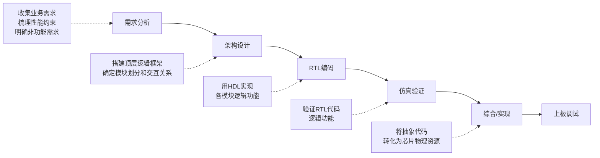

# 1.2 EDA技术基础

EDA（Electronic Design Automation，电子设计自动化）是现代数字系统设计的核心技术。本节介绍可编程逻辑器件 (PLD) 的发展历史与分类、硬件描述语言 (HDL) 的概念与优势，以及EDA软件工具的生态体系。

---

## 1.2.1 集成电路的分类

在进入PLD之前，先了解集成电路的两种基本类型：

| 类型 | 特点 | 优势 | 劣势 |
|------|------|------|------|
| **通用集成电路** | 内部硬件结构固定，功能通过外部控制或程序灵活改变 | 使用灵活 | 速度、功耗不一定最优 |
| **专用集成电路 (ASIC)** | 针对特定功能、特定应用设计制造 | 速度快、功耗低 | 设计贵、周期长、流片后不能改 |

PLD处于两者之间——用户可通过编程自定义硬件逻辑功能，兼具灵活性与定制性。

---

## 1.2.2 可编程逻辑器件 (PLD)

### 1. PLD的定义

**可编程逻辑器件** (Programmable Logic Device, PLD) 是20世纪70年代发展起来的一种大规模集成电路，采用**软件和硬件相结合**的方法设计所需数字系统。

PLD的逻辑功能由用户通过器件编程来设定，用户可将一个数字系统集成在一片PLD上，做成**片上系统 (SoC)**。

### 2. PLD硬件发展历史

PLD的发展经历了从简单存储器到复杂可编程阵列的演进：

**（1）ROM（只读存储器）—— 掩模定制**

最早的ROM为掩模定制，出厂数据永久固定。优点是成本低、可靠性高；缺点是开发周期长、小批量成本极高。

**（2）PROM（可编程只读存储器）—— 第一代用户可编程器件**

通过熔断内部金属丝实现一次性编程（称为"烧录 / burn"）。PROM是第一代用户可编程非易失性存储器。

缺点：
- 一次性编程：写入错误直接报废，小批量开发成本高
- 双极工艺：功耗高、集成度难提升

**（3）EPROM（可擦除可编程只读存储器）**

采用浮栅MOS管，紫外线 (UV) 擦除，可反复编程，解决了PROM不可修改的问题。发明者：多夫·弗罗曼。

缺点：
- 擦除不方便（需要紫外线照射）
- 擦除成本较高、效率低
- 只能整芯片擦除，不能按字节修改

**（4）EEPROM（电可擦除可编程只读存储器）**

采用薄氧化层浮栅MOS结构，可实现电擦除/电编程。闪存之父艾利·哈拉里是闪迪 (SanDisk) 联合创始人。

**（5）PLD器件家族的演进**

| 缩写 | 全称 | 核心特点 |
|------|------|----------|
| PLA | 可编程逻辑阵列 | 与阵列和或阵列均可编程；速度慢、结构复杂、成本高 |
| PAL | 可编程阵列逻辑 | 与阵列可编程、或阵列固定；速度快、便宜、简单 |
| GAL | 通用阵列逻辑 | 具有OLMC（可配置输出逻辑宏单元）；可反复编程、输出灵活 |
| EPLD | 可擦除可编程逻辑器件 | 较GAL规模更大 |
| CPLD | 复杂可编程逻辑器件 | 采用EEPROM/Flash工艺；非易失性，上电即工作 |
| FPGA | 现场可编程门阵列 | CLB + 可编程互联 + 可配置IO；高集成、高能效 |

### 3. PLD硬件分类

按结构层次，PLD可分为：

| 分类 | 包含器件 | 结构特点 |
|------|----------|----------|
| **SPLD** (简单PLD) | PROM, PLA, PAL, GAL | PROM: 与阵列固定、或阵列可编程；PLA: 两阵列均可编程；PAL: 与可编程、或固定；GAL: 具有OLMC |
| **CPLD** | 复杂PLD | 一个芯片上集成多个可编程互连的SPLD |
| **FPGA** | 现场可编程门阵列 | 非"与-或阵列"结构，基于查找表(LUT) |

!!! warning "易错点"
    CPLD基于EEPROM/Flash工艺，**非易失性**（掉电程序不丢失），上电立即工作，不需配置芯片。FPGA多为SRAM工艺，**易失性**，掉电丢失配置，需外部配置芯片。

### 4. PLD器件的编程开发

**传统方式**：开发软件完成逻辑功能设计（布尔方程/真值表/原理图输入） → 编译/化简/适配 → 生成熔丝图/JEDEC文件 → 编程器写入PLD芯片。

**现代方式（ISP）**：在系统可编程 (In-System Programmable)，编程时只需将计算机产生的编程数据直接写入PLD即可。

---

## 1.2.3 硬件描述语言 (HDL)

### 1. HDL的定义

**硬件描述语言** (Hardware Description Language, HDL) 是用形式化方法来描述数字电路行为和结构的计算机语言。

| 对比维度 | C语言（软件） | HDL（硬件） |
|----------|---------------|-------------|
| 描述对象 | 软件指令 | 硬件电路 |
| 运行方式 | 依赖处理器逐条执行 | 直接映射为电路 |
| 变量含义 | 数据 | 信号（导线/寄存器） |
| 执行模式 | 顺序执行 | 并行执行 |

### 2. HDL的优点

1. 用HDL描述电路的行为或结构，实现细节由软件自动完成，减少工作量，缩短设计周期
2. 硬件描述与具体实现工艺无关，**代码重用率**比原理图设计方法高
3. 支持层次化描述，便于大型设计管理
4. 具有电路仿真与验证机制，早发现设计错误
5. 支持从高层次到低层次的综合转换

### 3. Verilog HDL与VHDL对比

| 对比维度 | Verilog HDL | VHDL |
|----------|-------------|------|
| 语法风格 | 相对自由（类C语言） | 严谨（基于ADA语言） |
| 学习曲线 | 易学易用 | 较陡 |
| 设计群体 | 广泛 | 欧美军工较多 |
| 系统级描述 | 略弱（SystemVerilog已大幅增强） | 较强 |
| 门级/开关级描述 | 强大 | 较弱 |

---

## 1.2.4 EDA软件工具

### 1. 集成开发环境 (IDE)

各FPGA厂商提供针对自家器件的集成开发环境：

| 厂商 | IDE | 说明 |
|------|-----|------|
| **AMD (Xilinx)** | Vivado | FPGA之父罗斯·弗里曼创办；XC2064(85K晶体管)→VP1902(1380亿晶体管) |
| **Intel (Altera)** | Quartus Prime | 1983年成立，2024年1月独立运营，数据中心市场份额28%~32% |
| **Lattice** | Lattice Diamond / Radiant | 聚焦低功耗、小尺寸FPGA，市场份额约5% |
| **Microchip (Microsemi)** | Libero | 反熔丝FPGA技术领先，高可靠性细分市场，市场份额约5% |
| **国产FPGA** | 复旦微/紫光等 | 国产品牌正在崛起 |

### 2. 仿真工具 (Simulation)

- **功能仿真（前仿真）**：验证RTL代码逻辑功能是否符合预期，及早发现逻辑错误
- **时序仿真（后仿真）**：精确评估信号传输时序关系，检查建立/保持时间违例

仿真工具分为四类：通用仿真器、厂商自研仿真器、开源仿真器、在线仿真器。

### 3. 综合工具 (Synthesis)

综合工具将HDL代码转化为门级网表：

| 类型 | 代表工具 | 特点 |
|------|----------|------|
| 厂商内置综合器 | Vivado Synthesis, Quartus Synthesis, LSE | 与厂商IDE深度集成 |
| 第三方综合器 | Synplify Pro/Premier (Synopsys) | 最主流第三方；跨厂商统一流程；时序优化极强 |

### 4. 实现工具 (Implementation)

实现工具负责布局、布线、时序模型映射到具体FPGA资源（BRAM、DSP、PLL、GT高速收发器等）。这些是芯片内部机密，第三方拿不到完整物理信息，必须使用**厂商自家工具**（如Vivado Implementation、Quartus Prime Fitter），最终输出 `.bit` 或 `.jed` 配置文件。

---

## 1.2.5 数字系统开发流程

> **重点**：开发流程遵循"需求分析 → 架构设计 → RTL编码 → 仿真验证 → 综合/实现 → 上板调试"的**自顶向下**设计方法。
