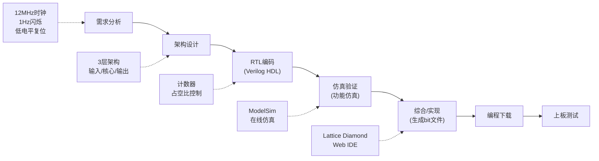

# 1.3 硬件开发环境简介

本节以 **STEP-MXO2-C 小脚丫开发板**（基于Lattice LCMXO2-4000HC）为例，介绍数字电路的实际开发环境、开发流程和一个完整的LED闪烁设计实例。

---

## 1.3.1 STEP-MXO2-C 小脚丫开发板

### 硬件资源

| 资源 | 规格 |
|------|------|
| 主控芯片 | LCMXO2-4000HC (Lattice MachXO2系列) |
| 显示 | 两位7段数码管 |
| LED | 两个RGB三色LED、8路用户LED |
| 输入 | 4路拨码开关、4路按键 |
| 扩展IO | 36个可扩展I/O引脚 |

### 开发环境

1. **本地IDE**：Lattice Diamond（需下载安装，约2GB）
2. **在线IDE**：小脚丫Web IDE（https://www.stepfpga.com/，无需安装，有网络即可）

### 开发语言

- Verilog HDL
- VHDL
- 图形输入（原理图方式）

!!! warning "易错点"
    在线IDE虽然方便，但功能不如本地Diamond完整。正式项目开发建议使用本地IDE以获得完整的综合、布局布线与时序分析能力。

---

## 1.3.2 LED交替闪烁设计实例

### 设计目标

控制小脚丫开发板上两个LED指示灯交替闪烁，闪烁频率为1Hz。

### 需求分析

| 需求项 | 具体要求 |
|--------|----------|
| 功能描述 | 两路LED交替闪烁，频率1Hz，两路互补 |
| 复位方式 | 低电平有效，复位后两路LED均熄灭 |
| 系统时钟 | 12MHz，50%占空比 |
| 复位响应 | 低电平有效，响应时间 ≤ 1个时钟周期 |
| 闪烁频率 | 1Hz（误差 ≤ ±1%） |

### 架构设计

采用单模块+纯组合/时序逻辑的极简架构，分三个功能层：

**（1）输入层 — 信号接口定义**

| 信号 | 方向 | 说明 |
|------|------|------|
| `clk_in` | input | 12MHz系统时钟，上升沿触发 |
| `rst_n_in` | input | 低电平有效，异步复位 |

**（2）核心处理层**

- **计数器设计**：对12MHz时钟计数，12MHz / 1Hz = 12,000,000 个周期。即每计数6,000,000个时钟周期翻转一次输出。
- **占空比控制**：产生50%占空比的1Hz方波信号 `clk_div`。

**（3）输出层 — LED驱动接口**

| 信号 | 方向 | 说明 |
|------|------|------|
| `led1` | output | 映射 `clk_div` 信号 |
| `led2` | output | 映射 `~clk_div` 信号，与 led1 互补 |

接口类型为纯组合输出，无锁存，确保信号实时响应。

### 开发流程（在线IDE方式）

1. **注册**：访问 https://www.stepfpga.com/ 注册账号
2. **创建项目**：在Web IDE中新建项目
3. **新建文件**：创建Verilog HDL源文件
4. **RTL编码**：输入Verilog HDL代码
5. **仿真验证**：功能仿真，验证逻辑正确性
6. **综合/实现**：综合成门级网表，布局布线
7. **编程下载**：将 `.bit` 文件下载到开发板

---

## 1.3.3 关键概念辨析

本节末尾的课堂练习中强调了两个核心判断：

!!! warning "易错点"
    **判断题1**：数字信号指的是时间离散或幅值离散的信号。  
    **答案：错误。** 数字信号必须满足**幅度和时间都离散**。仅满足一个条件的属于过渡信号。

!!! warning "易错点"
    **判断题2**：模拟电路中晶体管工作于放大区；数字电路中晶体管工作于截止区或饱和区。  
    **答案：正确。** 这是模拟电路与数字电路在器件工作状态上的本质区别。

---

## 开发流程总览

