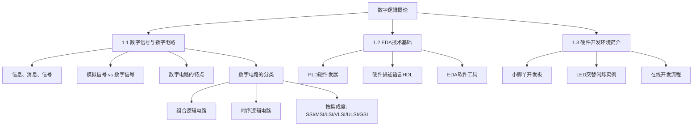

# 数字逻辑概论

数字电子技术是现代电子信息技术的重要基石。本章作为数字电子技术的入门，从**信号与电路**的基本概念出发，介绍数字信号与模拟信号的区别、数字电路的特点与分类，以及数字电路在工程实践中的应用。

---

## 1.1 数字信号与数字电路

### 1.1.1 信息、消息与信号

在讨论数字电路之前，需要厘清三个基本概念：

| 概念 | 定义 | 例子 |
|------|------|------|
| **信息** (Information) | 用来消除随机不定性的东西（香农定义） | 温度数值、文字内容 |
| **消息** (Message) | 信息的载体，是信息的外在表现形式 | 语音、图像、文字 |
| **信号** (Signal) | 消息在电子线路中传输的物理表现形式 | 电压波形、电流变化 |

在电子与计算机领域，**信号是电子线路中传输的以信号作为载体的内容**，它是随时间或空间等因素变化的某种物理量。

### 1.1.2 模拟信号与数字信号

根据幅度和时间特性的不同，信号可以分为三类：

**（1）模拟信号 (Analog Signal)**

幅度和相位都连续的信号。或者说，幅度和时间两方面都连续的信号。例如：话筒输出的音频电压信号、温度传感器输出的连续电压信号。

**（2）数字信号 (Digital Signal)**

幅度和相位都离散的信号。或者说，幅度和时间两方面都离散的信号。数字信号通常用二值逻辑 **"0"** 和 **"1"** 表示，对应低电平和高电平两种状态。

**（3）过渡信号**

介于模拟信号与数字信号之间：
- 时间连续、幅值离散的信号（如采样保持信号）
- 时间离散、幅值连续的信号（如脉冲幅度调制信号）

> **重点**：模拟信号与数字信号的本质区别在于信号在**幅度**和**时间**上是否连续。两者都是连续则为模拟信号，两者都是离散则为数字信号。

### 1.1.3 模拟电路与数字电路

根据工作信号类型的不同，电子电路分为两类：

| 类别 | 工作信号 | 晶体管工作状态 | 典型电路 |
|------|----------|----------------|----------|
| **模拟电路** | 模拟信号 | 放大区（线性区） | 放大器电路 |
| **数字电路** | 数字信号 | 饱和导通或截止（开关状态） | 逻辑门、触发器 |

模拟电路关注**放大性能**（如虚短特性、分压关系、电压增益等），而数字电路关注**逻辑功能**。

数字电路使用数字信号对数字量进行算术运算和逻辑运算，因其具备逻辑运算与逻辑处理功能，故又称为**数字逻辑电路**。

### 1.1.4 数字电路的特点

数字电路具有以下显著特点：

1. **抗干扰能力强**：仅用 0/1 两种状态，噪声干扰只要不超过阈值就不会影响逻辑判断
2. **易于集成**：电路结构简单、重复性强，适合大规模集成
3. **便于存储、传输和处理**：0/1 状态适合长期保存、处理与传输
4. **灵活性高**：可编程逻辑器件 (PLD) 具备可编程能力，灵活性和复用性强

### 1.1.5 模拟电路与数字电路对比

| 内容 | 模拟电路 | 数字电路 |
|------|----------|----------|
| 工作信号 | 模拟信号 | 数字信号 |
| 管子工作状态 | 放大状态 | 饱和导通或截止（开关） |
| 基本单元电路 | 放大器 | 逻辑门、触发器 |
| 研究对象 | 放大性能 | 逻辑功能 |
| 基本分析方法 | 图解法、微变等效电路法 | 真值表、卡诺图、状态转换图、布尔代数 |
| EDA分析方法 | PSpice、orCAD、Multisim等 | Vivado、ModelSim等 |

### 1.1.6 数字电路的分类

**（1）按逻辑功能特点分类：**

| 类型 | 定义 | 典型电路 |
|------|------|----------|
| **组合逻辑电路** | 任一时刻的输出仅与该时刻的输入信号有关，与电路原有输出状态无关 | 编码器、译码器、加法器、数据选择器 |
| **时序逻辑电路** | 任一时刻的输出状态不仅与该时刻的输入状态有关，还与电路原有的输出状态有关 | 触发器、计数器、寄存器、状态机 |

!!! warning "易错点"
    组合逻辑电路 "没有记忆"，输出完全由当前输入决定。时序逻辑电路 "有记忆"，包含存储元件（如触发器），输出由当前输入和电路历史状态共同决定。

**（2）按集成度分类：**

| 集成度 | 缩写 | 晶体管数 | 逻辑门数 | 年代 | 典型产品 |
|--------|------|----------|----------|------|----------|
| 小规模 | SSI | < 10^2 | < 10 | 1961 | 集成门、触发器 |
| 中规模 | MSI | 10^2~10^3 | 10~10^2 | 1966 | 计算器、加法器 |
| 大规模 | LSI | 10^3~10^4 | 10^2~10^3 | 1971 | 8bMCU、ROM、RAM |
| 超大规模 | VLSI | 10^4~10^6 | 10^3~10^5 | 1980 | 16-32bit MCU、DSP |
| 甚大规模 | ULSI | 10^6~10^7 | 10^5~10^6 | 1990 | CPU |
| 巨大规模 | GSI | > 10^7 | > 10^6 | 2000 | 多核处理器、SoC |

---

## 本章知识结构

