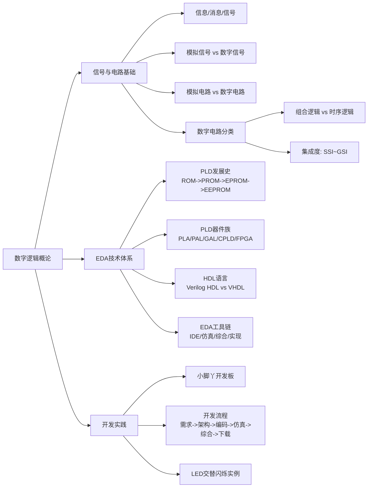

# 第1章总结：数字逻辑概论

---

## 知识脉络

---

## 核心公式与概念汇总表

| 序号 | 概念/公式 | 说明 |
|:---:|------|------|
| 1 | 模拟信号 | 幅度和时间都连续的信号 |
| 2 | 数字信号 | 幅度和时间都离散的信号（0/1二值） |
| 3 | 过渡信号 | 仅幅度或时间之一离散的信号 |
| 4 | 组合逻辑电路 | \(Y(t) = F[X(t)]\)，输出仅取决于当前输入 |
| 5 | 时序逻辑电路 | \(Y(t) = F[X(t), Q(t)]\)，输出取决于当前输入和历史状态 |
| 6 | PLD分类 | SPLD → CPLD → FPGA（集成度递增） |
| 7 | 开发流程 | 需求分析 → 架构设计 → RTL编码 → 仿真验证 → 综合/实现 → 上板调试 |
| 8 | CPLD vs FPGA | CPLD: EEPROM/Flash工艺，非易失性；FPGA: SRAM工艺，易失性 |
| 9 | Verilog HDL vs VHDL | Verilog类C易学；VHDL基于ADA严谨 |

---

## 集成电路集成度分级

| 级别 | 晶体管数 | 逻辑门数 | 里程碑年代 |
|------|----------|----------|------------|
| SSI | < 100 | < 10 | 1961 |
| MSI | 100 ~ 1,000 | 10 ~ 100 | 1966 |
| LSI | 1,000 ~ 10,000 | 100 ~ 1,000 | 1971 |
| VLSI | 10,000 ~ 1,000,000 | 1,000 ~ 100,000 | 1980 |
| ULSI | 1,000,000 ~ 10,000,000 | 100,000 ~ 1,000,000 | 1990 |
| GSI | > 10,000,000 | > 1,000,000 | 2000 |

---

## FPGA厂商一览

| 厂商 | IDE | 市场份额 | 特点 |
|------|-----|----------|------|
| AMD (Xilinx) | Vivado | 最大 (~50%) | FPGA发明者，产品线最全 |
| Intel (Altera) | Quartus Prime | ~28-32% | 数据中心/通信优势 |
| Lattice | Diamond/Radiant | ~5% | 低功耗、小尺寸 |
| Microchip | Libero | ~5% | 反熔丝FPGA、高可靠性 |
| 国产 (复旦微/紫光等) | 各品牌自研 | 增长中 | 自主可控 |

---

## 关键概念小结

1. **信号是信息的载体**：信息的传递依赖信号，电子电路中信号是核心研究对象。
2. **数字电路用开关状态工作**：晶体管在数字电路中工作于饱和导通或截止区，呈现二值逻辑特性。
3. **EDA是数字设计的核心手段**：从PLD到FPGA，从HDL编写到综合实现，EDA贯穿数字系统设计全过程。
4. **自顶向下的设计方法**：现代数字系统采用"需求→架构→编码→验证→实现"的结构化流程。
5. **硬件描述语言不同于软件语言**：HDL描述的是**并行**的硬件电路结构，而非顺序执行的指令序列。
