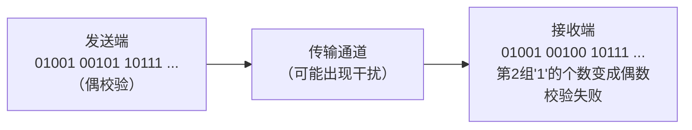

# 2.2 码制

**码制**是指用数字技术来处理和传输的以二进制形式表示数字、字母或特殊符号的系统。用文字、符号或数码表示特定对象的过程称为**编码 (Coding)**。编码本质上是信息从一种形式转换为另一种形式的过程。

---

## 2.2.1 编码基础

数字电路中常用的是**二进制编码**。N位二进制代码有 \(2^N\) 个状态，可以表示 \(2^N\) 个对象。

**实例**：
- 中文汉字 "好" 对应的国家标准信息交换汉字编码为 `3A43H`，即 `0001 0110 0000 0001`
- 英文字母 "M" 对应的美国信息交换标准编码 (ASCII) 为 `4DH`，即 `0100 1101`

### 常用码制分类

| 码制类型 | 用途 |
|----------|------|
| **二-十进制码 (BCD)** | 用二进制编码表示十进制数 |
| **格雷码 (Gray Code)** | 错误最小化编码，用于传输和测量 |
| **误差检验码** | 检测传输中是否出错 |
| **纠错码** | 检测并纠正传输错误 |
| **字符/数字代码** | 表示字母、数字、符号 |

---

## 2.2.2 二-十进制码 (BCD)

### 1. BCD码的定义

**BCD码** (Binary Coded Decimal) 是一种至少用**四位二进制编码**表示一位十进制数的代码。BCD码仅表示十进制数的 0~9 十个数码，因此某些四位二进制组合（1010~1111）是**禁用码**。

> BCD码有许多种编码方案。从16种四位二进制组合中选10种表示0~9，选择方案数为：
> \[
> A_{16}^{10} = \frac{16!}{(16-10)!} \approx 2.9 \times 10^{10}
> \]

### 2. 常见BCD码对照表

| 十进制数 | 二进制 | 8421-BCD | 2421-BCD | 余3码 | 余3循环码 |
|:--------:|:------:|:--------:|:--------:|:-----:|:---------:|
| 0 | 0000 | 0000 | 0000 | 0011 | 0010 |
| 1 | 0001 | 0001 | 0001 | 0100 | 0110 |
| 2 | 0010 | 0010 | 0010 | 0101 | 0111 |
| 3 | 0011 | 0011 | 0011 | 0110 | 0101 |
| 4 | 0100 | 0100 | 0100 | 0111 | 0100 |
| 5 | 0101 | 0101 | 1011 | 1000 | 1100 |
| 6 | 0110 | 0110 | 1100 | 1001 | 1101 |
| 7 | 0111 | 0111 | 1101 | 1010 | 1111 |
| 8 | 1000 | 1000 | 1110 | 1011 | 1110 |
| 9 | 1001 | 1001 | 1111 | 1100 | 1010 |
| **权** | — | **8 4 2 1** | **2 4 2 1** | 非恒权码 | 变权码 |

### 3. BCD码分类

| 分类 | 典型编码 | 特点 |
|------|----------|------|
| **恒权码** | 8421码、2421码、5421码 | 每一位有固定权重，加权求和即得十进制值 |
| **变权码** | 余3码、余3循环码 | 每一位没有固定权重 |

**8421-BCD码**是最常用的BCD码。每位权重为 \(8-4-2-1\)，与自然二进制相同（仅使用0~9）。

**余3码**：在8421-BCD码基础上加3（0011）得到，是一种**自补码**（对9互补后等于自身）。

!!! warning "易错点"
    8421-BCD码的1010~1111是**禁用码**，不能使用。将二进制数直接当作BCD码解读会出错。例如 \((10)_{10}\) 的BCD码是 `0001 0000`，而不是 `1010`。

---

## 2.2.3 格雷码 (Gray Code)

### 1. 格雷码的特点

| 十进制 | 4位二进制 | 4位典型格雷码 |
|:------:|:--------:|:------------:|
| 0 | 0000 | 0000 |
| 1 | 0001 | 0001 |
| 2 | 0010 | 0011 |
| 3 | 0011 | 0010 |
| 4 | 0100 | 0110 |
| 5 | 0101 | 0111 |
| 6 | 0110 | 0101 |
| 7 | 0111 | 0100 |
| 8 | 1000 | 1100 |
| 9 | 1001 | 1101 |
| 10 | 1010 | 1111 |
| 11 | 1011 | 1110 |
| 12 | 1100 | 1010 |
| 13 | 1101 | 1011 |
| 14 | 1110 | 1001 |
| 15 | 1111 | 1000 |

格雷码是一种**无权码**，其核心特点是：**任意两个相邻码组之间只有一位码元不同**。

格雷码在传输过程中引起的误差较小，因为相邻码组仅有一位码元不同，可减小逻辑上的差错，避免可能存在的**瞬间模糊状态**，所以它是**错误最小化代码**。

### 2. 格雷码与8421-BCD码对比

| 十进制 | 8421BCD | 典型格雷码 | 修改格雷码 |
|:------:|:-------:|:--------:|:--------:|
| 0 | 0000 | 0000 | 0010 |
| 1 | 0001 | 0001 | 0110 |
| 2 | 0010 | 0011 | 0111 |
| 3 | 0011 | 0010 | 0101 |
| 4 | 0100 | 0110 | 0100 |
| 5 | 0101 | 0111 | 1100 |
| 6 | 0110 | 0101 | 1101 |
| 7 | 0111 | 0100 | 1111 |
| 8 | 1000 | 1100 | 1110 |
| 9 | 1001 | 1101 | 1010 |

> **重点**：卡诺图的坐标排列就是按格雷码顺序，以保证几何相邻的方格逻辑相邻——这正是格雷码在数字设计中的重要应用。

---

## 2.2.4 误差检验码 — 奇偶校验码

### 1. 原理

由于存在干扰，二进制信息在传输过程中可能会出现错误。为发现并纠正错误，需使代码具有检错能力。最常用的误差检验码为**奇偶校验码**。

**编码方法**：在信息码组外增加一位**监督码元**，使整个码组中 "1" 的数目为奇数或偶数。

| 类型 | "1"的个数 | 监督位规则 |
|------|:--------:|------------|
| **奇校验码** | 奇数 | 使总"1"数为奇数 |
| **偶校验码** | 偶数 | 使总"1"数为偶数 |

### 2. 8421BCD码奇偶校验示例

| 十进制 | 信息码 | 奇校验码 | 偶校验码 |
|:------:|:------:|:--------:|:--------:|
| 0 | 0000 | **1** 0000 | **0** 0000 |
| 1 | 0001 | **0** 0001 | **1** 0001 |
| 2 | 0010 | **0** 0010 | **1** 0010 |
| 3 | 0011 | **1** 0011 | **0** 0011 |
| 4 | 0100 | **0** 0100 | **1** 0100 |
| 5 | 0101 | **1** 0101 | **0** 0101 |
| 6 | 0110 | **1** 0110 | **0** 0110 |
| 7 | 0111 | **0** 0111 | **1** 0111 |
| 8 | 1000 | **0** 1000 | **1** 1000 |
| 9 | 1001 | **1** 1001 | **0** 1001 |

### 3. 检错原理

**特点**：
- 奇偶校验码可以检测**单向单错**（一位出错）
- 信息码和校验码是**可分离**的（可分离码）
- 无需附加电路即可从收到的奇偶校验码中提取信息码
- 只能**检错**不能**纠错**，无法判断哪位出错

!!! warning "易错点"
    奇偶校验码只能检测**奇数位**错误。如果同时有两个位翻转（偶数位错误），奇偶性不变，无法检测。
