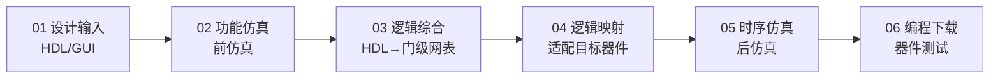

# 2.5 Verilog HDL基础

本节介绍数字系统设计方法与Verilog HDL语言基础，是从理论到实践的桥梁。内容涵盖数字系统设计方法论、EDA设计流程、Verilog HDL基本结构和语法规则。

---

## 2.5.1 数字系统设计方法

### 1. 基本概念

| 概念 | 定义 | 示例 |
|------|------|------|
| **逻辑功能模块** | 只能实现某种单一逻辑功能的电路 | 加法器、译码器、数据选择器、计数器 |
| **数字系统** | 将若干逻辑功能模块组合，按一定规则处理和传输数字信号的设备 | 数字通信设备、图像处理设备、通用计算机 |

### 2. 两种设计方法对比

| 方法 | 流程方向 | 特点 |
|------|----------|------|
| **传统方法（自底向上）** | 先设计底层模块，再拼装成系统 | 依赖设计者经验；模块复用困难；适合小规模设计 |
| **现代方法（自顶向下）** | 先规划顶层架构，再逐层细化 | 层次清晰；便于团队协作；适合大规模SoC设计 |

---

## 2.5.2 数字系统EDA设计流程

现代EDA设计流程包含六个步骤：



| 步骤 | 名称 | 内容 |
|:----:|------|------|
| 01 | **设计输入** | 用VHDL/Verilog HDL在算法级进行行为描述，或直接进行电路结构描述，以源文件形式保存 |
| 02 | **功能仿真** | 前仿真：将源文件调入HDL仿真软件，验证逻辑功能是否正确 |
| 03 | **逻辑综合** | 将源文件综合成门级电路网表文件，这是从高层次语言描述到硬件电路的关键步骤 |
| 04 | **逻辑映射** | 将综合后的网表针对具体目标器件进行适配，把设计植入所选PLD内 |
| 05 | **时序仿真** | 后仿真：利用包含器件实际硬件特性的精确参数，验证电路时序（建立/保持时间等） |
| 06 | **编程下载** | 将最终文件下载到实际目标芯片中，并进行器件测试 |

> 实现载体：**可编程逻辑器件 (PLD)** + **硬件描述语言 (HDL)**

---

## 2.5.3 Verilog HDL语言基础

### 1. HDL定义

硬件描述语言 (HDL) 是一种专门用于描述、建模、仿真和综合硬件电路的计算机编程语言。核心作用是用文本形式定义硬件的结构、行为、功能和时序特性。

HDL相比传统原理图设计的优点：

- **抽象层次更高**：从画门电路升级为行为/功能描述
- **设计效率高**：代码简洁、修改快，适合超大规模设计
- **可移植性强**：代码可在不同芯片、项目间复用
- **仿真验证方便**：流片/制版前即可仿真排错，降低风险

### 2. Verilog HDL基本结构

模块 (module) 是Verilog HDL的基本描述单位。每个模块实现特定功能。

**模块的四个组成部分**：

| 部分 | 说明 |
|------|------|
| **模块声明** | `module 模块名(端口列表);` |
| **端口定义** | 端口是模块与外部电路交互的接口，必须明确方向(input/output/inout)、数据类型和位宽 |
| **信号声明** | 模块内部信号（无对外接口），使用前必须声明 |
| **逻辑描述** | 核心功能实现，三种描述方式：结构级/数据流/行为级 |

### 3. 半加器的三种描述方式

**（1）结构级描述 (Gate Level)**

```verilog
module HalfAdder_GL(A, B, Sum, Carry);
    input A, B;
    output Sum, Carry;
    wire A, B, Sum, Carry;
    xor X1(Sum, A, B);
    and A1(Carry, A, B);
endmodule
```

**（2）数据流描述 (Data Flow)**

```verilog
module HalfAdder_DF(A, B, Sum, Carry);
    input A, B;
    output Sum, Carry;
    wire A, B, Sum, Carry;
    assign Sum = A ^ B;      // 用数据流赋值语句描述逻辑功能
    assign Carry = A & B;
endmodule
```

**（3）行为级描述 (Behavioral)**

```verilog
module HalfAdder_BH(A, B, sum, carry);
    input A, B;
    output sum, carry;
    reg sum, carry;          // 声明为寄存器型变量
    always @(A or B)
    begin
        sum = A ^ B;         // 用过程赋值语句描述逻辑功能
        carry = A & B;
    end
endmodule
```

!!! warning "易错点"
    同一电路（尤其是组合逻辑电路）可采用多种描述方式，逻辑功能不变。组合逻辑用 `wire` + `assign`（数据流）或 `reg` + `always @(*)`（行为级）。

---

## 2.5.4 基本语法规则

### 1. 词法规定

| 要素 | 说明 |
|------|------|
| **间隔符** | 空格(`\b`)、TAB(`\t`)、换行(`\n`) |
| **注释符** | 单行 `//`、多行 `/* ... */` |
| **标识符** | 模块名、端口、变量等，由字母/数字/`$`/`_` 组成，区分大小写 |
| **关键词** | `module` `endmodule` `input` `output` `wire` `reg` `and` 等，必须小写 |

### 2. 逻辑值集合

| 逻辑值 | 含义 |
|:------:|------|
| **0** | 逻辑0、逻辑假 |
| **1** | 逻辑1、逻辑真 |
| **x / X** | 未知状态（不确定） |
| **z / Z** | 高阻态 |

### 3. 常量及其表示

**整数型常量**：

- 十进制：`16`、`-15`
- 带基数格式：`<位宽>'<基数><数值>`
  - `3'b101` — 3位二进制数 101
  - `5'o37` — 5位八进制数 37
  - `8'he3` — 8位十六进制数 E3

| 基数符号 | 含义 |
|:--------:|------|
| `b` / `B` | 二进制 |
| `o` / `O` | 八进制 |
| `d` / `D` | 十进制 |
| `h` / `H` | 十六进制 |

**实数型常量**：

- 十进制计数法：`1.0`、`6.67`
- 科学计数法：`5E-4`（即 0.0005）、`23_5.1e2`（即 23510.0）

**字符串型常量**：用双引号括起，如 `"hello world!"`，可存入 `reg` 型变量。

### 4. 数据类型

Verilog HDL的数据类型分为**线网型**和**变量型**两大类。

**（1）线网型 (Net)**

表示硬件电路中元件之间的实际物理连接。

```
wire [3:0] A;  // 声明4位线网型变量
```

| 线网类型 | 功能说明 |
|----------|----------|
| `wire` / `tri` | 一般连线 / 多信号源驱动线网 |
| `wor` / `trior` | 具有线或特性的线网 |
| `wand` / `triand` | 具有线与特性的线网 |
| `supply1` | 电源建模，高电平1 |
| `supply0` | 对地建模，低电平0 |

**（2）变量型 (Variable)**

表示抽象的数据存储单元，只能在 `initial` 和 `always` 内部被赋值，值保持到下一条赋值语句。

```
reg clock;          // 1位寄存器型变量
reg [3:0] counter;  // 4位寄存器型变量
```

| 变量类型 | 含义 |
|----------|------|
| `reg` | 寄存器型变量，默认值 x |
| `integer` | 32位带符号整数型变量 |
| `real` / `realtime` | 64位带符号实数型变量 |
| `time` | 64位无符号时间型变量 |

**线网型 vs 变量型的区别**：

| 对比维度 | 线网型 (`wire`) | 变量型 (`reg`) |
|----------|:--------------:|:-------------:|
| 硬件对应 | 元件间连线 | 抽象数据存储单元（不一定是触发器） |
| 仿真内存 | 不占用，由驱动源决定 | 占用仿真内存 |
| 赋值方式 | 必须用 `assign`（连续赋值） | 必须在 `always`/`initial` 内（过程赋值） |

---

## 2.5.5 运算符 (Operators)

### 常用运算符一览

| 类别 | 运算符 | 说明 |
|------|--------|------|
| 算术 | `+` `-` `*` `/` `%` | 加、减、乘、除、取模 |
| 赋值 | `=` `<=` | 阻塞赋值 / 非阻塞赋值 |
| 逻辑 | `&&` `\|\|` `!` | 逻辑与、逻辑或、逻辑非 |
| 位运算 | `~` `&` `\|` `^` `~^` | 按位非、与、或、异或、同或 |
| 关系 | `<` `<=` `>` `>=` | 小于、小于等于、大于、大于等于 |
| 等式 | `==` `!=` `===` `!==` | 等于、不等于、全等、不全等 |
| 归约 | `&` `~&` `\|` `~\|` `^` `~^` | 归约与/与非/或/或非/异或/同或 |
| 移位 | `>>` `<<` | 逻辑右移、逻辑左移 |
| 条件 | `?:` | 三目条件运算符 |
| 拼接 | `{ }` | 位拼接 |

### 连续赋值 vs 过程赋值

| 赋值类型 | 适用对象 | 语法 |
|----------|----------|------|
| **连续赋值** | 仅线网型 (`wire`) | `assign 线网名 = 表达式;` |
| **过程赋值** | 仅变量型 (`reg`) | 在 `always`/`initial` 内使用 `=` 或 `<=` |

### 阻塞赋值 vs 非阻塞赋值

| 类型 | 运算符 | 执行方式 |
|------|:------:|----------|
| **阻塞赋值** | `=` | 前一条执行完毕前，后一条被阻塞，不能执行（顺序） |
| **非阻塞赋值** | `<=` | 多条语句同时执行，不受前面语句影响（并行） |

!!! warning "易错点"
    阻塞赋值 `=` 和非阻塞赋值 `<=` 的选择是Verilog HDL中最易错的点之一。组合逻辑用阻塞赋值 `=`，时序逻辑（边沿触发）用非阻塞赋值 `<=`。混用会导致仿真与综合结果不一致。

### 运算符优先级

从高到低：

\[
\begin{aligned}
&\text{高: } \; +, -, !, \sim \text{ (单目) } \;\rightarrow\; *, /, \% \;\rightarrow\; +, - \text{ (双目) } \;\rightarrow\; <<, >> \;\rightarrow\; <, <=, >, >= \\
&\qquad \rightarrow\; ==, !=, ===, !== \;\rightarrow\; \&, \sim\& \;\rightarrow\; \verb|^|, \verb|^~| \;\rightarrow\; | \;\rightarrow\; \&\& \;\rightarrow\; || \;\rightarrow\; ?: \; \text{ :低}
\end{aligned}
\]

> 使用 `()` 可调整优先级。

---

## Verilog HDL注意事项总结

- **大小写敏感**：所有关键词须小写
- 空格用于增加可读性
- **分号 `;`** 是语句终结符
- 单行注释 `//`，多行注释 `/* */`
- `wire` 用 `assign` 赋值，`reg` 在 `always`/`initial` 内赋值
- 组合逻辑用 `=`（阻塞），时序逻辑用 `<=`（非阻塞）
