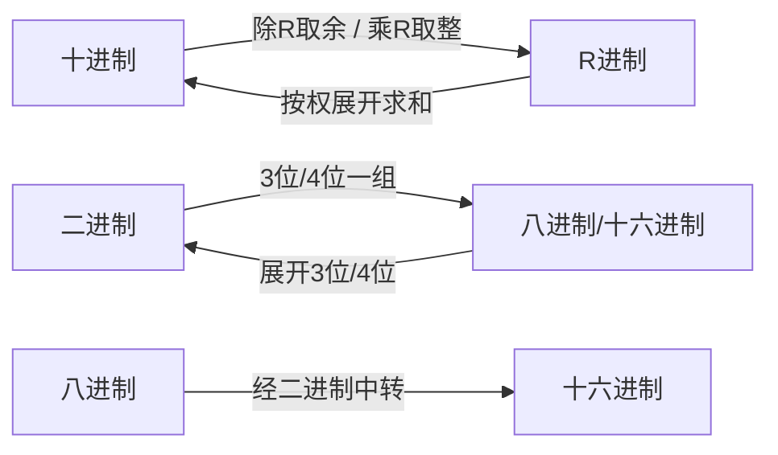
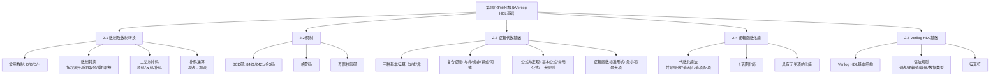

# 逻辑代数及Verilog HDL基础

本章是数字电子技术的**数学基础**和**工具基础**。内容涵盖数制转换、码制编码、逻辑代数三大基本运算及定律、逻辑函数化简方法（代数法、卡诺图法），以及Verilog HDL语言入门。掌握本章内容是后续学习组合逻辑电路和时序逻辑电路设计的前提。

---

## 2.1 数制及数制转换

### 2.1.1 数制的基本概念

**数制**是指多位数码中每一位的构成方法以及从低位到高位的进位规则。

任意N进制数的一般表达式：

\[
(N)_R = \sum_{i=-m}^{n-1} a_i \cdot R^i
\]

其中 \(R\) 为基数，\(a_i\) 为第 \(i\) 位的系数（\(0 \leq a_i \leq R-1\)），\(n\) 为整数位数，\(m\) 为小数位数。

### 2.1.2 常用数制对照

| 数制 | 基数 | 数码 | 计数规则 | 后缀标识 |
|------|:----:|------|----------|----------|
| 十进制 (Decimal) | 10 | 0~9 | 逢十进一 | D 或下标10 |
| 二进制 (Binary) | 2 | 0, 1 | 逢二进一 | B 或下标2 |
| 八进制 (Octal) | 8 | 0~7 | 逢八进一 | O 或下标8 |
| 十六进制 (Hexadecimal) | 16 | 0~9, A~F | 逢十六进一 | H 或下标16 |

### 2.1.3 各进制对照表

| 十进制 | 二进制 | 八进制 | 十六进制 |
|:------:|:------:|:------:|:--------:|
| 0 | 0000 | 00 | 0 |
| 1 | 0001 | 01 | 1 |
| 2 | 0010 | 02 | 2 |
| 3 | 0011 | 03 | 3 |
| 4 | 0100 | 04 | 4 |
| 5 | 0101 | 05 | 5 |
| 6 | 0110 | 06 | 6 |
| 7 | 0111 | 07 | 7 |
| 8 | 1000 | 10 | 8 |
| 9 | 1001 | 11 | 9 |
| 10 | 1010 | 12 | A |
| 11 | 1011 | 13 | B |
| 12 | 1100 | 14 | C |
| 13 | 1101 | 15 | D |
| 14 | 1110 | 16 | E |
| 15 | 1111 | 17 | F |

> **重点**：四位二进制恰好对应一位十六进制，三位二进制恰好对应一位八进制。这是二进制与八进制/十六进制快速转换的基础。

---

## 2.1.4 数制间的转换

### 1. 任意进制 → 十进制

按权展开求和：

\[
(N)_R = \sum_{i=-m}^{n-1} a_i \cdot R^i
\]

**示例**：\((101.01)_2 = 1 \times 2^2 + 0 \times 2^1 + 1 \times 2^0 + 0 \times 2^{-1} + 1 \times 2^{-2} = 4 + 0 + 1 + 0 + 0.25 = (5.25)_{10}\)

### 2. 十进制 → 任意进制

**整数部分**：除基取余，逆序排列。

**小数部分**：乘基取整，顺序排列。

**示例**：\((41)_{10} = (101001)_2\)

| 步骤 | 操作 | 商 | 余数 |
|:----:|------|:--:|:----:|
| 1 | 41 ÷ 2 | 20 | 1 |
| 2 | 20 ÷ 2 | 10 | 0 |
| 3 | 10 ÷ 2 | 5 | 0 |
| 4 | 5 ÷ 2 | 2 | 1 |
| 5 | 2 ÷ 2 | 1 | 0 |
| 6 | 1 ÷ 2 | 0 | 1 |

余数**逆序**排列：101001，即 \((41)_{10} = (101001)_2\)。

**小数示例**：\((0.39)_{10} \approx (0.01100011)_2 + e\)（小数转换可能不精确，存在截断误差）

| 步骤 | 操作 | 积 | 整数位 |
|:----:|------|:--:|:------:|
| 1 | 0.39 × 2 = 0.78 | 0.78 | 0 |
| 2 | 0.78 × 2 = 1.56 | 0.56 | 1 |
| 3 | 0.56 × 2 = 1.12 | 0.12 | 1 |
| 4 | 0.12 × 2 = 0.24 | 0.24 | 0 |
| 5 | 0.24 × 2 = 0.48 | 0.48 | 0 |
| 6 | 0.48 × 2 = 0.96 | 0.96 | 0 |
| 7 | 0.96 × 2 = 1.92 | 0.92 | 1 |
| 8 | 0.92 × 2 = 1.84 | 0.84 | 1 |

整数位**顺序**排列：0.01100011。

!!! warning "易错点"
    "除基取余，逆序排列" 用于整数部分；"乘基取整，顺序排列" 用于小数部分。两者方向相反，不可混淆！

### 3. 二进制 ↔ 八进制

- **二进制 → 八进制**：从小数点起，向左向右每3位一组，不足补零，每组转为1位八进制。
- **八进制 → 二进制**：每位八进制展开为3位二进制。

**示例**：\((1011101000.011)_2 = (001)(011)(101)(000).(011) = (1350.3)_8\)

### 4. 二进制 ↔ 十六进制

- **二进制 → 十六进制**：从小数点起，向左向右每4位一组，不足补零，每组转为1位十六进制。
- **十六进制 → 二进制**：每位十六进制展开为4位二进制。

### 5. 八进制 ↔ 十六进制

通过**二进制作为中介**进行转换：八进制 → 二进制 → 十六进制（或反之）。

---

## 2.1.5 二进制算术运算

### 1. 基本算术运算

二进制数的算术运算遵循与十进制类似的规则，但更简洁：

\[
\begin{aligned}
\text{加法: } & 1001 + 0101 = 1110 \\
\text{减法: } & 1001 - 0101 = 0100 \\
\text{乘法: } & 1001 \times 0101 = 0101101 \\
\text{除法: } & 1001 \div 0101 = 1 \text{ 余 } 0100
\end{aligned}
\]

> **重点**：二进制乘法可通过"被乘数左移 + 相加"实现；除法可通过"除数右移 + 相减"实现。若再将减法通过**补码**转换为加法，则所有算术运算均可归结为 **"移位 + 加法"** 两种基本操作。

### 2. 二进制正负数表示

在数字电路中，正负号也用 0/1 表示：**0 表示正，1 表示负**。

三种表示法（以8位字长为例）：

| 表示法 | (+45) | (-45) | 规则 |
|--------|-------|-------|------|
| **原码** | `0 0101101` | `1 0101101` | 符号位 + 绝对值 |
| **反码** | `0 0101101` | `1 1010010` | 负数：符号位不变，数值位按位取反 |
| **补码** | `0 0101101` | `1 1010011` | 负数：反码 + 1（末位加1） |

公式定义：

\[
[N]_{\text{反}} = \begin{cases} N, & N \geq 0 \\ 2^n - 1 - |N|, & N < 0 \end{cases}
\]

\[
[N]_{\text{补}} = \begin{cases} N, & N \geq 0 \\ 2^n - |N|, & N < 0 \end{cases}
\]

!!! warning "易错点"
    正数的原码、反码、补码**完全相同**。负数的三种表示法各不相同：原码 = 符号位1 + 绝对值；反码 = 符号位1 + 数值位取反；补码 = 反码 + 1。

### 3. 补码运算

用补码实现减法运算的步骤（设 \(A - B\)）：

1. 将 \(A\) 与 \(-B\) 均表示为补码形式
2. 两个补码相加，**符号位也参与运算**
3. 若最高位产生进位，**将该进位舍弃**

**示例**：计算 \(21 - 26\)（8位字长）：

\[
\begin{aligned}
[+21]_{\text{补}} &= 0\;0010101 \\
[-26]_{\text{补}} &= 1\;1100110
\end{aligned}
\]

相加：
\[
\begin{array}{c@{\;}c@{\;}c@{\;}c@{\;}c@{\;}c@{\;}c@{\;}c}
  & 0 & 0 & 0 & 1 & 0 & 1 & 0 & 1 \\
+ & 1 & 1 & 1 & 0 & 0 & 1 & 1 & 0 \\
\hline
  & 1 & 1 & 1 & 1 & 1 & 0 & 1 & 1
\end{array}
\]

结果 \([21-26]_{\text{补}} = 1\;1111011\)，再求补得原码 \(1\;0000101 = (-5)_{10}\)。

> **核心结论**：通过补码，减法变成加法："加、减、乘、除"全部可用 **"移位 + 加法"** 实现。

---

## 2.1.6 补码运算性质

\[
\begin{aligned}
[[X]_{\text{反}}]_{\text{反}} &= [X]_{\text{原}} \\
[[X]_{\text{补}}]_{\text{补}} &= [X]_{\text{原}} \\
[X]_{\text{反}} + [Y]_{\text{反}} &= [X+Y]_{\text{反}} \\
[X]_{\text{补}} + [Y]_{\text{补}} &= [X+Y]_{\text{补}}
\end{aligned}
\]

---

## 本章知识结构

