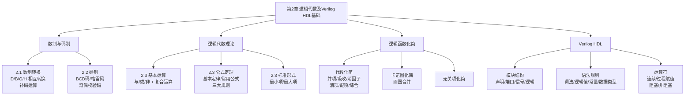

# 第2章总结：逻辑代数及Verilog HDL基础

---

## 知识脉络

---

## 核心公式汇总表

### 数制转换公式

| 公式 | 说明 |
|------|------|
| \((N)_R = \sum_{i=-m}^{n-1} a_i R^i\) | 任意进制按权展开为十进制 |
| 整数转换：除 \(R\) 取余，逆序排列 | 十进制整数 → R进制整数 |
| 小数转换：乘 \(R\) 取整，顺序排列 | 十进制小数 → R进制小数 |
| 二进制→八进制：3位一组 | 从小数点向两侧分组 |
| 二进制→十六进制：4位一组 | 从小数点向两侧分组 |

### 补码公式

| 公式 | 说明 |
|------|------|
| \([N]_{\text{反}} = N\;(N \geq 0),\; 2^n-1-\|N\|\;(N < 0)\) | 反码定义 |
| \([N]_{\text{补}} = N\;(N \geq 0),\; 2^n-\|N\|\;(N < 0)\) | 补码定义 |
| 负数补码 = 反码 + 1 | 快速转换规则 |
| \([[X]_{\text{补}}]_{\text{补}} = [X]_{\text{原}}\) | 补码还原 |
| \([X]_{\text{补}} + [Y]_{\text{补}} = [X+Y]_{\text{补}}\) | 补码加法 |

### 逻辑代数基本公式

| 类别 | 公式 |
|------|------|
| 0-1律 | \(A \cdot 0 = 0,\; A + 1 = 1\) |
| 自等律 | \(A \cdot 1 = A,\; A + 0 = A\) |
| 重叠律 | \(A \cdot A = A,\; A + A = A\) |
| 互补律 | \(A \cdot \overline{A} = 0,\; A + \overline{A} = 1\) |
| 交换律 | \(AB = BA,\; A+B = B+A\) |
| 结合律 | \(A(BC) = (AB)C,\; A+(B+C) = (A+B)+C\) |
| 分配律 | \(A(B+C) = AB + AC,\; A+BC = (A+B)(A+C)\) |
| 还原律 | \(\overline{\overline{A}} = A\) |
| De Morgan | \(\overline{AB} = \overline{A} + \overline{B},\; \overline{A+B} = \overline{A} \cdot \overline{B}\) |

### 常用吸收律

| 编号 | 公式 |
|:----:|------|
| (1) | \(AB + A\overline{B} = A\) |
| (2) | \(A + AB = A\) |
| (3) | \(A + \overline{A}B = A + B\) |
| (4) | \(AB + \overline{A}C + BC = AB + \overline{A}C\) |

### 三大规则

| 规则 | 操作 | 变量处理 |
|------|------|:--------:|
| **代入定理** | 用逻辑式替换变量 | — |
| **反演定理** | \(\cdot \leftrightarrow +\)，\(0 \leftrightarrow 1\) | 原变量 \(\leftrightarrow\) 反变量 |
| **对偶定理** | \(\cdot \leftrightarrow +\)，\(0 \leftrightarrow 1\) | 变量不变 |

### 逻辑运算真值表汇总

| A | B | AND | OR | NAND | NOR | XOR | XNOR |
|:-:|:-:|:---:|:--:|:----:|:---:|:---:|:----:|
| 0 | 0 | 0 | 0 | 1 | 1 | 0 | 1 |
| 0 | 1 | 0 | 1 | 1 | 0 | 1 | 0 |
| 1 | 0 | 0 | 1 | 1 | 0 | 1 | 0 |
| 1 | 1 | 1 | 1 | 0 | 0 | 0 | 1 |

---

## 常用码制速查

| 十进制 | 8421BCD | 2421BCD | 余3码 | 格雷码 |
|:------:|:-------:|:-------:|:-----:|:------:|
| 0 | 0000 | 0000 | 0011 | 0000 |
| 1 | 0001 | 0001 | 0100 | 0001 |
| 2 | 0010 | 0010 | 0101 | 0011 |
| 3 | 0011 | 0011 | 0110 | 0010 |
| 4 | 0100 | 0100 | 0111 | 0110 |
| 5 | 0101 | 1011 | 1000 | 0111 |
| 6 | 0110 | 1100 | 1001 | 0101 |
| 7 | 0111 | 1101 | 1010 | 0100 |
| 8 | 1000 | 1110 | 1011 | 1100 |
| 9 | 1001 | 1111 | 1100 | 1101 |

---

## 化简方法对比

| 方法 | 适用变量数 | 优点 | 缺点 |
|------|:----------:|------|------|
| 代数法 | 不限 | 灵活、通用 | 无固定步骤，不易判断最简 |
| 卡诺图 | ≤ 4 (最佳) | 直观、固定步骤 | 变量多时操作困难 |
| Q-M算法 | 不限 | 适合计算机 | 手工繁琐 |

---

## Verilog HDL 核心要点速查

| 要点 | 说明 |
|------|------|
| 模块结构 | `module` → 端口定义 → 信号声明 → 逻辑描述 → `endmodule` |
| 三种描述方式 | 结构级（门实例化）、数据流（`assign`）、行为级（`always`） |
| 逻辑值 | 0, 1, x（未知）, z（高阻） |
| `wire` vs `reg` | `wire`：连线，用 `assign`赋值；`reg`：存储，在 `always`/`initial` 内赋值 |
| 阻塞 `=` | 顺序执行，组合逻辑使用 |
| 非阻塞 `<=` | 并行执行，时序逻辑使用 |
| 常量格式 | `<位宽>'<基数><数值>`，如 `8'hFF` |

---

## 关键概念小结

1. **数制转换是数字电路的基本功**：二进制/八进制/十六进制之间的快速转换贯穿整个数字设计。
2. **补码使减法变加法**：所有算术运算最终归结为"移位+加法"两种操作，这是CPU ALU设计的核心思想。
3. **逻辑代数是一切组合电路分析设计的理论基础**：真值表、表达式、卡诺图、逻辑图四者等价且可相互转换。
4. **化简的终极目标是"最简与或式"**：与项最少且每项变量最少，对应电路门数最少、输入端最少。
5. **Verilog HDL是描述硬件而非软件**：代码的并行执行语义、线网/变量的区分、阻塞/非阻塞赋值的选择都是硬件思维的体现。
6. **自顶向下 + EDA工具 = 现代数字设计方法**：从需求到架构到RTL编码到综合实现，形成完整的自动化设计流程。
