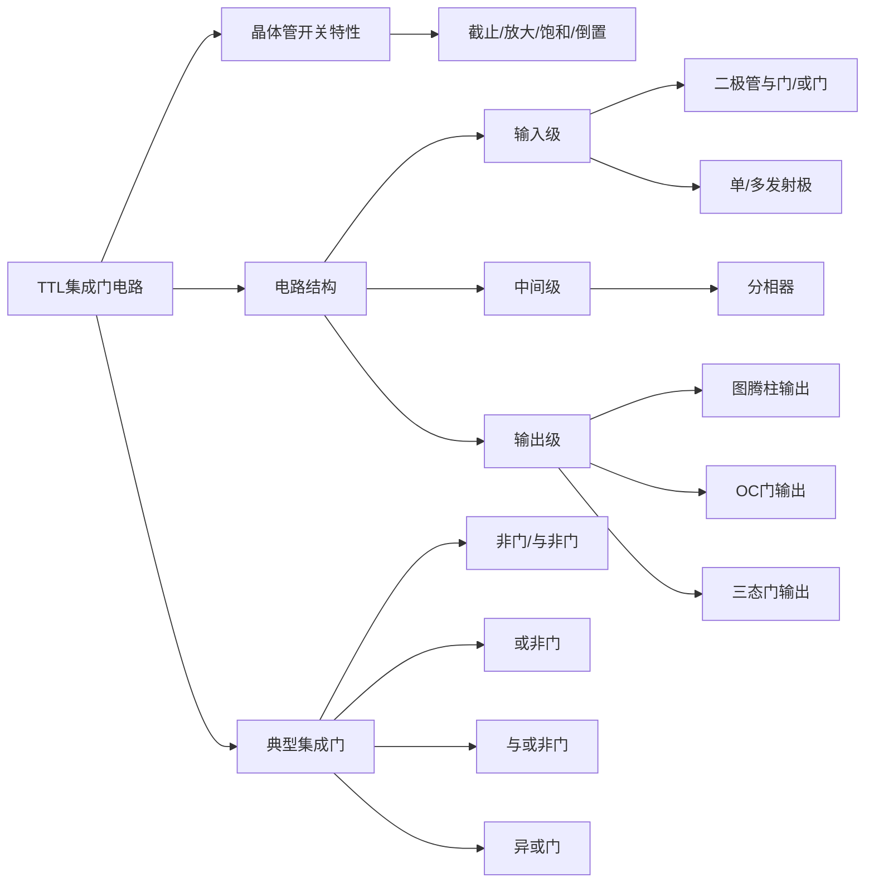

# 3.2 TTL集成门电路

TTL集成电路（Transistor-Transistor Logic）的输入端和输出端基本开关都是半导体三极管，因此称为三极管-三极管逻辑电路。TTL集成电路应用最早、技术比较成熟，曾经是电路设计中使用最广泛的电路类型。

---

## 一、晶体管的开关特性

NPN型三极管有四种工作状态，由发射结和集电结的偏置状态决定：

| 发射结 | 集电结 | 工作状态 | 特点 |
|:---:|:---:|:---:|------|
| 反偏 | 反偏 | **截止** | 几乎无电流，相当于开关断开 |
| 正偏 | 反偏 | **放大** | \(I_C = \beta \cdot I_B\)，电流被放大 |
| 正偏 | 正偏 | **饱和** | C-E之间压降很小（约 0.1~0.3V），相当于开关闭合 |
| 反偏 | 正偏 | **倒置** | 发射极与集电极角色互换，电流增益很小 |

在TTL电路中，合理地选择电路参数：
- 当 \(v_I = V_{IL}\) 时，晶体管截止，相当于开关断开
- 当 \(v_I = V_{IH}\) 且 \(i_B\) 足够大时，三极管工作在深度饱和状态，相当于开关闭合

三极管的 c-e 间相当于一个受 \(v_I\) 控制的非触点开关。

!!! warning "易错点"
    在TTL门电路的输入级，当输入为高电平时，输入三极管工作在**倒置**状态而非截止状态。倒置状态下电流增益很小（\(\beta_R \approx 0.02\)），用于实现与逻辑、快速关断、抗饱和和降低功耗。

---

## 二、TTL集成门电路的电路结构

### 1. 总体结构

```
输入 → 输入级 → 中间级 → 输出级 → 输出
```

- **输入级**：实现基本的逻辑功能（如与、或）
- **中间级**：产生驱动信号（分相、放大）
- **输出级**：提升驱动能力，降低输出电阻

### 2. 典型输入级形式

#### （1）二极管与门输入

| A | B | C | 逻辑关系 |
|:---:|:---:|:---:|:---:|
| 0 | 0 | 0 | \(C = AB\) |
| 0 | 1 | 0 | |
| 1 | 0 | 0 | |
| 1 | 1 | 1 | |

#### （2）二极管或门输入

| A | B | C | 逻辑关系 |
|:---:|:---:|:---:|:---:|
| 0 | 0 | 0 | \(C = A+B\) |
| 0 | 1 | 1 | |
| 1 | 0 | 1 | |
| 1 | 1 | 1 | |

#### （3）单发射极输入

- 当 \(V_A = V_{IL}\) 时，VT饱和导通，\(V_{CA}\) 约 0.1~0.3V，输出低电平
- 当 \(V_A = V_{IH}\) 时，VT倒置，输出高电平

逻辑关系：\(C = \overline{A}\)（非逻辑）。钳位二极管 VD 用于抑制输入端可能出现的负极性干扰脉冲，保护 VT 发射极。

#### （4）多发射极输入

- 当 \(V_A = V_{IL}\) 或 \(V_B = V_{IL}\) 时，VT至少有一个发射结导通，工作在饱和状态，输出低电平
- 当 \(V_A = V_B = V_{IH}\) 时，VT倒置，输出高电平

逻辑关系：\(C = \overline{AB}\)（与非逻辑）。\(I_{D(max)} \approx 20\text{mA}\)。

### 3. 典型中间级形式

#### （1）单变量分相器

| A(V) | F1(V)（反相端） | F2(V)（同相端） |
|:---:|:---:|:---:|
| 0.3 | 12 | 0 |
| 3.0 | 2.6 | 2.3 |

分相器将输入信号分成一对互补信号，供输出级使用。反相端与输入反方向变化，同相端与输入同方向变化。

#### （2）两个变量之或的分相器

\[
F_1 = \overline{A + B},\quad F_2 = f(A+B)
\]

#### （3）多个变量之或的分相器

\[
\begin{cases}
F_1 = \overline{A + B + C + \cdots + K} \\
F_2 = A + B + C + \cdots + K
\end{cases}
\]

### 4. 典型输出级形式

#### （1）图腾柱输出（Totem-Pole）

- VT1和VT2总是一管导通、另一管截止，**静态功耗较低**
- **输出电阻很低**，驱动能力强
- 输出高低电平固定

#### （2）图腾柱和复合管输出（达林顿结构）

- 可加速开关过程
- 输出电阻更小，速度更快
- 驱动能力进一步增强
- 静态功耗增加

#### （3）集电极开路（OC）门输出

- 需外接电源和上拉电阻才能正常工作
- 输出电平可变（可通过选择上拉电压实现电平变换）
- 输出端可直接并联使用，实现**"线与"**
- 可实现高电压、大电流驱动

\[
Y = \overline{AB} \quad \text{（以OC与非门为例）}
\]

!!! warning "易错点"
    OC门输出端可以直接并联实现"线与"，但普通推挽输出的TTL门**不允许**输出端直接并联，否则可能导致器件损坏。

#### （4）三态（TS）门输出

- 具有控制 VT1、VT2 均截止的电路
- 当控制有效时，输出端呈现**高阻态（Z）**
- 当控制无效时，按逻辑门正常功能输出 0、1 状态
- 即具有"三态"：高电平、低电平、高阻

---

## 三、几种典型TTL集成门

### 1. TTL非门（反相器）

**电路结构**：单发射极（输入级）+ 单变量分相（中间级）+ 图腾柱（输出级）

**工作原理：**

| \(A(u_I)\) | T1 | T2 | T3 | T4 | \(F(u_O)\) |
|:---:|:---:|:---:|:---:|:---:|:---:|
| 0.2V | 饱和导通 | 截止 | 导通 | 截止 | 3.6V |
| 3.4V | 倒置工作 | 饱和导通 | 截止 | 饱和导通 | 0.3V |

**电压传输特性**分为四个区域：

| 区域 | \(v_I\) 范围 | 状态 |
|:---:|------|------|
| **截止区** | \(v_I\) 很低 | T2截止，输出高电平 |
| **线性区** | \(v_I\) 逐步增大 | T2进入放大，输出开始下降 |
| **转折区** | \(v_I \approx V_{TH}\) | 状态急剧翻转，输出迅速下降 |
| **饱和区** | \(v_I\) 足够高 | T2深度饱和，输出低电平 |

### 2. TTL集成与非门

电路结构：多发射极（输入级）+ 单变量分相（中间级）+ 图腾柱（输出级）。

输入级采用多发射极三极管实现 \(AB\) 逻辑，与分相器和输出级配合，最终输出 \(Y = \overline{AB}\)。

### 3. TTL集成或非门

通过并联输入三极管实现或逻辑，最终输出 \(Y = \overline{A+B}\)。

### 4. TTL集成与或非门

两路独立的与输入（\(AB\) 和 \(CD\)）分别经各自输入级和分相级处理后合并，输出 \(Y = \overline{AB + CD}\)。

### 5. TTL集成异或门

通过多级三极管网络实现 \(Y = A \oplus B = \overline{A}B + A\overline{B}\) 的逻辑功能。

---

## 知识脉络


