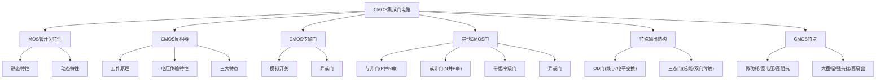

# 3.3 CMOS集成门电路

CMOS（Complementary Metal-Oxide-Semiconductor）互补金属氧化物半导体门电路是现代数字集成电路的主流技术。其核心优势在于**微功耗**、**高集成度**和**宽电源电压范围**。

---

## 一、MOS管的开关特性

### 1. MOS管基本结构

MOS管（金属-氧化物-半导体场效应管）有三个电极：

- **源极 S**（Source）
- **栅极 G**（Gate）
- **漏极 D**（Drain）

按导电沟道类型分为**N沟道增强型**和**P沟道增强型**。增强型MOS管在栅源电压为零时不导电，需要施加超过阈值的栅源电压才能形成导电沟道。

#### 静态开关特性

MOS管作为开关元件，工作在截止或导通两种状态，主要由**栅源电压 \(V_{GS}\)** 决定：

- \(V_{GS} < V_{GS(th)}\)：MOS管截止，D-S间相当于开路
- \(V_{GS} > V_{GS(th)}\)：MOS管导通，D-S间相当于小电阻（几十欧姆）

#### 动态开关特性

MOS管的开关速度受杂散电容充放电时间的影响：

- \(v_G\) 由高变低（导通到截止）：通过 \(R_D\) 向杂散电容 \(C_L\) 充电，充电时间常数 \(\tau_1 = R_D \cdot C_L\)
- \(v_G\) 由低变高（截止到导通）：杂散电容 \(C_L\) 通过 \(R_{DS}\) 放电，放电时间常数 \(\tau_2 = R_{DS} \cdot C_L\)

!!! warning "易错点"
    MOS管的充放电时间较长，开关速度比晶体三极管的开关速度低。且截止到导通的转换时间比导通到截止的转换时间短（因为 \(R_{DS}\) 较小）。

---

## 二、CMOS反相器

### 1. 重要地位

- CMOS反相器的电路结构是CMOS电路的基本结构
- CMOS反相器和传输门是构成复杂CMOS电路的两种基本模块
- CMOS反相器通常应用于CMOS电路的输入、输出端，作缓冲器使用

### 2. 工作原理

CMOS反相器由一只N沟道增强型MOS管（\(VT_N\)）和一只P沟道增强型MOS管（\(VT_P\)）串联组成，两管栅极相连作为输入，漏极相连作为输出。

**工作条件**：\(V_{DD} > V_{GS(th)N} + |V_{GS(th)P}|\)

#### 输入为低电平（\(v_I = V_{IL} \approx 0\)）时：

\[
\begin{aligned}
|V_{GS(P)}| &= V_{DD} - 0 = V_{DD} > |V_{GS(th)P}|,\quad VT_P \text{导通} \\
V_{GS(N)} &= 0 < V_{GS(th)N},\quad VT_N \text{截止}
\end{aligned}
\]

\[
v_O = V_{OH} \approx V_{DD}
\]

#### 输入为高电平（\(v_I = V_{IH} \approx V_{DD}\)）时：

\[
\begin{aligned}
V_{GS(N)} &= V_{DD} > V_{GS(th)N},\quad VT_N \text{导通} \\
|V_{GS(P)}| &\approx 0 < |V_{GS(th)P}|,\quad VT_P \text{截止}
\end{aligned}
\]

\[
v_O = V_{OL} \approx 0
\]

### 3. 电压传输特性

CMOS反相器的电压传输特性曲线分为三段：

| 区域 | 条件 | 状态 |
|:---:|------|------|
| **AB段** | \(v_I < V_{GS(th)N}\) | \(VT_N\)截止，\(VT_P\)导通，\(v_O = V_{DD}\) |
| **BC段（转折区）** | \(V_{GS(th)N} < v_I < V_{DD} - |V_{GS(th)P}|\) | 两管均导通，\(v_O\)随\(v_I\)急剧变化 |
| **CD段** | \(v_I > V_{DD} - |V_{GS(th)P}|\) | \(VT_N\)导通，\(VT_P\)截止，\(v_O \approx 0\) |

在转折区BC段中，当 \(v_I = V_{DD}/2\) 时，两管的导通电阻相等，曲线急剧变化（转折）。

### 4. CMOS反相器特点

| 特点 | 说明 |
|:---|------|
| **噪声容限接近50%** | \(V_{TH} = V_{DD}/2\)处两管状态切换 |
| **开关速度快** | 总有一管导通且导通电阻较小，充放电速度快，\(t_{pd} \approx 10\text{ns}\) |
| **静态功耗极低** | 无论何种状态，\(VT_N\)和\(VT_P\)中总有一管截止，有"微功耗电路"之称 |

---

## 三、CMOS传输门

### 1. 工作原理

CMOS传输门由一只NMOS管和一只PMOS管并联组成，两管栅极分别接互补控制信号 \(C\) 和 \(\overline{C}\)。

- **当 \(C = -5\text{V}\)，\(\overline{C} = +5\text{V}\)**：\(VT_N\) 和 \(VT_P\) 均截止，电路不导通，开关断开
- **当 \(C = +5\text{V}\)，\(\overline{C} = -5\text{V}\)**：\(VT_N\) 和 \(VT_P\) 均导通，电路导通，开关闭合

CMOS传输门导通后可双向传输信号，既可以传输数字信号，也可以传输模拟信号。

### 2. 应用示例

**应用一：CMOS模拟开关**——传输门导通时可直接传输模拟信号，广泛用于采样-保持、数/模和模/数转换、斩波等电路。

**应用二：CMOS异或门**——利用CMOS传输门和CMOS反相器可以组合成各种复杂的逻辑电路（异或门、数据选择器、寄存器、计数器等）。

---

## 四、其他典型CMOS集成门电路

### 1. CMOS与非门（P并N串）

结构规律：**PMOS管并联，NMOS管串联**。

| A | B | Y |
|:---:|:---:|:---:|
| 0 | 0 | 1 |
| 0 | 1 | 1 |
| 1 | 0 | 1 |
| 1 | 1 | 0 |

### 2. CMOS或非门（N并P串）

结构规律：**NMOS管并联，PMOS管串联**。

| A | B | Y |
|:---:|:---:|:---:|
| 0 | 0 | 1 |
| 0 | 1 | 0 |
| 1 | 0 | 0 |
| 1 | 1 | 0 |

!!! warning "易错点"
    CMOS与非门是 **P并N串**，或非门是 **N并P串**。记忆技巧：与门对应串联（NMOS串联），或门对应并联（NMOS并联），PMOS则取反（与门用并联，或门用串联）。

### 3. 带缓冲级的CMOS与非门/或非门

在基本CMOS门电路的输入和输出端增加反相器作为缓冲级，可以：
- 提高输入阻抗
- 增强驱动能力
- 改善电压传输特性

### 4. CMOS异或门

通过传输门和反相器组合实现：
\[
Y = A \oplus B
\]

---

## 五、CMOS漏极开路门（OD门）

### 1. OD门电路结构

OD门（Open-Drain）是输出MOS管漏极开路的门电路，与TTL的OC门类似。

### 2. OD门的特点

1. 输出MOS管的漏极是开路的，工作时**必须外接电源 \(V_{DD}'\) 和上拉电阻 \(R_P\)**
2. 可以用来实现**逻辑电平变换**
3. 可以实现**"线与"**功能——将几个OD门的输出端用导线连接起来实现线与运算

---

## 六、CMOS三态门

### 1. 电路结构

CMOS三态门在普通CMOS门的基础上增加了使能控制电路。按使能电平分为：
- **高电平使能**三态门
- **低电平使能**三态门

### 2. 三态门的特点

- 三态：**低电平、高电平、高阻**
- 可做成单输入、单输出的总线驱动器
- 可实现同一导线上分时传送若干门电路的输出信号（**总线结构**）
- 可实现数据的**双向传输**

### 3. 典型应用

**应用一：总线结构**——多个设备共享同一数据总线，通过三态门分时控制各设备的输出。

**应用二：数据双向传输**——通过三态门控制数据的发送和接收方向。

---

## 七、CMOS集成门的特点

| 特点 | 说明 |
|:---|------|
| **静态功耗低** | 两管总有一管截止 |
| **电源电压范围宽** | 例：CC4000系列 \(V_{DD}\) 为 3~18V |
| **输入阻抗高** | 低频时直流输入阻抗 > 100M\(\Omega\) |
| **逻辑摆幅大** | 空载时 \(V_{OH} \approx V_{DD}\)，\(V_{OL} \approx V_{SS}\) |
| **噪声容限大** | 约为电源电压的 45% |
| **扇出能力强** | 低频时一个CMOS门可驱动 50 个以上同类门 |
| **温度稳定性好** | 抗辐射能力强 |
| **集成度高，成本低** | |

---

## 知识脉络

