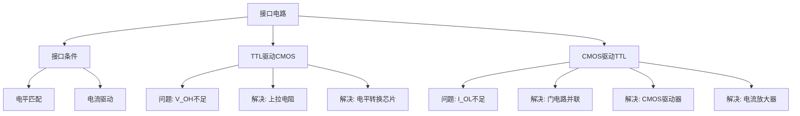

# 3.4 不同逻辑门间的接口电路

在实际数字系统中，往往需要将不同类型的逻辑门电路（TTL与CMOS）互相连接。驱动门与负载门之间必须满足一定的电压电流关系，才能保证电路正常工作。

---

## 一、接口条件

当驱动门驱动负载门时，必须同时满足电平匹配和电流驱动两个条件：

### 电平匹配条件

\[
V_{OH(min)} \geq V_{IH(min)}
\]
\[
V_{OL(max)} \leq V_{IL(max)}
\]

驱动门输出的高电平最低值不能低于负载门要求的高电平输入最低值；驱动门输出的低电平最高值不能高于负载门要求的低电平输入最高值。

### 电流驱动条件

\[
|I_{OH(max)}| \geq n \cdot |I_{IH(max)}|
\]
\[
|I_{OL(max)}| \geq m \cdot |I_{IL(max)}|
\]

其中 \(n\)、\(m\) 分别为高电平和低电平下驱动门可带负载门的数量（即**扇出系数**）。

---

## 二、TTL、CMOS电路的输入输出特性参数

| 参数名称 | TTL 74系列 | TTL 74LS系列 | CMOS 4000系列 | 高速CMOS 74HC系列 | 高速CMOS 74HCT系列 |
|:---|:---:|:---:|:---:|:---:|:---:|
| \(V_{OH(min)}\) (V) | 2.4 | 2.7 | 4.6 | 4.4 | 4.4 |
| \(V_{OL(max)}\) (V) | 0.4 | 0.5 | 0.05 | 0.1 | 0.1 |
| \(I_{OH(max)}\) (mA) | -0.4 | -0.4 | -0.51 | -4 | -4 |
| \(I_{OL(max)}\) (mA) | 16 | 8 | 0.51 | 4 | 4 |
| \(V_{IH(min)}\) (V) | 2 | 2 | 3.5 | 3.5 | 2 |
| \(V_{IL(max)}\) (V) | 0.8 | 0.8 | 1.5 | 1 | 0.8 |
| \(I_{IH(max)}\) (\(\mu\)A) | 40 | 20 | 0.1 | 0.1 | 0.1 |
| \(I_{IL(max)}\) (mA) | -1.6 | -0.4 | \(-0.1 \times 10^{-3}\) | \(-0.1 \times 10^{-3}\) | \(-0.1 \times 10^{-3}\) |

!!! warning "易错点"
    注意 74HCT 系列是专门为兼容 TTL 电平而设计的 CMOS 电路，其 \(V_{IH(min)} = 2\text{V}\) 与 TTL 一致，可直接互连。

---

## 三、用TTL电路驱动CMOS电路

### 问题分析

以 TTL 74系列驱动 CMOS 4000系列为例：

\[
V_{OH(min)}^{TTL} = 2.4\text{V} < V_{IH(min)}^{CMOS} = 3.5\text{V}
\]

TTL输出的高电平最低值（2.4V）低于CMOS要求的高电平输入最低值（3.5V），**电平不匹配**！但电流驱动能力足够。

### 解决方法

#### 方法一：使用上拉电阻

在 TTL 输出端与 \(V_{DD}\) 之间接上拉电阻 \(R_P\)，将 TTL 输出高电平提升到接近 \(V_{DD}\)（如 5V 或 15V）。

要求：\(R_P\) 的取值需使提升后的电压满足 \(V_{OH(min)}' \geq V_{IH(min)}^{CMOS}\)。

#### 方法二：使用专门的电平转换芯片

使用专用的电平转换器（Level Shifter）芯片实现 TTL 到 CMOS 的电平转换，这是最可靠的解决方案。

---

## 四、用CMOS电路驱动TTL电路

### 问题分析

以 CMOS 4000系列驱动 TTL 74系列为例：

**电平条件：**

\[
V_{OH(min)}^{CMOS} = 4.6\text{V} \geq V_{IH(min)}^{TTL} = 2.0\text{V} \quad \checkmark
\]
\[
V_{OL(max)}^{CMOS} = 0.05\text{V} \leq V_{IL(max)}^{TTL} = 0.8\text{V} \quad \checkmark
\]

电平匹配没问题。

**电流条件：**

\[
|I_{OL(max)}^{CMOS}| = 0.51\text{mA} < |I_{IL(max)}^{TTL}| = 1.6\text{mA} \quad \times
\]

CMOS 4000系列的低电平输出电流能力（0.51mA）**不足以驱动** TTL 74系列的一个输入端（需要 1.6mA）！

### 解决方法

#### 方法一：同一封装内门电路并联使用

将同一封装内的多个CMOS门电路的输入和输出分别并联，以提高总的电流驱动能力。

#### 方法二：增加一级CMOS驱动器

在CMOS输出端增加一级专门的CMOS驱动器（如CC4010同相驱动器、CC40107 OD驱动器），这些驱动器的 \(I_{OL}\) 远大于普通CMOS门。

#### 方法三：使用分立元件接口电路实现电流扩展

通过外加三极管等分立元件构成电流放大级，实现电流扩展。

---

## 知识脉络

