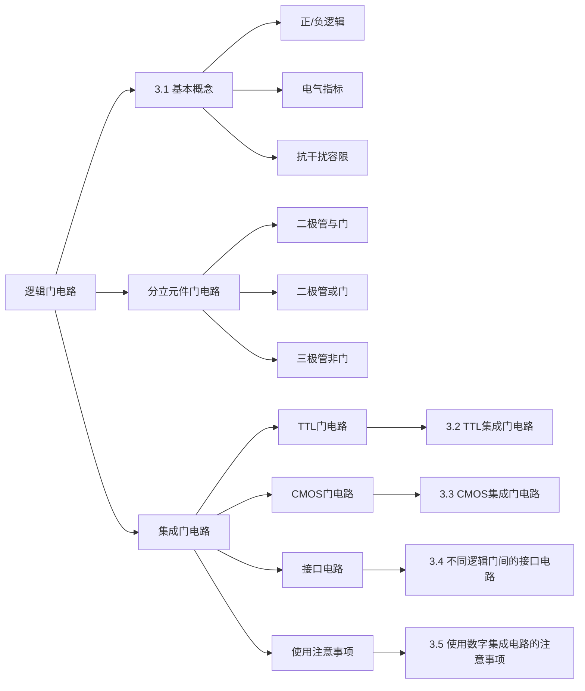

# 逻辑门电路

逻辑门电路是数字电路中最基本的组成单元，用以实现基本逻辑运算和复合逻辑运算。本章系统介绍从分立元件门电路到集成门电路（TTL、CMOS）的工作原理、电气特性及实际应用注意事项。

---

## 3.1 逻辑门电路简介

### 一、逻辑门电路基本概念

**逻辑门电路**是指用以实现基本逻辑运算和复合逻辑运算的单元电路。常用的逻辑门电路包括：

- **与门**（AND）—— \( Y = A \cdot B \)
- **或门**（OR）—— \( Y = A + B \)
- **非门**（NOT）—— \( Y = \overline{A} \)
- **与非门**（NAND）—— \( Y = \overline{A \cdot B} \)
- **或非门**（NOR）—— \( Y = \overline{A + B} \)
- **与或非门**（AND-OR-INVERT）—— \( Y = \overline{AB + CD} \)
- **异或门**（XOR）—— \( Y = A \oplus B \)

#### 正逻辑与负逻辑

在数字电路中，用电平高低表示二值逻辑状态：

\[
\text{正逻辑：高电平} \rightarrow 1,\quad \text{低电平} \rightarrow 0
\]

\[
\text{负逻辑：高电平} \rightarrow 0,\quad \text{低电平} \rightarrow 1
\]

通常默认采用**正逻辑**。数字电路对元器件参数精度和电源稳定度的要求较模拟电路低。

!!! warning "易错点"
    正逻辑和负逻辑的区分是关键。同一电路在不同逻辑约定下，实现的逻辑功能完全不同。例如，正逻辑下的与门在负逻辑下等效为或门。考试中注意审题，明确题目采用的逻辑约定。

---

### 二、集成电路的电气指标

#### 1. 输出电压与输入电压

| 参数 | 含义 | 5V CMOS | 5V TTL | LVTTL | 2.5V CMOS |
|:---:|------|:---:|:---:|:---:|:---:|
| \(V_{OH(min)}\) | 输出高电平最小值 | 4.4V | 2.4V | 2.4V | 2.3V |
| \(V_{OL(max)}\) | 输出低电平最大值 | 0.5V | 0.4V | 0.4V | 0.2V |
| \(V_{TH}\) | 阈值电压 | 2.5V | 1.5V | 1.5V | 1.2V |
| \(V_{IH(min)}\) | 输入高电平允许最小值 | 3.5V | 2.0V | 2.0V | 1.7V |
| \(V_{IL(max)}\) | 输入低电平允许最大值 | 1.5V | 0.8V | 0.8V | 0.7V |

!!! warning "易错点"
    \(V_{OH(min)}\) 和 \(V_{IH(min)}\) 容易混淆。\(V_{OH(min)}\) 是**输出**高电平时保证的最小值，\(V_{IH(min)}\) 是**输入**被识别为高电平所需的最小值。前者是驱动能力指标，后者是识别阈值。

**工作电压演变趋势：**

- **TTL**：工作电压几乎始终锁定在 5V，内部阈值优化、功耗降低、速度提升，后期推出 3.3V 低压变种（LVTTL）。
- **CMOS**：工作电压随工艺节点缩小而持续降低，主线从早期 18V 一路降至如今的约 0.7V，目的是控制功耗、提升频率、防止击穿。

#### 2. 抗干扰容限

抗干扰容限（Noise Margin）衡量电路在保证逻辑功能正确的前提下，允许叠加在输入信号上的最大噪声电压。

\[
V_{NH} = V_{OH(min)} - V_{IH(min)}
\]

\[
V_{NL} = V_{IL(max)} - V_{OL(max)}
\]

其中 \(V_{NH}\) 为高电平抗干扰容限，\(V_{NL}\) 为低电平抗干扰容限。

**计算示例——5V TTL：**

\[
V_{NH} = 2.4V - 2.0V = 0.4V
\]

\[
V_{NL} = 0.8V - 0.4V = 0.4V
\]

**计算示例——5V CMOS：**

\[
V_{NH} = 4.4V - 3.5V = 0.9V
\]

\[
V_{NL} = 1.5V - 0.5V = 1.0V
\]

可见 CMOS 电路的抗干扰能力远优于 TTL 电路。

---

### 三、分立元件门电路

#### 1. 二极管与门

利用二极管的单向导电性实现与逻辑：

| A | B | Y(V) | 逻辑(Y) |
|:---:|:---:|:---:|:---:|
| 0 | 0 | 0.7 | 0 |
| 0 | 3 | 0.7 | 0 |
| 3 | 0 | 0.7 | 0 |
| 3 | 3 | 3.7 | 1 |

当任一输入为低电平（0V），对应二极管导通，输出被钳位在约 0.7V（低电平）；只有当所有输入均为高电平（3V）时，所有二极管截止，输出才为高电平。

#### 2. 二极管或门

| A | B | Y(V) | 逻辑(Y) |
|:---:|:---:|:---:|:---:|
| 0 | 0 | 0 | 0 |
| 0 | 3 | 2.3 | 1 |
| 3 | 0 | 2.3 | 1 |
| 3 | 3 | 2.3 | 1 |

当任一输入为高电平时，对应二极管导通，输出为高电平（约 2.3V，因二极管有 0.7V 正向压降）；只有所有输入均为低电平时，所有二极管截止，输出才为低电平。

#### 3. 三极管非门（反相器）

利用 NPN 三极管的开关特性实现非逻辑：

- 当 \(v_I = V_{IL}\) 时，三极管截止，\(v_O \approx V_{CC}\)（高电平）
- 当 \(v_I = V_{IH}\) 且 \(i_B\) 足够大时，三极管深度饱和导通，\(v_O \approx V_{CE(sat)}\)（低电平，约 0.1~0.3V）

三极管的 c-e 间相当于一个受 \(v_I\) 控制的非触点开关。

#### 分立元件门电路的局限

1. **体积大、功耗大、可靠性差**；
2. 输出与输入之间会发生高、低电平的偏移（如二极管正向压降 0.7V）；
3. 输出端负载电阻的接入会对输出电平造成影响，无法直接驱动负载电路。

---

### 四、集成电路的分类

#### 按输出结构分类

| 输出结构 | 特点 |
|:---|------|
| **推挽式输出**（Totem-Pole） | 上下两管交替导通，输出电阻低，静态功耗低 |
| **OC/OD输出**（集电极开路/漏极开路） | 需外接上拉电阻，可实现"线与"和电平变换 |
| **三态输出**（Tri-State） | 具有高电平、低电平和高阻三种状态，适合总线结构 |

#### 按制造工艺分类

| 类型 | 代表系列 | 特点 |
|:---|------|------|
| **双极型**（TTL、ECL） | 74系列 | 速度较快，功耗较大 |
| **MOS型**（NMOS、PMOS、CMOS） | 4000系列、74HC系列 | 功耗低，集成度高 |
| **Bi-CMOS型** | — | 结合双极型和CMOS优点 |

---

### 本章知识结构

