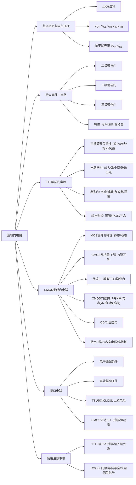

# 第3章总结：逻辑门电路

---

## 知识脉络总览

---

## 核心公式汇总

| 公式 | 含义 |
|:---|------|
| \(V_{NH} = V_{OH(min)} - V_{IH(min)}\) | 高电平抗干扰容限 |
| \(V_{NL} = V_{IL(max)} - V_{OL(max)}\) | 低电平抗干扰容限 |
| \(V_{OH(min)} \geq V_{IH(min)}\) | 接口电平匹配条件（高电平） |
| \(V_{OL(max)} \leq V_{IL(max)}\) | 接口电平匹配条件（低电平） |
| \(\lvert I_{OH(max)}\rvert \geq n \cdot \lvert I_{IH(max)}\rvert\) | 接口电流驱动条件（高电平） |
| \(\lvert I_{OL(max)}\rvert \geq m \cdot \lvert I_{IL(max)}\rvert\) | 接口电流驱动条件（低电平） |
| \(\tau_1 = R_D \cdot C_L\) | MOS管导通到截止的充电时间常数 |
| \(\tau_2 = R_{DS} \cdot C_L\) | MOS管截止到导通的放电时间常数 |

---

## 关键概念小结

### 1. TTL与CMOS对比

| 对比维度 | TTL | CMOS |
|:---|------|------|
| 基本开关元件 | 双极型三极管 | MOS场效应管 |
| 功耗 | 静态功耗较大（mA级） | 静态功耗极低（\(\mu\)W级） |
| 电源电压 | 5V固定（LVTTL为3.3V） | 宽范围（3~18V，先进工艺可低于1V） |
| 噪声容限 | 较小（约0.4V） | 大（约电源电压的45%） |
| 输入阻抗 | 较低（k\(\Omega\)级） | 极高（>100M\(\Omega\)） |
| 扇出能力 | 约10个同类门 | 低频时>50个同类门 |
| 速度 | 中等 | 快（\(t_{pd} \approx 10\text{ns}\)），随工艺仍有提升 |
| 多余输入端处理 | 不能悬空（悬空=1），应接Vcc或地 | **严禁悬空**，必须接 \(V_{DD}\) 或 \(V_{SS}\) |

### 2. 三极管工作状态速查

| 状态 | 发射结 | 集电结 | 应用场景 |
|:---|:---:|:---:|------|
| 截止 | 反偏 | 反偏 | 开关断开 |
| 放大 | 正偏 | 反偏 | 线性放大 |
| 饱和 | 正偏 | 正偏 | 开关闭合 |
| 倒置 | 反偏 | 正偏 | TTL输入级（输入为高时） |

### 3. CMOS与非门和或非门的结构规律

- **CMOS与非门**：P管并联 + N管串联（**P并N串**）
- **CMOS或非门**：N管并联 + P管串联（**N并P串**）

### 4. 三种特殊输出结构

| 输出结构 | TTL名称 | CMOS名称 | 核心应用 |
|:---|:---|:---|------|
| 推挽/互补输出 | 图腾柱 | CMOS反相器输出 | 常规逻辑驱动 |
| 集电极/漏极开路 | OC门 | OD门 | 线与、电平变换、大电流驱动 |
| 三态输出 | TS门 | TS门 | 总线结构、双向传输 |

### 5. TTL驱动CMOS vs CMOS驱动TTL

| 驱动方向 | 主要问题 | 解决方法 |
|:---|------|------|
| TTL -> CMOS | \(V_{OH(min)}^{TTL}\) 太低 | 上拉电阻、电平转换芯片 |
| CMOS -> TTL | \(I_{OL(max)}^{CMOS}\) 太小 | 门并联、CMOS驱动器、电流放大 |
