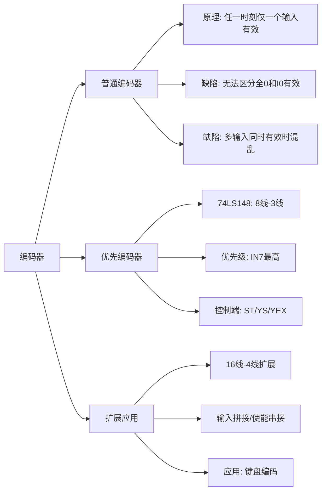

# 4.2 编码器

编码器（Encoder）是将输入信号转化为对应二进制代码的组合逻辑电路。编码是信息从一种形式转换为另一种形式的过程。

---

## 一、普通编码器

### 1. 工作原理

**普通编码器**要求任何时刻只允许输入一个待编码的信号，否则会发生混乱（输出不确定）。

以 8 线-3 线普通编码器为例：8 个输入（\(I_0 \sim I_7\)，高电平有效），3 位二进制编码输出（\(Y_2 Y_1 Y_0\)）。

**真值表：**

| \(I_0\) | \(I_1\) | \(I_2\) | \(I_3\) | \(I_4\) | \(I_5\) | \(I_6\) | \(I_7\) | \(Y_2\) | \(Y_1\) | \(Y_0\) |
|:---:|:---:|:---:|:---:|:---:|:---:|:---:|:---:|:---:|:---:|:---:|
| 1 | 0 | 0 | 0 | 0 | 0 | 0 | 0 | 0 | 0 | 0 |
| 0 | 1 | 0 | 0 | 0 | 0 | 0 | 0 | 0 | 0 | 1 |
| 0 | 0 | 1 | 0 | 0 | 0 | 0 | 0 | 0 | 1 | 0 |
| 0 | 0 | 0 | 1 | 0 | 0 | 0 | 0 | 0 | 1 | 1 |
| 0 | 0 | 0 | 0 | 1 | 0 | 0 | 0 | 1 | 0 | 0 |
| 0 | 0 | 0 | 0 | 0 | 1 | 0 | 0 | 1 | 0 | 1 |
| 0 | 0 | 0 | 0 | 0 | 0 | 1 | 0 | 1 | 1 | 0 |
| 0 | 0 | 0 | 0 | 0 | 0 | 0 | 1 | 1 | 1 | 1 |

由于普通编码器在任何时刻 \(I_0 \sim I_7\) 中仅有一个取值为 1，其他 248 种状态均为约束项。

**或门实现的逻辑表达式：**

\[
Y_2 = I_4 + I_5 + I_6 + I_7
\]

\[
Y_1 = I_2 + I_3 + I_6 + I_7
\]

\[
Y_0 = I_1 + I_3 + I_5 + I_7
\]

**与非门实现（德-摩根变换后）：**

\[
Y_2 = \overline{\overline{I_4} \cdot \overline{I_5} \cdot \overline{I_6} \cdot \overline{I_7}}
\]

\[
Y_1 = \overline{\overline{I_2} \cdot \overline{I_3} \cdot \overline{I_6} \cdot \overline{I_7}}
\]

\[
Y_0 = \overline{\overline{I_1} \cdot \overline{I_3} \cdot \overline{I_5} \cdot \overline{I_7}}
\]

### 2. 普通编码器的两个致命缺陷

1. **无法区分所有输入都无效和仅有 \(I_0\) 有效**——两者输出编码均为 000
2. **无法应对多个输入同时有效的情况**——会导致输出混乱

这催生了**优先编码器**的诞生。

---

## 二、优先编码器

### 1. 工作原理

**优先编码器**允许同时输入两个或两个以上编码信号。在设计时已规定了所有输入信号的优先级顺序，当几个输入信号同时出现时，只对其中**优先级最高**的一个进行编码。

以 **74LS148**（8线-3线优先编码器）为例分析。

**管脚功能：**

| 管脚 | 功能 |
|:---|------|
| \(IN_0 \sim IN_7\) | 编码输入端（**低电平有效**） |
| \(Y_2, Y_1, Y_0\) | 编码输出端（反码输出） |
| \(ST\) | 输入使能端（**低电平有效**），ST=1 时所有输出封锁为高电平 |
| \(Y_S\) | 输出使能端（低电平有效），表示"电路工作但无有效输入" |
| \(Y_{EX}\) | 扩展端（低电平有效），表示"电路工作且有有效输入" |

### 2. 74LS148 真值表

!!! warning "易错点"
    输入是**低电平有效**，所以当 \(IN_7=0\) 时表示第 7 路有输入。输出编码也是**反码**输出（即输出编码取反）。

| ST | \(IN_0\) | \(IN_1\) | \(IN_2\) | \(IN_3\) | \(IN_4\) | \(IN_5\) | \(IN_6\) | \(IN_7\) | \(Y_2\) | \(Y_1\) | \(Y_0\) | \(Y_{EX}\) | \(Y_S\) |
|:---:|:---:|:---:|:---:|:---:|:---:|:---:|:---:|:---:|:---:|:---:|:---:|:---:|:---:|
| 1 | x | x | x | x | x | x | x | x | 1 | 1 | 1 | 1 | 1 |
| 0 | 1 | 1 | 1 | 1 | 1 | 1 | 1 | 1 | 1 | 1 | 1 | 1 | 0 |
| 0 | x | x | x | x | x | x | x | 0 | 0 | 0 | 0 | 0 | 1 |
| 0 | x | x | x | x | x | x | 0 | 1 | 0 | 0 | 1 | 0 | 1 |
| 0 | x | x | x | x | x | 0 | 1 | 1 | 0 | 1 | 0 | 0 | 1 |
| 0 | x | x | x | x | 0 | 1 | 1 | 1 | 0 | 1 | 1 | 0 | 1 |
| 0 | x | x | x | 0 | 1 | 1 | 1 | 1 | 1 | 0 | 0 | 0 | 1 |
| 0 | x | x | 0 | 1 | 1 | 1 | 1 | 1 | 1 | 0 | 1 | 0 | 1 |
| 0 | x | 0 | 1 | 1 | 1 | 1 | 1 | 1 | 1 | 1 | 0 | 0 | 1 |
| 0 | 0 | 1 | 1 | 1 | 1 | 1 | 1 | 1 | 1 | 1 | 1 | 0 | 1 |

> 优先级：\(IN_7 > IN_6 > IN_5 > IN_4 > IN_3 > IN_2 > IN_1 > IN_0\)

### 3. 逻辑函数表达式

\[
Y_2 = (\overline{IN_4} + \overline{IN_5} + \overline{IN_6} + \overline{IN_7}) \cdot \overline{ST}
\]

\[
Y_1 = (\overline{IN_2} \cdot \overline{IN_4} \cdot \overline{IN_5} + \overline{IN_3} \cdot \overline{IN_4} \cdot \overline{IN_5} + \overline{IN_6} + \overline{IN_7}) \cdot \overline{ST}
\]

\[
Y_0 = (\overline{IN_1} \cdot \overline{IN_2} \cdot \overline{IN_4} \cdot \overline{IN_6} + \overline{IN_3} \cdot \overline{IN_4} \cdot \overline{IN_6} + \overline{IN_5} \cdot \overline{IN_6} + \overline{IN_7}) \cdot \overline{ST}
\]

\[
Y_S = \overline{IN_0} \cdot \overline{IN_1} \cdot \overline{IN_2} \cdot \overline{IN_3} \cdot \overline{IN_4} \cdot \overline{IN_5} \cdot \overline{IN_6} \cdot \overline{IN_7} \cdot \overline{ST}
\]

\[
Y_{EX} = (\overline{IN_0} + \overline{IN_1} + \overline{IN_2} + \overline{IN_3} + \overline{IN_4} + \overline{IN_5} + \overline{IN_6} + \overline{IN_7}) \cdot \overline{ST}
\]

---

## 三、优先编码器的扩展

### 用两片 74LS148 组成 16 线-4 线编码器

将 16 个独立的低电平信号编码为 4 位二进制代码 \(Z_3 Z_2 Z_1 Z_0\)：

**步骤：**

1. **输入拼接**——16 路输入分别接两片 74LS148 的 \(IN_0 \sim IN_7\)
2. **使能串接**——将低位片的 \(Y_{EX}\) 接到高位片的 \(ST\)，实现优先级控制
3. **低位与非**——低位片的 \(Y_2,Y_1,Y_0\) 经与非门输出
4. **高位扩展取反**——高位片输出的编码经取反后作为高位输出
5. **扩展相与**——\(Y_S\) 和 \(Y_{EX}\) 信号合并

> 键盘中使用的是**优先编码器**，这样可以正确处理同时按下多个按键的情况。

---

## 知识脉络

