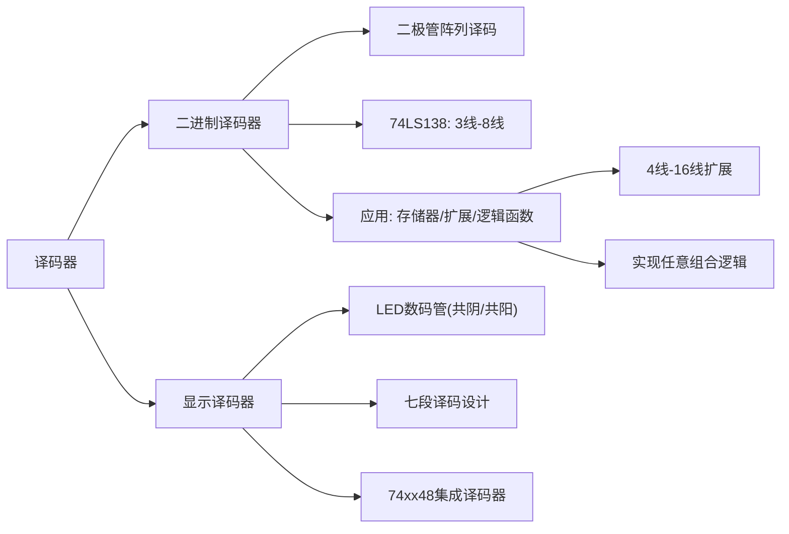

# 4.3 译码器

译码是编码的反操作。译码器（Decoder）将输入的二进制代码翻译为对应的高、低电平输出信号。常用的译码器有二进制译码器、显示译码器和二-十进制译码器。

---

## 一、二进制译码器

### 1. 3线-8线译码器基本原理

3位二进制译码器将 3 位输入代码翻译为 8 路输出，每路输出对应一个最小项。

**真值表：**

| \(A_2\) | \(A_1\) | \(A_0\) | \(Y_7\) | \(Y_6\) | \(Y_5\) | \(Y_4\) | \(Y_3\) | \(Y_2\) | \(Y_1\) | \(Y_0\) |
|:---:|:---:|:---:|:---:|:---:|:---:|:---:|:---:|:---:|:---:|:---:|
| 0 | 0 | 0 | 0 | 0 | 0 | 0 | 0 | 0 | 0 | 1 |
| 0 | 0 | 1 | 0 | 0 | 0 | 0 | 0 | 0 | 1 | 0 |
| 0 | 1 | 0 | 0 | 0 | 0 | 0 | 0 | 1 | 0 | 0 |
| 0 | 1 | 1 | 0 | 0 | 0 | 0 | 1 | 0 | 0 | 0 |
| 1 | 0 | 0 | 0 | 0 | 0 | 1 | 0 | 0 | 0 | 0 |
| 1 | 0 | 1 | 0 | 0 | 1 | 0 | 0 | 0 | 0 | 0 |
| 1 | 1 | 0 | 0 | 1 | 0 | 0 | 0 | 0 | 0 | 0 |
| 1 | 1 | 1 | 1 | 0 | 0 | 0 | 0 | 0 | 0 | 0 |

### 2. 二极管与门阵列译码电路

利用二极管与门阵列可实现译码功能。优点是结构简单、易于集成。但存在以下缺点：
- 输入电阻较低，输出电阻较高
- 输出的高、低电平信号发生偏移（约 0.7V）

因此，二极管门阵列译码器通常用于大规模（LSI）集成电路中。

### 3. 74LS138 3线-8线译码器

中规模（MSI）集成电路通常采用三极管集成门（TTL）电路。

**74LS138 功能表关键信息：**

| 控制端 | 功能 |
|:---|------|
| \(S_1\)（高有效）、\(\overline{S_2}\)、\(\overline{S_3}\)（低有效） | 片选使能，全部有效时芯片工作 |
| \(A_2, A_1, A_0\) | 地址输入端 |
| \(\overline{Y_0} \sim \overline{Y_7}\) | 译码输出端（**低电平有效**） |

!!! warning "易错点"
    74LS138 输出是**低电平有效**——被选中的输出端输出低电平（0），其余输出端为高电平（1）。这与二极管阵列译码器输出高电平有效不同。74LS138 是**最小项译码器**，每个输出对应一个最小项的取反。

**74LS138 内部逻辑：** 由多个与非门网络构成，每个输出 \(\overline{Y_i}\) 是输入端变量的最小项取反（即 \(\overline{m_i}\)）。

---

## 二、译码器的应用

### （一）在存储器中的应用

译码器用作地址译码器，输入地址码，输出为存储单元选通信号。\(m\) 位地址线可寻址 \(2^m\) 个存储单元。

### （二）芯片扩展

**用两片 74LS138 组成 4 线-16 线译码器：**

- 当 \(D_3 = 0\) 时，低位片正常工作，高位片封锁，译出 \(\overline{Y_0} \sim \overline{Y_7}\)
- 当 \(D_3 = 1\) 时，低位片封锁，高位片正常工作，译出 \(\overline{Y_8} \sim \overline{Y_{15}}\)

利用最高位地址 \(D_3\) 分别控制两片的使能端实现扩展。

### （三）实现组合逻辑函数

由于 \(n\) 变量二进制译码器可以提供变量的 \(2^n\) 个最小项取反后的输出，而任何逻辑函数均可化为最小项相或的标准形式，所以利用二进制译码器和必要的逻辑门可以实现任意组合逻辑函数。

**设计步骤：**

1. 将逻辑函数转换成最小项相或的形式
2. 将逻辑函数变换成最小项取反（德-摩根变换）
3. 根据需要增加适当的逻辑门电路（通常为与非门）

---

## 三、显示译码器

### 1. 组成

显示译码器将数字（0~9）、文字、字母（A~F）等的二进制代码翻译并显示出来，包括**译码驱动电路**和**数码显示器**两部分。

### 2. LED 数码管

**优点：** 工作电压低、寿命长、可靠性高、响应快、亮度高。

**缺点：** 工作电流较大，每一段工作电流在 10mA 左右。

| 类型 | 公共端接法 | 段点亮条件 |
|:---|------|------|
| **共阴极** | 公共阴极接地 | 段接高电平亮 |
| **共阳极** | 公共阳极接 \(V_{CC}\) | 段接低电平亮 |

LED 数码管由 7 段（a~g）加上小数点（D.P.）共 8 段组成，通过不同段的组合显示 0~9 和 A~F。

### 3. 显示译码器设计流程

**（一）逻辑抽象：** 输入为 4 位 BCD 码 \(DCBA\)（\(D_3 D_2 D_1 D_0\)），输出为 7 段控制信号 \(a \sim g\)。

**（二）列真值表（共阳极数码管，输出 0 有效）：**

| D | C | B | A | a | b | c | d | e | f | g | 显示 |
|:---:|:---:|:---:|:---:|:---:|:---:|:---:|:---:|:---:|:---:|:---:|:---:|
| 0 | 0 | 0 | 0 | 0 | 0 | 0 | 0 | 0 | 0 | 1 | 0 |
| 0 | 0 | 0 | 1 | 1 | 0 | 0 | 1 | 1 | 1 | 1 | 1 |
| 0 | 0 | 1 | 0 | 0 | 0 | 1 | 0 | 0 | 1 | 0 | 2 |
| 0 | 0 | 1 | 1 | 0 | 0 | 0 | 0 | 1 | 1 | 0 | 3 |
| 0 | 1 | 0 | 0 | 1 | 0 | 0 | 1 | 1 | 0 | 0 | 4 |
| 0 | 1 | 0 | 1 | 0 | 1 | 0 | 0 | 1 | 0 | 0 | 5 |
| 0 | 1 | 1 | 0 | 0 | 1 | 0 | 0 | 0 | 0 | 0 | 6 |
| 0 | 1 | 1 | 1 | 0 | 0 | 0 | 1 | 1 | 1 | 1 | 7 |
| 1 | 0 | 0 | 0 | 0 | 0 | 0 | 0 | 0 | 0 | 0 | 8 |
| 1 | 0 | 0 | 1 | 0 | 0 | 0 | 0 | 1 | 0 | 0 | 9 |

**（三）化简逻辑函数：** 利用卡诺图化简每段逻辑表达式，其中 1010~1111 为约束项。

**化简结果示例：**

\[
a = \overline{DCBA} + \overline{C}BA
\]
\[
b = \overline{C}BA + \overline{C}B\overline{A}
\]
\[
c = \overline{C}B\overline{A}
\]
\[
d = \overline{C}BA + C\overline{B}\overline{A} + \overline{DC}B\overline{A}
\]
\[
e = \overline{A} + \overline{C}BA
\]
\[
f = B\overline{A} + C\overline{B}\overline{A} + \overline{DC}B\overline{A}
\]
\[
g = \overline{DC}B + CBA
\]

**（四）封装形成集成译码器 74xx48：**

- \(A_3 \sim A_0\)：BCD 地址代码输入
- \(Y_a \sim Y_g\)：段位显示代码（灯亮为 1），可驱动共阴极 LED 数码管
- \(\overline{LT}\)：灯测试输入
- \(\overline{RBI}\)：动态灭零输入
- \(\overline{BI}/\overline{RBO}\)：消隐输入/动态灭零输出

---

## 知识脉络

