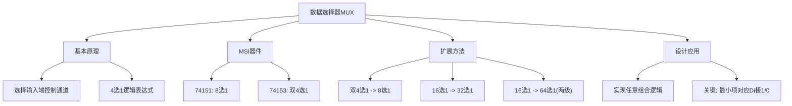

# 4.4 数据选择器

数据选择器（Data Selector / Multiplexer，简称 MUX）完成从多路输入数据中选出某一路数据送至输出端，也被称为多路开关。

---

## 一、数据选择器工作原理

数据选择器由**选择输入端**（地址端）控制，从多个**数据输入端**中选择一路输出。若有 \(n\) 个选择输入端，则最多可选择 \(2^n\) 路数据输入。

---

## 二、4选1数据选择器门级电路设计

**真值表：**

| \(S_1\) | \(S_0\) | \(Y\) |
|:---:|:---:|:---:|
| 0 | 0 | \(D_0\) |
| 0 | 1 | \(D_1\) |
| 1 | 0 | \(D_2\) |
| 1 | 1 | \(D_3\) |

**逻辑表达式：**

\[
Y = \overline{S_1} \cdot \overline{S_0} \cdot D_0 + \overline{S_1} \cdot S_0 \cdot D_1 + S_1 \cdot \overline{S_0} \cdot D_2 + S_1 \cdot S_0 \cdot D_3
\]

---

## 三、MSI数据选择器

### 1. 八选一数据选择器 74151

74151 有 3 个选择输入端（\(A_2, A_1, A_0\)），8 个数据输入端（\(D_0 \sim D_7\)），并有互补的原码（\(Y\)）和反码（\(\overline{Y}\)）两种输出形式。

| 选通 ST | 功能 |
|:---:|------|
| ST = 1 | 禁止工作，\(Y=0\)，\(\overline{Y}=1\) |
| ST = 0 | 正常工作，选择对应数据输出 |

\[
Y = \sum_{i=0}^{7} m_i \cdot D_i
\]

其中 \(m_i\) 为地址码 \(A_2 A_1 A_0\) 对应的最小项。

### 2. 双四选一数据选择器 74153

74153 包含两个完全相同的 4 选 1 MUX，共享地址输入端（\(A_1, A_0\)），数据输入和输出端各自独立。

---

## 四、数据选择器的扩展

### （一）双四选一扩展成八选一

利用两片 4 选 1 MUX 和一个额外的选择输入端，通过使能端或输出级联实现扩展。

### （二）16选1扩展成32选1

利用两片 16 选 1 MUX，通过最高位选择输入端分别控制两片的使能端，低位地址共享，输出相或。

### （三）16选1扩展成64选1

采用两级级联结构：第一级用 4 片 16 选 1 MUX 处理 64 路输入（每片处理 16 路），第二级用 1 片 4 选 1 MUX 从 4 片的输出中选择最终结果。

---

## 五、用数据选择器设计组合逻辑电路

### 设计原理

利用选择输入端选择不同的输入通道，通过数据输入端接高电平或低电平实现若干最小项相加，从而实现任意组合逻辑函数。

**核心公式：**

\[
Y = \sum_{i=0}^{2^n-1} m_i \cdot D_i
\]

将逻辑变量依次接在选择输入端上，根据目标函数的真值表确定 \(D_i\) 接 0 还是 1。

### 示例：用 74151 实现 \(F(A,B,C) = AB + AC + BC\)

**Step 1：** 将逻辑函数化成标准最小项相或：

\[
F(A,B,C) = \overline{A}BC + A\overline{B}C + AB\overline{C} + ABC = m_3 + m_5 + m_6 + m_7
\]

**Step 2：** 将 \(A, B, C\) 依次接在 74151 选择输入端 \(A_2, A_1, A_0\) 上。

**Step 3：** 将 \(D_3, D_5, D_6, D_7\) 接高电平 1，其余 \(D_i\) 接 0。

### 示例：交通信号灯监控电路（用 4 选 1 MUX）

真值表：（R=红，A=黄，G=绿；Z=故障信号，1 表示故障）

| R | A | G | Z |
|:---:|:---:|:---:|:---:|
| 0 | 0 | 0 | 1 |
| 0 | 0 | 1 | 0 |
| 0 | 1 | 0 | 0 |
| 0 | 1 | 1 | 1 |
| 1 | 0 | 0 | 0 |
| 1 | 0 | 1 | 1 |
| 1 | 1 | 0 | 1 |
| 1 | 1 | 1 | 1 |

选用 R、A 作为选择输入端，G 作为数据输入，根据真值表确定 \(D_0 \sim D_3\) 的连接方式实现 Z。

---

## 知识脉络

