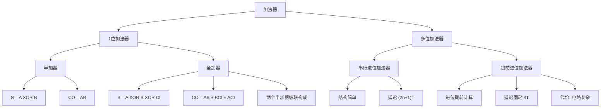

# 4.5 加法器

两个二进制数之间的算术运算（加、减、乘、除），在计算机中都是化为若干步加法运算和移位操作进行的。因此，**加法器是构成算术运算器的基本单元**。

---

## 一、加法器分类

```
加法器
├── 1位加法器
│   ├── 半加器（Half-Adder）
│   └── 全加器（Full-Adder）
└── 多位加法器
    ├── 串行进位加法器（Ripple Carry Adder）
    └── 超前进位加法器（Carry Lookahead Adder）
```

---

## 二、1位加法器

### 1. 半加器（Half-Adder）

不考虑来自低位的进位，将两个 1 位二进制数相加。

**真值表：**

| A | B | S（和） | CO（进位） |
|:---:|:---:|:---:|:---:|
| 0 | 0 | 0 | 0 |
| 0 | 1 | 1 | 0 |
| 1 | 0 | 1 | 0 |
| 1 | 1 | 0 | 1 |

**逻辑表达式：**

\[
S = A \oplus B
\]
\[
CO = A \cdot B
\]

半加器由一个异或门（产生和）和一个与门（产生进位）组成。

### 2. 全加器（Full-Adder）

将两个 1 位二进制数相加时，还考虑来自低位的进位（CI），即将三个数相加。

**真值表：**

| CI | A | B | S（和） | CO（进位） |
|:---:|:---:|:---:|:---:|:---:|
| 0 | 0 | 0 | 0 | 0 |
| 0 | 0 | 1 | 1 | 0 |
| 0 | 1 | 0 | 1 | 0 |
| 0 | 1 | 1 | 0 | 1 |
| 1 | 0 | 0 | 1 | 0 |
| 1 | 0 | 1 | 0 | 1 |
| 1 | 1 | 0 | 0 | 1 |
| 1 | 1 | 1 | 1 | 1 |

**逻辑表达式：**

\[
S = A \oplus B \oplus CI = \overline{A} \cdot \overline{B} \cdot CI + \overline{A} \cdot B \cdot \overline{CI} + A \cdot \overline{B} \cdot \overline{CI} + A \cdot B \cdot CI
\]

\[
CO = A \cdot B + B \cdot CI + A \cdot CI
\]

全加器可由两个半加器和一个或门级联构成。

---

## 三、多位加法器

### 1. 串行进位加法器

**设计思想：** 依次将低位全加器的进位输出端 CO 连接到高位全加器的进位输入端 CI。

**4 位串行进位加法器结构：**

```
  CO ─┬─ FA3 ─┬─ FA2 ─┬─ FA1 ─┬─ FA0 <-- CI(初始进位)
      │       │       │       │
  S3,CO3   S2,CO2   S1,CO1   S0,CO0
```

**优点：** 电路结构简单。

**缺点：** 速度慢。每一位的进位必须等待前一位的进位结果，总延迟时间为：

\[
t_{total} = (2n+1) \cdot T
\]

对于 4 位加法器：\(t_{total} = (2 \times 4 + 1)T = 9T\)

### 2. 超前进位加法器（Carry Lookahead Adder）

**设计思想：** 第 \(i\) 位的进位输入信号 \(CI_i\) 一定能由 \(A_{i-1}A_{i-2}\cdots A_0\) 和 \(B_{i-1}B_{i-2}\cdots B_0\) 唯一确定，无需从最低位开始向高位逐级传递进位信号。

**定义：**

- 进位产生信号：\(G_i = A_i \cdot B_i\)
- 进位传递信号：\(P_i = A_i \oplus B_i\)

**进位递推公式：**

\[
C_{i+1} = G_i + P_i \cdot C_i
\]

**展开各进位：**

\[
\begin{aligned}
C_1 &= G_0 + P_0 \cdot C_0 \\
C_2 &= G_1 + P_1 \cdot G_0 + P_1 \cdot P_0 \cdot C_0 \\
C_3 &= G_2 + P_2 \cdot G_1 + P_2 \cdot P_1 \cdot G_0 + P_2 \cdot P_1 \cdot P_0 \cdot C_0 \\
C_4 &= G_3 + P_3 \cdot G_2 + P_3 \cdot P_2 \cdot G_1 + P_3 \cdot P_2 \cdot P_1 \cdot G_0 + P_3 \cdot P_2 \cdot P_1 \cdot P_0 \cdot C_0
\end{aligned}
\]

**每位和：**

\[
S_i = P_i \oplus C_i
\]

**特点：**
- 进位产生的延迟时间固定为**三级门延迟**，与加法器位数无关
- 总延迟约为 **4T**
- 如果加法器位数太多，进位产生电路会变得比较复杂

!!! warning "易错点"
    串行进位加法器和超前进位加法器的核心区别：串行的进位链导致延迟与位数成正比（\(O(n)\)），超前进位通过提前计算进位使延迟与位数无关（\(O(1)\)），但代价是电路复杂度增加。**得其一利，必承其一弊。**

---

## 知识脉络


