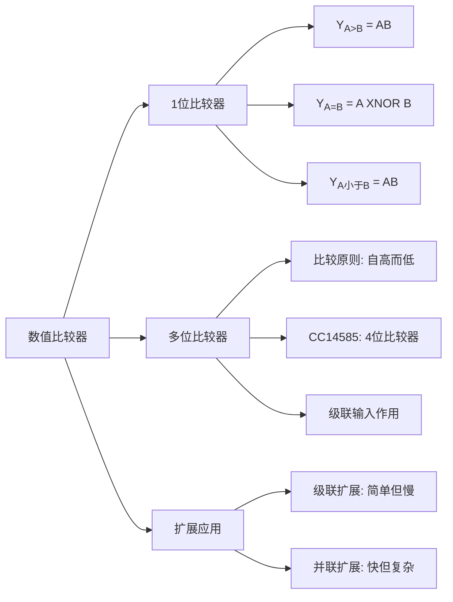

# 4.6 数值比较器

数值比较器是实现两个数值之间大、小、相等比较的组合逻辑电路。

---

## 一、1位数值比较器

两个 1 位二进制数 \(A\) 和 \(B\) 的比较有三种结果：\(A > B\)、\(A = B\)、\(A < B\)。

**真值表：**

| A | B | \(Y_{(A>B)}\) | \(Y_{(A=B)}\) | \(Y_{(A<B)}\) |
|:---:|:---:|:---:|:---:|:---:|
| 0 | 0 | 0 | 1 | 0 |
| 0 | 1 | 0 | 0 | 1 |
| 1 | 0 | 1 | 0 | 0 |
| 1 | 1 | 0 | 1 | 0 |

**逻辑表达式：**

\[
Y_{(A>B)} = A \cdot \overline{B}
\]
\[
Y_{(A=B)} = \overline{A \oplus B} = \overline{A} \cdot \overline{B} + A \cdot B
\]
\[
Y_{(A<B)} = \overline{A} \cdot B
\]

---

## 二、多位数值比较器

### 1. 比较原则

在比较两个多位数的大小时，必须**自高而低**逐位比较，而且只有在高位相等时，才需要比较较低位。

例如比较 4 位二进制数 \(A_3A_2A_1A_0\) 和 \(B_3B_2B_1B_0\)：

1. 先比较最高位 \(A_3\) 和 \(B_3\)
2. 若 \(A_3 = B_3\)，则比较次高位 \(A_2\) 和 \(B_2\)
3. 以此类推...
4. 若所有位都相等，则最终结果取决于**级联输入**

### 2. CC14585 4位数值比较器

**逻辑符号及管脚：**

| 管脚 | 功能 |
|:---|------|
| \(A_3 \sim A_0\)、\(B_3 \sim B_0\) | 待比较的 4 位数值输入 |
| \(I_{(A>B)}\)、\(I_{(A<B)}\)、\(I_{(A=B)}\) | 级联信号输入端（接收来自低位比较器的输出结果） |
| \(Y_{(A>B)}\)、\(Y_{(A<B)}\)、\(Y_{(A=B)}\) | 比较结果输出 |

**CC14585 逻辑函数表达式：**

\[
\begin{aligned}
Y_{(A<B)} &= A_3B_3 + (A_3 \oplus B_3)A_2B_2 + (A_3 \oplus B_3)(A_2 \oplus B_2)A_1B_1 \\
&\quad + (A_3 \oplus B_3)(A_2 \oplus B_2)(A_1 \oplus B_1)A_0B_0 \\
&\quad + (A_3 \oplus B_3)(A_2 \oplus B_2)(A_1 \oplus B_1)(A_0 \oplus B_0)I_{(A<B)}
\end{aligned}
\]

\[
Y_{(A=B)} = (A_3 \oplus B_3)(A_2 \oplus B_2)(A_1 \oplus B_1)(A_0 \oplus B_0)I_{(A=B)}
\]

\[
Y_{(A>B)} = \overline{Y_{(A<B)} + Y_{(A=B)} \cdot \overline{I_{(A>B)}}}
\]

### 3. 级联输入的作用

芯片设置有级联信号输入端 \(I_{(A>B)}\)、\(I_{(A<B)}\) 和 \(I_{(A=B)}\)，用来接收来自低位比较器的输出结果。当比较器的各位比较结果都相等时，**最终结果取决于级联信号输入**。

---

## 三、MSI数值比较器的扩展应用

### （一）级联扩展

将低 4 位的比较结果作为高 4 位的级联输入，实现 8 位数值比较。

**结构：** 低位片的 \(Y_{(A>B)}\)、\(Y_{(A<B)}\)、\(Y_{(A=B)}\) 分别接高位片的 \(I_{(A>B)}\)、\(I_{(A<B)}\)、\(I_{(A=B)}\)。

**优点：** 结构简单。

**缺点：** 运算速度慢（信号需逐级传递）。

### （二）并联扩展

采用两级比较法，各组的比较是**并行进行**的，因此运算速度比级联扩展快。

**16 位数值比较器并联扩展结构：**
- 第一级：4 片 4 位比较器各自独立比较各组
- 第二级：1 片比较器根据第一级的比较结果进行最终判决

---

## 知识脉络

