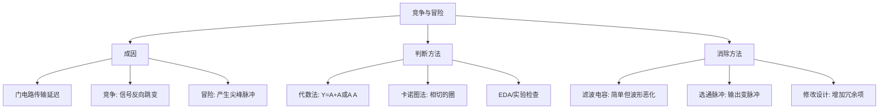

# 4.7 竞争与冒险

组合逻辑电路在实际工作中，由于门电路的传输延迟，可能产生短暂的尖峰脉冲（毛刺），导致逻辑错误。这种现象称为**竞争-冒险**。

> **得其一利，必承其一弊**——组合逻辑电路的简洁性背后，隐藏着竞争-冒险的风险。

---

## 一、竞争-冒险现象及成因

### 基本概念

考虑一个简单电路：信号 \(A\) 和经过非门后的 \(\overline{A}\) 同时送入一个与门/或门。

由于非门存在传输延迟，\(\overline{A}\) 的变化会滞后于 \(A\) 的变化。在 \(A\) 和 \(\overline{A}\) 信号同时向相反逻辑电平跳变的极短时间内（\(\Delta t\)），两个信号可能：

- 对于**与门**：同时为高电平，产生不应有的高电平尖峰脉冲
- 对于**或门**：同时为低电平，产生不应有的低电平尖峰脉冲

### 定义

- **竞争（Race）**：门电路两个输入信号同时向相反的逻辑电平跳变（一个从 1 变为 0，一个从 0 变为 1）的现象
- **冒险（Hazard）**：由于竞争而在电路输出端产生尖峰脉冲的现象

### 危害

竞争-冒险产生的尖峰脉冲可能导致：
- 后级电路误触发（如触发器错误翻转）
- 逻辑功能错误
- 系统不稳定

> **安全无小事，防患于未然。**

---

## 二、竞争-冒险的判断方法

### （一）代数法

通过逻辑函数式判断：在表达式中保持一个变量及其反变量不动，将剩余其他变量用 0 或 1 代替。

**判定准则：** 如果逻辑表达式能化简成以下形式，则存在竞争-冒险：

\[
Y = A + \overline{A} \quad \text{或} \quad Y = A \cdot \overline{A}
\]

**示例：**

对于 \(Y = AB + \overline{A}C\)：

- 令 \(B = C = 1\)，则 \(Y = A \cdot 1 + \overline{A} \cdot 1 = A + \overline{A}\)，存在竞争-冒险

### （二）卡诺图法

观察卡诺图中各卡诺圈之间的关系：

**判定准则：** 有两个**相切的卡诺圈**（即两个卡诺圈相邻但不相交），并且相切处没有其他卡诺圈包围，则可能出现竞争-冒险现象。

**示例分析：**

卡诺图中有两个相切的卡诺圈（分别对应两个乘积项），它们覆盖了相邻的最小项但没有公共部分，这对应电路中存在 \(A + \overline{A}\) 型竞争-冒险。

### （三）EDA软件检查 / 实验检查

利用 EDA 工具的时序分析功能或通过示波器在实际电路中观察波形，可以发现竞争-冒险现象。

---

## 三、竞争-冒险的消除方法

### （一）接入滤波电容

在输出端并接一个很小的滤波电容 \(C_f\)（TTL 电路中通常为几十到几百皮法）。

**原理：** 尖峰脉冲一般都很窄（几十 ns 以内），滤波电容的积分效应可将尖峰脉冲的幅度削弱至门电路的阈值电压以下。

| 优点 | 缺点 |
|:---|------|
| 简单易行 | 增加了输出电压波形的上升和下降时间，信号质量恶化 |

### （二）引入选通脉冲

在电路中引入选通脉冲信号，使输出只在选通脉冲有效期间才被采样。

| 优点 | 缺点 |
|:---|------|
| 逻辑简单 | 正常的输出信号也将变成脉冲信号，宽度与选通脉冲相同 |

### （三）修改逻辑设计

通过增加**冗余项**来消除竞争-冒险现象。

**原理：** 在卡诺图中添加一个额外的卡诺圈（冗余乘积项），覆盖原来两个相切卡诺圈的相切处，消除竞争-冒险的根源。

**示例：**

对于函数 \(Y = AB + \overline{A}C\)，增加冗余项 \(BC\)：

\[
Y = AB + \overline{A}C + BC
\]

当 \(B = C = 1\) 时，\(Y = A + \overline{A} + 1 = 1\)，不再存在竞争-冒险。

> 冗余项 \(BC\) 覆盖了 \(A\) 变化时可能产生冒险的区域，确保输出始终稳定。

---

## 四、三种消除方法对比

| 方法 | 原理 | 优点 | 缺点 |
|:---|------|------|------|
| 接入滤波电容 | 削弱尖峰幅度 | 简单易行 | 波形边沿变缓 |
| 引入选通脉冲 | 避开冒险时段 | 逻辑简单 | 输出变为脉冲信号 |
| 修改逻辑设计 | 增加冗余项 | 从根本上消除 | 增加电路复杂度 |

!!! warning "易错点"
    三种消除方法各有适用场景：
    - 滤波电容适合对速度要求不高的场合
    - 选通脉冲适合同步系统
    - 修改逻辑设计是**从根本上解决问题**的方法，在实际设计中优先推荐

---

## 知识脉络

