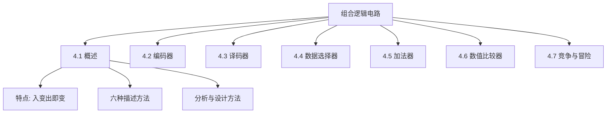

# 组合逻辑电路

组合逻辑电路是数字电路两大基本类型之一，其输出仅取决于当前时刻的输入，与电路历史状态无关。本章涵盖组合逻辑电路的基本概念、分析方法、设计方法，以及编码器、译码器、数据选择器、加法器、数值比较器等常用组合逻辑器件，最后讨论竞争-冒险现象。

---

## 4.1 组合逻辑电路概述

### 一、组合逻辑电路的特点

根据逻辑功能的特点，数字电路分为**组合逻辑电路（Combinational Logic Circuit）**和**时序逻辑电路（Sequential Logic Circuit）**两大类。

#### 组合逻辑电路

**功能上：** 任意时刻的输出仅仅取决于该时刻的输入，而与电路原来的状态无关。

**结构上：** 不包含记忆电路状态的元件（如触发器、锁存器），输出和输入之间无反馈通路。

> 核心特征：**入变出即变，当前输出仅取决于当前输入。**

与组合逻辑电路相对，时序逻辑电路在任意时刻的输出不仅取决于当前时刻的输入，而且与电路原来的状态有关，其结构中包含记忆元件且存在反馈。

---

### 二、组合逻辑电路的功能描述方法

| 描述方法 | 用途 |
|:---|------|
| **逻辑函数表达式** | 用布尔代数精确描述输入输出关系 |
| **真值表** | 穷举所有输入组合对应的输出 |
| **卡诺图** | 用于逻辑函数化简 |
| **逻辑电路图** | 直观展示门级连接关系 |
| **波形图（时序图）** | 描述信号随时间的变化关系 |
| **硬件描述语言（HDL）** | 用Verilog/VHDL代码描述电路功能 |

#### 逻辑函数表达式的一般形式

\[
\begin{cases}
Y_0 = F_0(A_0, A_1, \cdots, A_{n-1}) \\
Y_1 = F_1(A_0, A_1, \cdots, A_{n-1}) \\
\quad \vdots \\
Y_{m-1} = F_{m-1}(A_0, A_1, \cdots, A_{n-1})
\end{cases}
\]

#### 硬件描述语言示例（Verilog 1位全加器）

```verilog
module full_add(a1, a2, a3, y1, y2);
    input a1, a2, a3;
    output y1, y2;
    assign y1 = a1 ^ a2 ^ a3;              // 和
    assign y2 = (a1 & a2) | (a1 & a3) | (a2 & a3);  // 进位
endmodule
```

这六种描述方法之间可以相互转换，构成组合逻辑电路完整的描述体系。

---

### 本章知识结构


