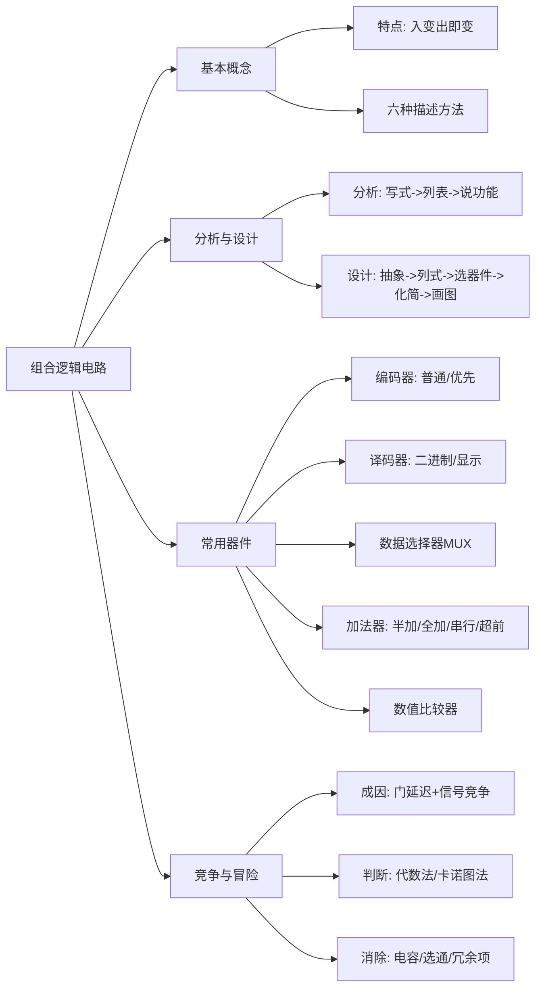

# 第4章总结：组合逻辑电路

---

## 知识脉络总览

---

## 核心公式汇总

| 公式 | 含义 |
|:---|------|
| \(Y = \sum_{i=0}^{2^n-1} m_i \cdot D_i\) | MUX输出通用表达式 |
| \(S = A \oplus B\) | 半加器和 |
| \(CO = A \cdot B\) | 半加器进位 |
| \(S = A \oplus B \oplus CI\) | 全加器和 |
| \(CO = AB + B\cdot CI + A\cdot CI\) | 全加器进位 |
| \(C_{i+1} = G_i + P_i \cdot C_i\) | 超前进位递推 |
| \(G_i = A_i \cdot B_i\) | 进位产生信号 |
| \(P_i = A_i \oplus B_i\) | 进位传递信号 |
| \(Y_{(A>B)} = A \cdot \overline{B}\) | 1位比较器大于 |
| \(Y_{(A<B)} = \overline{A} \cdot B\) | 1位比较器小于 |
| \(Y = A + \overline{A}\) 或 \(Y = A \cdot \overline{A}\) | 竞争-冒险判定条件 |

---

## 关键概念小结

### 1. 组合逻辑电路分析方法（三步）

| 步骤 | 内容 |
|:---:|------|
| Step 1 | 写出逻辑函数式并化简 |
| Step 2 | 列出逻辑电路的真值表 |
| Step 3 | 分析并描述电路的逻辑功能 |

### 2. 组合逻辑电路设计方法（五步）

| 步骤 | 内容 |
|:---:|------|
| Step 1 | 进行逻辑抽象：确定输入/输出变量，定义逻辑状态含义，列出真值表 |
| Step 2 | 写出逻辑函数式 |
| Step 3 | 选定器件类型（集成门电路、中大规模集成电路） |
| Step 4 | 化简或变换逻辑函数式（与所选器件匹配） |
| Step 5 | 画出逻辑电路图 |

### 3. 常用组合逻辑器件速查

| 器件 | 功能 | 典型芯片 |
|:---|------|:---|
| **优先编码器** | 多路输入 -> 二进制编码（有优先级） | 74LS148（8线-3线） |
| **二进制译码器** | 二进制代码 -> 对应输出选通 | 74LS138（3线-8线） |
| **显示译码器** | BCD码 -> 七段显示 | 74xx48 |
| **数据选择器** | 多选一输出 | 74151（8选1）、74153（双4选1） |
| **全加器** | 1位带进位加法 | 74LS183 |
| **数值比较器** | 多位数值大小比较 | CC14585（4位） |

### 4. 普通编码器 vs 优先编码器

| 对比 | 普通编码器 | 优先编码器 |
|:---|------|------|
| 同时输入 | 只允许一个 | 允许多个 |
| 处理方式 | 多输入时混乱 | 按优先级编码最高者 |
| 全0与I0 | 无法区分 | 通过 \(Y_S/Y_{EX}\) 区分 |
| 典型应用 | 简单场景 | 键盘编码 |

### 5. 串行进位 vs 超前进位加法器

| 对比 | 串行进位 | 超前进位 |
|:---|------|------|
| 延迟 | \((2n+1)T\)（与位数成正比） | \(4T\)（固定） |
| 电路复杂度 | 简单 | 复杂（位数多时） |
| 适用场景 | 位数少、速度要求低 | 位数多、速度要求高 |

### 6. 用译码器实现逻辑函数

\[
\text{任意逻辑函数} = \sum \text{最小项} \xrightarrow{\text{德-摩根}} \prod \overline{\text{最小项}}
\]

利用 74LS138 输出的最小项取反信号 + 与非门 = 实现任意组合逻辑函数。

### 7. 用MUX实现逻辑函数

将逻辑变量接选择输入端，根据真值表将对应的数据输入端 \(D_i\) 接 0/1（或接变量/反变量），MUX 输出即为目标函数。

### 8. 竞争-冒险三要素

| 要素 | 说明 |
|:---|------|
| **原因** | 门电路传输延迟 |
| **条件** | 两个信号同时向相反逻辑电平跳变 |
| **后果** | 输出产生尖峰脉冲 |
