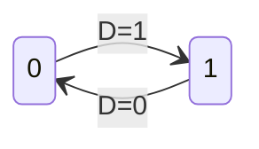
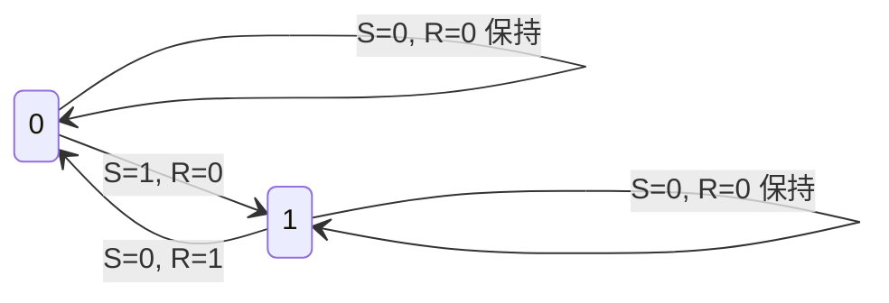
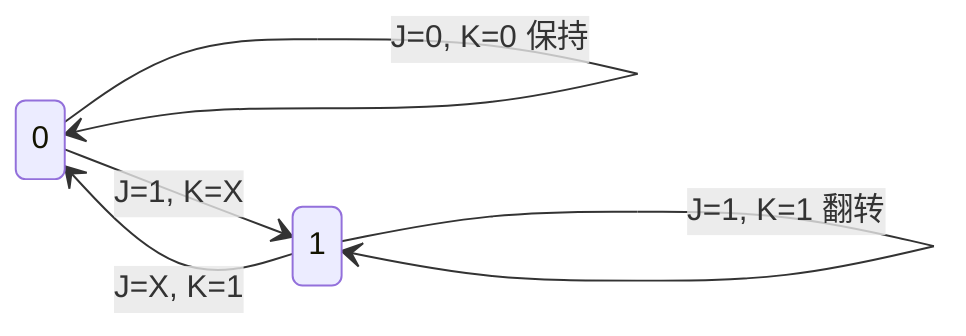
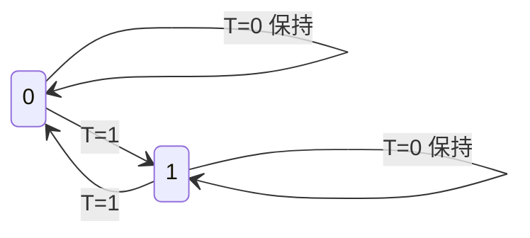
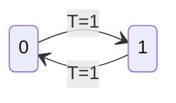

# 5.2 触发器

触发器（Flip-Flop）是一种对时钟脉冲边沿敏感的存储单元电路，其状态更新仅发生在 CP 信号的上升沿或下降沿。本节系统介绍五种基本触发器的逻辑功能：RS、D、JK、T 和 T' 触发器。

---

## 一、触发器与锁存器的区别

| 特性 | 锁存器 (Latch) | 触发器 (Flip-Flop) |
|:---:|:---|:---|
| 触发方式 | **电平触发** | **边沿触发** |
| 状态更新时机 | CP 有效电平的整个期间 | CP 跳变瞬间（上升沿/下降沿） |
| 空翻现象 | 存在（CP=1 期间输入变化即翻转） | 不存在 |
| 抗干扰能力 | 弱 | 强 |

同一逻辑功能的触发器可以用不同的电路结构实现（如主从结构、维持阻塞结构），不同逻辑功能的触发器之间往往可以进行转换。

---

## 二、主从 D 触发器

### 2.1 工作原理

主从 D 触发器由两个 D 锁存器（主锁存器和从锁存器）级联构成：

- **CP = 0 时**：主锁存器使能，\(Q_m = D\)；从锁存器保持原状态不变
- **CP 上升沿**：主锁存器锁存 CP 上升沿前瞬间的 D 值；从锁存器将此值输出到 Q 端

### 2.2 特性表

| CP | D | \(Q^n\) | \(Q^{n+1}\) |
|:---:|:---:|:---:|:---:|
| X | X | X | \(Q^n\) |
| \(\uparrow\) | 0 | X | 0 |
| \(\uparrow\) | 1 | X | 1 |

> 注：表中 \(\uparrow\) 表示 CP 上升沿，X 表示任意值。

### 2.3 特性方程

\[
Q^{n+1} = D
\]

D 触发器的特性方程最为简洁：**次态等于当前输入 D**。

### 2.4 状态转换图

- 两个圆圈分别表示状态 0 和状态 1
- 有向箭头标注输入条件 D 的值

---

## 三、维持阻塞结构 D 触发器

### 3.1 电路特点

维持阻塞 D 触发器是一种上升沿触发的边沿触发器，其内部包含维持线和阻塞线：

- **置 1 维持线**：在 CP 上升沿后，维持内部节点为低电平，保证输出置 1 状态不变
- **置 0 阻塞线**：在 CP 上升沿后，封锁可能产生置 0 信号的路径
- **置 0 维持线 / 置 1 阻塞线**：兼具维持置 0 和阻塞置 1 的双重作用

### 3.2 工作原理

- **CP = 0 时**：输入信号 D 进入触发器内部，为状态刷新做好准备
- **CP 上升沿瞬间**：触发器根据 D 的值更新状态
- **CP = 1 时**：维持线和阻塞线起作用，确保状态不再受 D 变化的影响

### 3.3 带异步输入端的 D 触发器

实用 D 触发器通常设有异步置位端 \(\overline{S_D}\) 和异步复位端 \(\overline{R_D}\)：

| \(\overline{S_D}\) | \(\overline{R_D}\) | CP | D | \(Q^{n+1}\) | 说明 |
|:---:|:---:|:---:|:---:|:---:|:---|
| 0 | 1 | X | X | 1 | 异步置 1 |
| 1 | 0 | X | X | 0 | 异步置 0 |
| 0 | 0 | X | X | 1 | 输出不定（不允许） |
| 1 | 1 | \(\uparrow\) | 0 | 0 | 同步置 0 |
| 1 | 1 | \(\uparrow\) | 1 | 1 | 同步置 1 |

> 异步输入端优先级高于同步输入端。\(\overline{S_D} = \overline{R_D} = 0\) 的情况应避免。

---

## 四、RS 触发器

### 4.1 逻辑功能

凡在时钟信号作用下逻辑功能符合以下特性表的触发器，均称为 **RS 触发器**。

### 4.2 特性表

| R | S | \(Q^n\) | \(Q^{n+1}\) | 功能 |
|:---:|:---:|:---:|:---:|:---|
| 0 | 0 | 0 | 0 | 保持 |
| 0 | 0 | 1 | 1 | 保持 |
| 0 | 1 | 0 | 1 | 置 1 |
| 0 | 1 | 1 | 1 | 置 1 |
| 1 | 0 | 0 | 0 | 置 0 |
| 1 | 0 | 1 | 0 | 置 0 |
| 1 | 1 | 0 | 1* | 不定 |
| 1 | 1 | 1 | 1* | 不定 |

### 4.3 特性方程

\[
\boxed{
\begin{cases}
Q^{n+1} = S + \overline{R} Q^n \\
S \cdot R = 0 \quad \text{（约束条件）}
\end{cases}
}
\]

### 4.4 状态转换图

> 注：S=1, R=1 为禁止状态（输出不定）

### 4.5 触发方式

RS 触发器既可以是上升沿触发，也可以是下降沿触发，逻辑功能相同。

!!! warning "易错点"
    RS 触发器的约束条件 \(S \cdot R = 0\) 必须牢记。R = S = 1 时输出"不定"，与 SR 锁存器的 S_D = R_D = 0 不定注意区分--两者输入有效电平相反！RS 触发器输入通常为高电平有效，SR 锁存器（与非门型）输入为低电平有效。

---

## 五、JK 触发器

### 5.1 逻辑功能

JK 触发器是对 RS 触发器的改进--它克服了 RS 触发器在 R = S = 1 时输出不定的缺点。当 J = K = 1 时，JK 触发器的状态**翻转**（即 \(Q^{n+1} = \overline{Q^n}\)）。

### 5.2 特性表

| J | K | \(Q^n\) | \(Q^{n+1}\) | 功能 |
|:---:|:---:|:---:|:---:|:---|
| 0 | 0 | 0 | 0 | 保持 |
| 0 | 0 | 1 | 1 | 保持 |
| 0 | 1 | 0 | 0 | 置 0 |
| 0 | 1 | 1 | 0 | 置 0 |
| 1 | 0 | 0 | 1 | 置 1 |
| 1 | 0 | 1 | 1 | 置 1 |
| 1 | 1 | 0 | 1 | 翻转 |
| 1 | 1 | 1 | 0 | 翻转 |

### 5.3 特性方程

\[
\boxed{Q^{n+1} = J\overline{Q^n} + \overline{K}Q^n}
\]

### 5.4 状态转换图

记忆口诀：J 控制置 1（Jump to 1），K 控制置 0（Kill to 0）。

### 5.5 波形分析示例

假设 JK 触发器的初态为 0（下降沿触发）。给定 CP、J、K 波形，需在 CP 下降沿时刻根据 J 和 K 的值查特性表更新 Q 的状态，其余时间 Q 保持不变。

### 5.6 历史趣闻

JK 触发器由蒙哥马利-菲斯特（Montgomery Phister）命名，其中 J 代表 "Jump"（跳变到 1），K 代表 "Kill"（清零到 0）。JK 触发器是功能最完备的触发器，任何其他类型的触发器都可以由 JK 转换而来。

---

## 六、T 触发器

### 6.1 逻辑功能

T 触发器的逻辑功能：当输入信号 **T = 1** 时，每来一个 CP 信号其状态就**翻转**一次；而当输入信号 **T = 0** 时，CP 信号到达后其状态**保持不变**。

### 6.2 特性表

| T | \(Q^n\) | \(Q^{n+1}\) | 功能 |
|:---:|:---:|:---:|:---|
| 0 | 0 | 0 | 保持 |
| 0 | 1 | 1 | 保持 |
| 1 | 0 | 1 | 翻转 |
| 1 | 1 | 0 | 翻转 |

### 6.3 特性方程

\[
\boxed{Q^{n+1} = T\overline{Q^n} + \overline{T}Q^n = T \oplus Q^n}
\]

### 6.4 状态转换图

### 6.5 T 触发器的构成方法

**用 D 触发器构成 T 触发器**：

将 \(Q^{n+1} = D\) 与 \(Q^{n+1} = T \oplus Q^n\) 对比，得 \(D = T \oplus Q^n\)。因此，将 D 触发器的输入 D 接至异或门的输出，异或门的输入端分别接 T 和 \(Q\)，即可构成 T 触发器。

**用 JK 触发器构成 T 触发器**：

将 \(Q^{n+1} = J\overline{Q^n} + \overline{K}Q^n\) 与 \(Q^{n+1} = T\overline{Q^n} + \overline{T}Q^n\) 对比，得 \(J = K = T\)。因此，将 JK 触发器的 J 和 K 端直接连在一起接至 T，即可构成 T 触发器。

---

## 七、T' 触发器

### 7.1 逻辑功能

将 T 触发器的输入 T 接高电平（T = 1），则每次 CP 信号作用后触发器都发生翻转。这种特殊的触发器称为 **T' 触发器**（也称为**计数触发器**）。

### 7.2 特性表

| T | \(Q^n\) | \(Q^{n+1}\) |
|:---:|:---:|:---:|
| 1 | 0 | 1 |
| 1 | 1 | 0 |

### 7.3 特性方程

\[
\boxed{Q^{n+1} = \overline{Q^n}}
\]

### 7.4 状态转换图

T' 触发器是最简单的翻转触发器，每来一个时钟脉冲，状态就翻转一次，因此常用作**二进制计数器**的基本单元，实现对 CP 信号的**二分频**。

### 7.5 T' 触发器的构成

**用 D 触发器构成**：将 D 触发器的 \(\overline{Q}\) 端直接反馈连接到 D 输入端，即 \(D = \overline{Q^n}\)。

**用 JK 触发器构成**：将 J 和 K 同时接高电平，即 \(J = K = 1\)。

---

## 八、触发器的逻辑功能转换

### 8.1 转换方法

不同逻辑功能的触发器之间可以进行转换，核心方法是**特性方程对比法**：

1. 写出目标触发器的特性方程
2. 写出已有触发器的特性方程
3. 令两方程相等，求解已有触发器输入端与目标触发器输入端的关系
4. 添加必要的组合逻辑电路实现

### 8.2 转换关系汇总

| 已有触发器 | 目标触发器 | 转换公式 |
|:---:|:---:|:---|
| D | T | \(D = T \oplus Q^n\) |
| D | T' | \(D = \overline{Q^n}\) |
| D | JK | \(D = J\overline{Q^n} + \overline{K}Q^n\) |
| JK | D | \(J = D,\ K = \overline{D}\) |
| JK | T | \(J = K = T\) |
| JK | T' | \(J = K = 1\) |
| JK | RS | \(J = S,\ K = R\)（需满足 \(S \cdot R = 0\)） |

---

## 九、五种触发器对比总结

| 触发器 | 特性方程 | 输入约束 | 功能特点 |
|:---:|:---|:---:|:---|
| RS | \(Q^{n+1} = S + \overline{R}Q^n\) | \(S \cdot R = 0\) | 置 0、置 1、保持；有不定态 |
| D | \(Q^{n+1} = D\) | 无 | 最简单，只能跟随 D 变化 |
| JK | \(Q^{n+1} = J\overline{Q^n} + \overline{K}Q^n\) | 无 | 功能最完备，可置 0、置 1、保持、翻转 |
| T | \(Q^{n+1} = T \oplus Q^n\) | 无 | T=0 保持，T=1 翻转 |
| T' | \(Q^{n+1} = \overline{Q^n}\) | 无 | 每 CP 必翻转（二分频） |

!!! warning "易错点"
    1. **SR 锁存器 vs RS 触发器**：前者输入低电平有效，后者输入高电平有效；约束条件的表示也不同
    2. **锁存器是电平触发，触发器是边沿触发**--这是本质区别，决定了它们适用场景的不同
    3. **D 锁存器 vs D 触发器**：D 锁存器在 CP=1 期间输出跟随 D 变化（电平敏感），D 触发器仅在 CP 边沿采样并更新（边沿敏感）。分析波形时必须先确定器件的触发方式
    4. **JK 触发器在 J=K=1 时翻转**，这是它的独特功能，RS 触发器无此功能
    5. **T' 触发器输出频率 = 输入频率/2**，是最简单的二分频电路

---

## 十、综合例题

**例**：已知一个 JK 触发器的初态为 0（下降沿触发），各输入波形如下图所示，试画出 Q 的波形。

解题步骤：
1. 确定触发方式（下降沿触发）
2. 仅在 CP 下降沿时刻，根据 J、K 的值查 JK 特性表更新 \(Q^{n+1}\)
3. 其他时刻 Q 保持不变
4. 特别注意 J = K = 1 时的翻转功能

**例**：试将 D 触发器转换为 T' 触发器。

解：
- D 触发器特性方程：\(Q^{n+1} = D\)
- T' 触发器特性方程：\(Q^{n+1} = \overline{Q^n}\)
- 对比得：\(D = \overline{Q^n}\)
- 电路实现：将 D 触发器的 \(\overline{Q}\) 端直接反馈连接到 D 输入端即可
