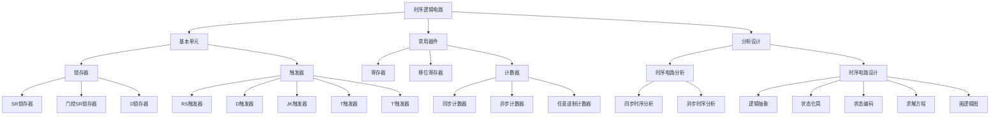

# 第5章 时序逻辑电路

本章系统介绍时序逻辑电路的基本概念、基本单元电路（锁存器与触发器）、常用时序逻辑器件（寄存器、计数器）以及时序逻辑电路的分析与设计方法。

---

## 5.1 时序逻辑电路概述

### 一、时序逻辑电路的基本概念

**时序逻辑电路**与组合逻辑电路的本质区别在于：电路在任意时刻的输出不仅取决于当前时刻的输入，而且与电路原来的状态有关。这种"记忆"特性使得时序逻辑电路成为数字系统中不可或缺的组成部分。

| 对比维度 | 组合逻辑电路 | 时序逻辑电路 |
|:---:|:---|:---|
| 输出决定因素 | 仅取决于当前输入 | 取决于当前输入 + 电路原状态 |
| 是否包含存储 | 无存储单元 | 含存储单元（锁存器/触发器） |
| 是否有反馈 | 无反馈回路 | 有反馈回路 |
| 典型器件 | 编码器、译码器、加法器 | 寄存器、计数器、状态机 |

### 二、时序逻辑电路的基本组成

时序逻辑电路由两大部分组成：

1. **存储电路**：保存电路当前的状态，是时序电路区别于组合电路的核心
2. **组合逻辑电路**：进行逻辑运算，产生输出信号和激励信号

锁存器和触发器是具有存储功能的单元电路，也是构成时序逻辑电路的基本部件。

### 三、问题引出：按钮控制LED

用一个按钮开关控制LED灯的亮灭。要求：按一次，灯亮；再按一次，灯灭；依次循环。

- 输出与状态相关（需要记忆当前是亮还是灭）
- 输入为一个脉冲信号（非电平信号）

这一看似简单的需求揭示了时序逻辑电路的必要性：单纯依靠组合逻辑无法实现"记忆"功能。

---

### 四、基本双稳态电路

#### 4.1 电路结构与原理

将两个非门（反相器）首尾交叉耦合连接，即构成最基本的双稳态电路：

- 若上电瞬间 \(Q = 0\)，则经过反馈后 \(Q\) 保持为 0
- 若上电瞬间 \(Q = 1\)，则经过反馈后 \(Q\) 保持为 1

**结论**：该电路一旦进入某一种逻辑状态，就能长期保持该状态不变。

将具有 0、1 两种逻辑状态，且一旦进入某一种逻辑状态就能长期保持该状态不变的电路，称为**双稳态存储电路**，简称**双稳态电路**。

#### 4.2 双稳态电路的输出定义

电路正常工作时，两个输出端的状态通常是相反的（互补的）：

- 输出端 \(Q\) 称为**常态输出**
- 输出端 \(\overline{Q}\) 称为**反态输出**

习惯上，用输出端 \(Q\) 的状态表示双稳态电路的状态：

- \(Q = 1, \overline{Q} = 0\) 为电路的 **1 状态**
- \(Q = 0, \overline{Q} = 1\) 为电路的 **0 状态**

#### 4.3 基本双稳态电路的局限

由非门构成的双稳态电路虽然具有存储 1 位二进制数据的功能，但功能不完备：

- 在接通电源时，它可能随机地进入 0 状态或 1 状态（上电初态不确定）
- 没有输入控制端，在工作时无法改变或控制它的状态
- 因此不能直接作为存储电路使用

要解决这个问题，需要在双稳态电路基础上增加输入控制端 -- 这就是 **SR 锁存器**的由来。

#### 4.4 历史溯源：Eccles-Jordan 电路

威廉-亨利-埃克尔斯（William Henry Eccles）和弗兰克-威尔弗雷德-乔丹（Frank Wilfred Jordan）于 1918 年发明了第一个电子双稳态触发电路--**Eccles-Jordan 电路**。这是锁存器、触发器、时序逻辑电路的历史源头。一个看似简单的双稳态电路，开启了现代数字系统的时代。

---

### 五、锁存器与触发器概述

#### 5.1 什么是锁存器

锁存器（Latch）是一种对脉冲电平敏感的存储单元电路。锁存器的输出状态在时钟脉冲 CP 的高电平（或低电平）期间会跟随输入信号变化。这种输出状态的更新方式，称为**电平触发**。

#### 5.2 什么是触发器

触发器（Flip-Flop）是一种对脉冲边沿敏感的存储单元电路。触发器的状态更新只发生在 CP 信号的上升沿或下降沿。这种输出状态的更新方式，称为**边沿触发**。

| 对比维度 | 锁存器 (Latch) | 触发器 (Flip-Flop) |
|:---:|:---|:---|
| 触发方式 | 电平触发 | 边沿触发 |
| 敏感时段 | CP 有效电平期间 | CP 跳变瞬间 |
| 空翻问题 | 存在空翻 | 无空翻 |
| 抗干扰能力 | 较弱 | 强 |
| 典型应用 | 数据暂存、总线保持 | 寄存器、计数器、状态机 |

---

### 六、SR 锁存器

#### 6.1 基本 SR 锁存器（与非门构成）

将交叉耦合双稳态电路中的反相器换成与非门，增加两个控制信号 \(S_D\) 和 \(R_D\)，就构成了 **SR 锁存器**。SR 锁存器是各种锁存器、触发器中结构最简单的一种，同时也是许多复杂结构触发器的基本组成部分。

**特性表：**

| \(S_D\) | \(R_D\) | \(Q^n\) | \(Q^{n+1}\) | 功能 |
|:---:|:---:|:---:|:---:|:---|
| 1 | 1 | 0 | 0 | 保持 |
| 1 | 1 | 1 | 1 | 保持 |
| 0 | 1 | 0 | 1 | 置 1 |
| 0 | 1 | 1 | 1 | 置 1 |
| 1 | 0 | 0 | 0 | 置 0 |
| 1 | 0 | 1 | 0 | 置 0 |
| 0 | 0 | 0 | 1* | 不定 |
| 0 | 0 | 1 | 1* | 不定 |

> 注：\(S_D\) 和 \(R_D\) 均为低电平有效（带下标 D 表示直接输入端），带 * 表示当 \(S_D\) 和 \(R_D\) 同时回到高电平后状态不确定。

**特点总结：**

- 锁存器次态 \(Q^{n+1}\) 不仅与输入 \(S_D\)、\(R_D\) 有关，而且与锁存器初态 \(Q^n\) 有关
- \(S_D\) 和 \(R_D\) 分别表示"置 1"输入端和"置 0"输入端，均以低电平作为有效输入信号
- 当 \(S_D = R_D = 0\) 时出现异常的"不定"状态，因此正常工作时应遵守 **\(S_D \cdot R_D = 1\)**（即 \(S_D + R_D = 0\)）的约束条件

**特性方程：**

通过卡诺图化简可得与非门构成的 SR 锁存器的特性方程：

\[
\begin{cases}
Q^{n+1} = \overline{S_D} + \overline{R_D} Q^n \\
\overline{S_D} \cdot \overline{R_D} = 0 \quad \text{（约束条件：不允许 }S_D\text{ 和 }R_D\text{ 同时为 0）}
\end{cases}
\]

!!! warning "易错点"
    SR 锁存器中 \(S_D = R_D = 0\) 时输出"不定"，此时 \(Q = \overline{Q} = 1\)。但当 \(S_D\) 和 \(R_D\) 同时恢复为 1 后，电路最终进入哪种状态无法预知（取决于两个与非门的延迟差异），因此实际应用中**必须避免** \(S_D = R_D = 0\) 的情况。

#### 6.2 或非门构成的 SR 锁存器

用或非门也可以构成 SR 锁存器，与与非门构成的主要区别在于：

- 输入 \(S_D\) 和 \(R_D\) 以**高电平**作为有效信号
- 当 \(S_D = R_D = 1\) 时出现不定状态
- 正常工作应满足约束条件：**\(S_D \cdot R_D = 0\)**（不允许 \(S_D\) 和 \(R_D\) 同时为 1）

---

### 七、门控 SR 锁存器

在数字系统中，为协调各部分的动作，常要求某些锁存器于同一时刻动作。为此，引入同步信号（时钟脉冲 CP），使锁存器只有在同步信号到达时才按输入信号改变状态。

**特性表：**

| CP | S | R | \(Q^n\) | \(Q^{n+1}\) | 功能 |
|:---:|:---:|:---:|:---:|:---:|:---|
| 0 | X | X | 0 | 0 | 保持 |
| 0 | X | X | 1 | 1 | 保持 |
| 1 | 0 | 0 | 0 | 0 | 保持 |
| 1 | 0 | 0 | 1 | 1 | 保持 |
| 1 | 1 | 0 | 0 | 1 | 置 1 |
| 1 | 1 | 0 | 1 | 1 | 置 1 |
| 1 | 0 | 1 | 0 | 0 | 置 0 |
| 1 | 0 | 1 | 1 | 0 | 置 0 |
| 1 | 1 | 1 | 0 | 1* | 不定 |
| 1 | 1 | 1 | 1 | 1* | 不定 |

**特性方程：**

\[
\begin{cases}
Q^{n+1} = S + \overline{R} Q^n \quad (CP = 1 \text{ 时有效}) \\
S \cdot R = 0 \quad \text{（约束条件）}
\end{cases}
\]

#### 门控 SR 锁存器的"空翻"问题

在 CP = 1 的全部时间里，控制输入端 S 和 R 的变化都将引起锁存器输出端状态的变化。若在 CP = 1 期间内输入信号发生多次变化，则锁存器的状态也会发生多次翻转--这就是**空翻现象**。空翻现象降低了电路的抗干扰能力，这也正是边沿触发器出现的原因。

---

### 八、D 锁存器

#### 8.1 逻辑门控 D 锁存器

为解决 SR 锁存器中 S 和 R 不能同时有效的问题，在 SR 锁存器前增加门控电路，将 S 和 R 合并为一个输入端 D。

**特性表：**

| CP | D | \(Q^{n+1}\) | 功能 |
|:---:|:---:|:---:|:---|
| 0 | X | 不变 | 保持 |
| 1 | 0 | 0 | 置 0 |
| 1 | 1 | 1 | 置 1 |

**核心规律**：CP 有效时，次态跟随输入变化；CP 无效时，次态保持初态不变。

#### 8.2 传输门控 D 锁存器

传输门控 D 锁存器由基本双稳态电路和传输门组成：

- 当 E = 1 时：TG1 导通，TG2 断开，\(Q = D\)
- 当 E = 0 时：TG1 断开，TG2 导通，电路保持原状态

传输门控 D 锁存器可以存储使能信号 E 由 1 变 0 之前瞬间的输入信号 D 的值，实现 1 位数据的存储。

---

### 九、本章知识结构

> 从下一节开始，我们将系统学习各类触发器、寄存器、计数器以及时序逻辑电路的分析与设计方法。
