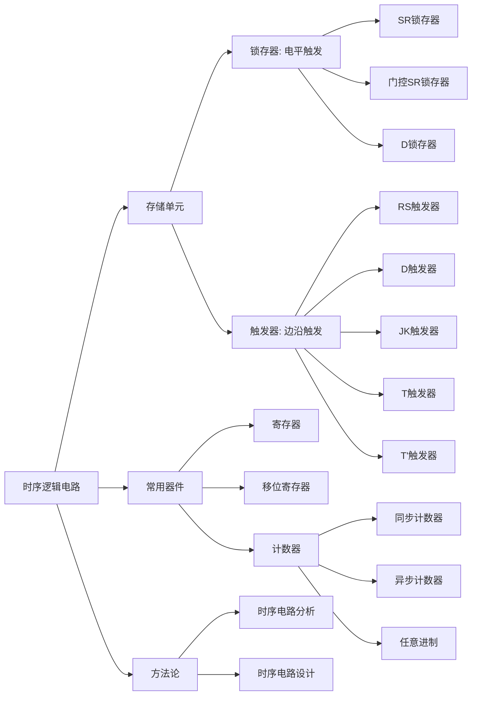

# 第5章 时序逻辑电路 -- 本章总结

---

## 一、知识体系总览



---

## 二、触发器特性方程速查表

| 触发器 | 特性方程 | 约束条件 | 功能要点 |
|:---:|:---|:---:|:---|
| **SR 锁存器**（与非门） | \(Q^{n+1} = \overline{S_D} + \overline{R_D}Q^n\) | \(\overline{S_D} \cdot \overline{R_D} = 0\) | \(S_D, R_D\) 低有效 |
| **门控 SR 锁存器** | \(Q^{n+1} = S + \overline{R}Q^n\) (CP=1) | \(S \cdot R = 0\) | 有空翻 |
| **RS 触发器** | \(Q^{n+1} = S + \overline{R}Q^n\) | \(S \cdot R = 0\) | 边沿触发 |
| **D 触发器** | \(Q^{n+1} = D\) | 无 | 最简单 |
| **JK 触发器** | \(Q^{n+1} = J\overline{Q^n} + \overline{K}Q^n\) | 无 | 功能最完备 |
| **T 触发器** | \(Q^{n+1} = T \oplus Q^n\) | 无 | T=1 翻转 |
| **T' 触发器** | \(Q^{n+1} = \overline{Q^n}\) | 无 | 每 CP 必翻 |

---

## 三、锁存器 vs 触发器核心对比

| 特性 | 锁存器 | 触发器 |
|:---|:---|:---|
| 触发方式 | 电平触发 | 边沿触发 |
| 符号标识 | 无三角标记 | 有时钟三角标记 |
| 空翻 | 存在 | 不存在 |
| 适用场景 | 数据暂存、保持 | 寄存器、计数器、状态机 |

---

## 四、计数器总结

### 4.1 分类体系

```
计数器
├── 按计数方向
│   ├── 加法计数器
│   ├── 减法计数器
│   └── 可逆计数器
├── 按时钟方式
│   ├── 同步计数器（时钟并联，速度快）
│   └── 异步计数器（时钟级联，结构简单）
└── 按计数进制
    ├── 二进制计数器（模 2^n）
    ├── 十进制计数器（模 10）
    └── 任意进制计数器（反馈清零/置数法）
```

### 4.2 任意进制计数器设计方法对比

| 方法 | 适用条件 | 要点 | 典型芯片 |
|:---|:---|:---|:---|
| **反馈清零法** | 异步清零芯片 | 模 N 时，N 对应状态产生清零脉冲 | 74LS161 |
| **反馈置数法** | 同步置数芯片 | 模 N 时，N-1 对应状态产生置数脉冲 | 74LS161/163 |

---

## 五、时序电路分析与设计方法对比

| 维度 | 分析 | 设计 |
|:---|:---|:---|
| 方向 | 电路 \(\to\) 功能 | 功能 \(\to\) 电路 |
| 起点 | 已知电路图 | 已知逻辑需求 |
| 核心 | 写方程，列图表 | 状态化简，状态编码，求解方程 |
| 终点 | 描述功能 + 自启动验证 | 电路图 + 自启动验证 |

### 分析流程

\[
\text{电路图} \xrightarrow{\text{写出}} \text{三大方程} \xrightarrow{\text{列出}} \text{三大图表} \xrightarrow{\text{得出}} \text{逻辑功能}
\]

### 设计流程

\[
\text{逻辑抽象} \to \text{状态化简} \to \text{状态编码} \to \text{求方程} \to \text{画电路} \to \text{自启动检查}
\]

---

## 六、关键数字速记

| 知识点 | 关键数字 |
|:---|:---|
| 双稳态电路 | 2 个稳定状态（0 和 1） |
| n 位二进制计数器 | 模为 \(2^n\)，共 \(2^n\) 个状态 |
| 触发器数目与状态数关系 | \(2^{n-1} < M \le 2^n\) |
| n 位环形计数器 | n 个有效状态 |
| n 位扭环形计数器 | 2n 个有效状态 |
| Eccles-Jordan 发明年份 | 1918 年 |

---

## 七、常见易错点总汇

!!! warning "高频易错点"

    1. **SR 锁存器约束 vs RS 触发器约束**：SR 锁存器（与非门型）禁止 \(S_D = R_D = 0\)（同时为 0）；RS 触发器禁止 \(R = S = 1\)（同时为 1）。两者有效电平相反！

    2. **锁存器 vs 触发器**：锁存器电平触发（CP 有效期间都敏感），触发器边沿触发（仅在跳变瞬间敏感）。分析波形必须先确认触发方式。

    3. **D 锁存器 vs D 触发器波形**：D 锁存器在 CP=1 期间 Q 跟随 D 变化；D 触发器仅在 CP 边沿采样。考题中经常混在一起让你画出波形。

    4. **异步计数器分析**：必须判断时钟有效性！无时钟则保持，有时钟才代入状态方程。

    5. **反馈清零法中的瞬态**：异步清零时，目标模数 N 对应的状态只瞬间出现即消失，不是稳定状态。

    6. **自启动检查不可遗漏**：无论是分析还是设计，最后都必须验证无效状态是否能进入有效循环。

    7. **摩尔型 vs 米利型**：摩尔型输出标注在状态圈内（只取决于状态）；米利型输出标注在箭头上（取决于状态和输入）。

    8. **JK 触发器 J=K=1 时翻转**：这是 JK 触发器的独特功能，也是计数器设计的核心原理。

---

## 八、章节学习建议

1. **先理解再记忆**：双稳态电路的工作原理是本章所有内容的物理基础，务必先理解交叉耦合反馈如何实现"保持"功能。
2. **特性方程必须能默写**：五种触发器的特性方程是分析和设计的"基本工具"，考试中不允许翻书查阅。
3. **多画波形图**：通过反复练习画出各种触发器和计数器电路的时序波形，培养对电路行为的直观感知。
4. **分析题和设计题都要练**：分析题从电路到功能，设计题从功能到电路，两个方向都要熟练掌握。
5. **关注芯片手册**：74 系列计数器芯片（161/163/160/390 等）的功能表和控制逻辑是考点热点。
6. **做完整的分析/设计大题**：从电路到状态表到状态图再到功能描述的全流程，每一步都不能省略。
