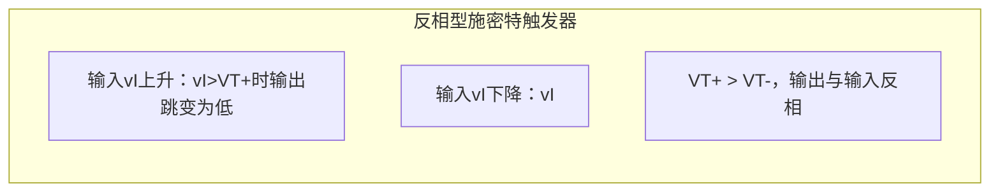
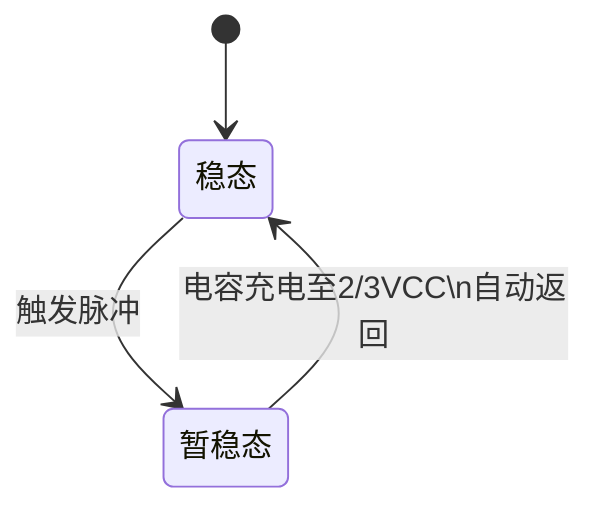

# 6.2 施密特触发器、单稳态触发器与多谐振荡器

## 一、施密特触发器

### 1. 基本概念

施密特触发器（Schmitt Trigger），也叫**迟滞比较器**或**滞回比较器**，是一种具有**滞回特性**的电平触发电路。由奥托-赫伯特-施密特于 1934 年发明，最初用于模拟生物神经脉冲的触发机制。

### 2. 核心特点

施密特触发器有两大性能特点：

| 特点 | 说明 |
|------|------|
| **双阈值触发** | 输入上升过程与下降过程的触发点电平**不同**，具有"记忆"效应 |
| **边沿陡峭** | 输出信号的电压波形边沿**十分陡峭**，即使输入信号变化缓慢 |

### 3. 滞回特性

**关键参数定义：**

\[
V_{T+（正向阈值/上限触发电平）}，\quad V_{T-（负向阈值/下限触发电平）}
\]

\[
\Delta V_T = V_{T+} - V_{T-（回差电压/滞后电压）}
\]

- **反相型**：\( v_I \) 上行超过 \( V_{T+} \) 时输出从高变低（**下行滞回/负向滞回**）
- **同相型**：\( v_I \) 上行超过 \( V_{T+} \) 时输出从低变高（**上行滞回/正向滞回**）

### 4. 用 555 构成施密特触发器

将 555 的 TH(6) 和 TR(2) 短接作为输入端，DIS(7) 悬空，即可构成施密特触发器。

- **默认阈值**：\( V_{T+} = \frac{2}{3}V_{CC} \)，\( V_{T-} = \frac{1}{3}V_{CC} \)，\( \Delta V_T = \frac{1}{3}V_{CC} \)
- **外接 VC(5) 电压**：\( V_{T+} = V_{CO} \)，\( V_{T-} = \frac{1}{2}V_{CO} \)，\( \Delta V_T = \frac{1}{2}V_{CO} \)

!!! warning "易错点"
    用 555 构成施密特触发器时，输出为**反相型**。若要改为**同相型**，需在输出端加一级反相器，或将输入信号改接方式。

### 5. 施密特触发器的应用

| 应用场景 | 说明 |
|---------|------|
| **波形变换** | 将正弦波、三角波等缓变信号转换为边沿陡峭的矩形波 |
| **脉冲整形** | 消除传输线反射、阻抗不匹配、噪声叠加引起的波形畸变 |
| **脉冲鉴幅** | 仅对幅值超过 \( V_{T+} \) 的脉冲做出响应，滤除小幅干扰 |

---

## 二、单稳态触发器

### 1. 基本概念

单稳态触发器（Monostable Multivibrator）具有**一个稳态**和**一个暂稳态**。在外部触发脉冲作用下从稳态翻转到暂稳态，维持一段时间后**自动返回**稳态。

### 2. 核心特点

- 有**稳态**和**暂稳态**两种不同的工作状态
- 在外部脉冲作用下可从稳态翻转到暂稳态
- 暂稳态维持时间 \( t_w \) **仅取决于 RC 参数**，与触发脉冲的宽度和幅度无关

### 3. 用 555 构成单稳态触发器

将 TH(6) 和 DIS(7) 短接，并通过电阻 R 接 VCC、通过电容 C 接地，TR(2) 作为触发输入端。

**工作原理：**
1. **稳态**：输出为低，放电管导通，电容电压为 0
2. **触发**：TR(2) 输入负脉冲（低于 \( \frac{1}{3}V_{CC} \)），输出翻转为高，放电管截止
3. **暂稳态**：电容 C 通过 R 从 0 开始充电
4. **恢复**：当电容电压达到 \( \frac{2}{3}V_{CC} \) 时，输出自动翻回低电平，放电管导通，电容快速放电

**脉宽计算公式：**

\[
t_w = RC \ln 3 \approx 1.1 RC
\]

!!! warning "易错点"
    输入触发脉冲的**宽度必须小于** \( t_w \)（输出正脉宽）。若输入脉宽过宽，电路可能无法正常恢复。若输入为连续窄脉冲，只有**第一个脉冲**会触发。

### 4. 单稳态触发器的应用

| 应用场景 | 说明 |
|---------|------|
| **脉冲整形** | 将不规则的输入脉冲转换为宽度固定的规则脉冲 |
| **按键消抖** | 消除机械按键闭合/断开时的抖动信号 |
| **定时与延时** | 产生精确的延时信号，如数字频率计中的定时闸门 |

---

## 三、多谐振荡器

### 1. 基本概念

多谐振荡器（Astable Multivibrator）是一种**自激振荡**电路，通电后无需外加触发信号，自动产生连续的矩形波。因矩形波含有丰富的谐波成分而得名"多谐"。

多谐振荡器**无稳态**，在两个暂稳态之间自动切换。

### 2. 占空比固定的多谐振荡器（555构成）

用 555 构成多谐振荡器的基本电路：R1 接 VCC-DIS 之间，R2 接 DIS-TH/TR 之间，TH/TR 短接后通过 C 接地。

**充放电过程：**
- **充电**：VCC → R1 → R2 → C 充电，\( \tau_{充} = (R_1 + R_2)C \)
- **放电**：C → R2 → DIS(7) 放电，\( \tau_{放} = R_2C \)

**参数计算：**

\[
t_1（充电时间） = (R_1 + R_2)C \ln 2 \approx 0.693(R_1 + R_2)C
\]

\[
t_2（放电时间） = R_2 C \ln 2 \approx 0.693 R_2 C
\]

\[
T（振荡周期） = t_1 + t_2 = (R_1 + 2R_2)C \ln 2 \approx 0.693(R_1 + 2R_2)C
\]

\[
f（振荡频率） = \frac{1}{T} = \frac{1.443}{(R_1 + 2R_2)C}
\]

\[
D（占空比） = \frac{t_1}{T} = \frac{R_1 + R_2}{R_1 + 2R_2}
\]

!!! warning "易错点"
    - 调节 RC 可改变周期（频率），但调节 \( R \) 和 \( C \) 的大小**不能**改变占空比。
    - 当 \( R_2 \gg R_1 \) 时，\( D \approx 50\% \)，输出近似方波。
    - 若 5 脚外接参考电压，充放电阈值改变，周期计算公式也需相应调整。

### 3. 占空比可调的多谐振荡器

在充放电回路中接入二极管和电位器，使充电和放电走不同路径：

\[
t_1 = R_A C \ln 2，\quad t_2 = R_B C \ln 2
\]

通过调节电位器，可以在**不改变振荡周期**的情况下改变占空比。

### 4. 施密特触发器构成的多谐振荡器

施密特触发器加 RC 反馈网络即可构成多谐振荡器。电容电压在 \( V_{T-} \) 和 \( V_{T+} \) 之间充放电，产生自激振荡。

### 5. 石英晶体多谐振荡器

**问题**：普通 RC 多谐振荡器频率稳定性差，转换电平 \( V_{TH} \) 不稳、易受干扰。

**解决方案**：接入**石英晶体**组成石英晶体多谐振荡器。

石英晶体利用**压电效应**工作，等效电路含动态电感 L、动态电容 C、动态电阻 R 和静态电容 \( C_0 \)，具有**极高的频率稳定性**（频率稳定度可达 \( 10^{-10} \sim 10^{-11} \)）。

**核心特点：**

| 特点 | 说明 |
|------|------|
| 振荡频率 | 取决于石英晶体**固有谐振频率 \( f_0 \)**，与 R、C 无关 |
| 频率稳定性 | 由晶体切割方向和外形尺寸决定，极高 |
| 应用 | 数字钟、微处理器时钟、精密频率源 |

!!! warning "易错点"
    石英晶体多谐振荡器的输出频率**等于**晶体的固有频率 \( f_0 \)，不能通过调节外接 R、C 来改变频率。外接电容仅起耦合作用（微法级）。

### 6. 环形振荡器

利用闭合回路中的**延迟负反馈**作用产生自激振荡。将**奇数个（n >= 3）**反相器首尾相接即构成环形振荡器。

**特点：**

\[
T（振荡周期） = 2n \cdot t_{pd}
\]

其中 \( t_{pd} \) 为单个门电路的传输延迟时间，\( n \) 为反相器个数。

!!! warning "易错点"
    环形振荡器必须用**大于等于 3 的奇数个**反相器。偶数个反相器构成的是双稳态锁存器，无法振荡。

**改进**：带 RC 延迟电路的环形振荡器可大幅降低频率、方便调节。RC 电路产生的延迟远大于门电路本身的传输延迟，振荡周期主要取决于 RC。

---

## 三种电路对比总结

| 电路名称 | 有无稳态 | 触发条件 | 特性 | 主要用途 |
|---------|---------|---------|------|---------|
| **施密特触发器** | 双稳态 | \( V_I < V_{T-} \) 置位；\( V_I > V_{T+} \) 复位 | 滞回特性 | 波形整形、变换、鉴幅 |
| **单稳态触发器** | 一个稳态 + 一个暂稳态 | 外部触发脉冲 | \( t_w \) 仅与 RC 有关 | 定时、延时、整形 |
| **多谐振荡器** | 无稳态 | 自激振荡 | 连续产生矩形波 | 时钟源、方波发生器 |
