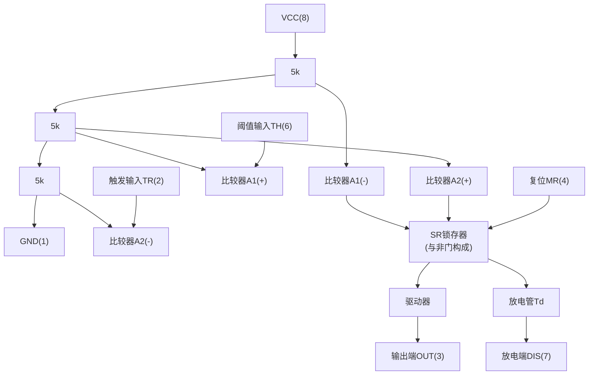

# 脉冲波形的产生与整形

## 章节概述

在数字系统中，矩形脉冲是最基本的工作信号。**脉冲波形的产生与整形**是数字电子技术的重要组成部分，本章围绕 **555时基电路** 这一经典芯片，介绍三种核心电路：**施密特触发器**、**单稳态触发器** 和**多谐振荡器**。它们分别用于波形的整形、定时延时以及信号产生。

---

## 6.1 555电路的功能与结构

### 1. 555时基电路简介

**555时基电路**是一种模拟/数字混合集成电路，由 Signetics 公司的汉斯-R-卡门辛德于 1972 年设计，是电子电路中最经典、用途最广泛的芯片之一。

常见型号：
- NE555 / SE555（Signetics，经典原型）
- LM555（TI，应用最广）
- CA555（RCA，精度高、温漂小）
- CB555（国产双极型定时器）

主要参数：双极型 555 电压范围 4.5V~15V，CMOS 型 2V~18V；最大输出电流可达 200mA（双极型），可直接驱动小型电机、喇叭、继电器等负载。

### 2. 555时基电路的内部结构

555 内部由以下五部分组成：

**核心组成部分：**

| 组成部分 | 功能说明 |
|---------|---------|
| **电阻分压器** | 三个 5k 电阻串联，提供 \( \frac{1}{3}V_{CC} \) 和 \( \frac{2}{3}V_{CC} \) 两个参考电平 |
| **电压比较器 A1** | 反相端接 \( \frac{2}{3}V_{CC} \)，同相端接 **阈值输入端 TH(6)** |
| **电压比较器 A2** | 同相端接 \( \frac{1}{3}V_{CC} \)，反相端接 **触发输入端 TR(2)** |
| **SR 锁存器** | 由与非门构成，接收比较器输出，决定电路状态 |
| **放电管 Td** | 集电极开路 NPN 管，用于电容充放电控制 |

### 3. 555时基电路的功能表（CB555）

功能表是理解和应用 555 的关键。比较器输出 \( S_D \)、\( R_D \) 控制 SR 锁存器，进而决定输出 \( Q \) 和放电管状态。

| TH(6) 电压 | TR(2) 电压 | \( R_D \) | \( S_D \) | 输出 OUT(3) | 放电管 Td |
|:---:|:---:|:---:|:---:|:---:|:---:|
| \( > \frac{2}{3}V_{CC} \) | \( > \frac{1}{3}V_{CC} \) | 0 | 1 | **0（置0）** | 导通 |
| \( < \frac{2}{3}V_{CC} \) | \( > \frac{1}{3}V_{CC} \) | 1 | 1 | **保持** | 保持 |
| \( < \frac{2}{3}V_{CC} \) | \( < \frac{1}{3}V_{CC} \) | 1 | 0 | **1（置1）** | 截止 |
| \( > \frac{2}{3}V_{CC} \) | \( < \frac{1}{3}V_{CC} \) | 0 | 0 | **不定（禁用）** | — |

> 注：MR(4) 为异步复位端，低电平有效，可将输出强制拉低，与 TH、TR 状态无关。

**功能表记忆口诀**：
- TH 高于 \( \frac{2}{3}V_{CC} \) 且 TR 高于 \( \frac{1}{3}V_{CC} \)：输出为 **0**（复位）
- TR 低于 \( \frac{1}{3}V_{CC} \)：输出为 **1**（置位）
- 其余情况：**保持**原状态

!!! warning "易错点"
    当 TH \( > \frac{2}{3}V_{CC} \) 且 TR \( < \frac{1}{3}V_{CC} \) 同时成立时，SR 锁存器出现 \( R_D = S_D = 0 \) 状态，输出**不定**，实际电路设计中应避免此情况。

### 4. 555引脚说明

| 引脚号 | 名称 | 功能 |
|:---:|------|------|
| 1 | GND | 接地端 |
| 2 | TR | 触发输入端，低于 \( \frac{1}{3}V_{CC} \) 时置位 |
| 3 | OUT | 输出端 |
| 4 | MR | 复位端，低电平强制输出为 0 |
| 5 | VC | 控制电压端，可外接电压改变阈值 |
| 6 | TH | 阈值输入端，高于 \( \frac{2}{3}V_{CC} \) 时复位 |
| 7 | DIS | 放电端，内部放电管的集电极 |
| 8 | VCC | 电源正端 |

!!! warning "易错点"
    5脚 VC 通常对地接 0.01μF 滤波电容以提高参考电压稳定性。当 5 脚外接电压 \( V_{CO} \) 时，阈值将变为 \( V_{T+} = V_{CO} \)，\( V_{T-} = \frac{1}{2}V_{CO} \)，回差电压也随之改变。
