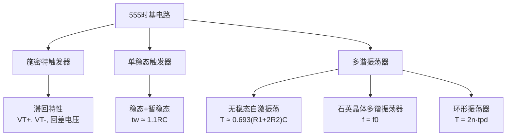

# 第6章 总结 — 脉冲波形的产生与整形

## 一、知识体系总览

## 二、555 电路核心要点

1. **内部结构**：电阻分压器（3x5k）、两个比较器、SR锁存器（与非门构成）、放电管、输出驱动器
2. **参考电平**：\( \frac{1}{3}V_{CC} \) 和 \( \frac{2}{3}V_{CC} \)
3. **功能表核心**：
   - TR < \( \frac{1}{3}V_{CC} \)：输出=1（置位），放电管截止
   - TH > \( \frac{2}{3}V_{CC} \)：输出=0（复位），放电管导通
   - 其余：保持
   - TH > \( \frac{2}{3}V_{CC} \) 且 TR < \( \frac{1}{3}V_{CC} \)：不定（禁用）
4. **5脚 VC**：外接电压可改变阈值，\( V_{T+} = V_{CO} \)，\( V_{T-} = \frac{1}{2}V_{CO} \)

## 三、三种电路对比

| 项目 | 施密特触发器 | 单稳态触发器 | 多谐振荡器 |
|------|------------|------------|----------|
| 稳态数量 | 2（双稳态） | 1稳态 + 1暂稳态 | 0（无稳态） |
| 触发方式 | 电平触发（有滞回） | 外部脉冲触发 | 自激振荡 |
| 核心参数 | \( V_{T+} \), \( V_{T-} \), \( \Delta V_T \) | \( t_w \approx 1.1RC \) | \( T \), \( f \), 占空比 \( D \) |
| 输出特点 | 边沿陡峭 | 单个固定宽度脉冲 | 连续矩形波 |
| 典型应用 | 波形变换、整形、鉴幅 | 定时、延时、消抖 | 时钟源、方波发生器 |

## 四、重点公式速查

| 电路 | 公式 | 说明 |
|------|------|------|
| 555施密特（默认） | \( V_{T+} = \frac{2}{3}V_{CC} \), \( V_{T-} = \frac{1}{3}V_{CC} \) | \( \Delta V_T = \frac{1}{3}V_{CC} \) |
| 555施密特（外接VC） | \( V_{T+} = V_{CO} \), \( V_{T-} = \frac{1}{2}V_{CO} \) | \( \Delta V_T = \frac{1}{2}V_{CO} \) |
| 单稳态脉宽 | \( t_w = RC \ln 3 \approx 1.1RC \) | |
| 多谐振荡周期 | \( T = (R_1 + 2R_2)C \ln 2 \approx 0.693(R_1 + 2R_2)C \) | |
| 多谐振荡频率 | \( f = \frac{1.443}{(R_1 + 2R_2)C} \) | |
| 多谐振荡占空比 | \( D = \frac{R_1 + R_2}{R_1 + 2R_2} \) | 当 \( R_2 \gg R_1 \), \( D \to 50\% \) |
| 环形振荡周期 | \( T = 2n \cdot t_{pd} \) | n 为奇数个反相器 |
| 石英晶体振荡 | \( f = f_0 \) | 仅取决于晶体，与 R、C 无关 |

## 五、常见易错点汇总

| 易错点 | 正确理解 |
|--------|---------|
| 555 内部 SR 锁存器构成 | 由**与非门**构成，而非或非门 |
| 施密特触发器输出 | 555 构成的默认为**反相型** |
| 单稳态输入脉宽要求 | 输入脉宽**必须小于** \( t_w \) |
| 多谐振荡器占空比 | 调节 R、C 可改变频率，但**不能改变占空比** |
| 石英晶体振荡频率 | **不可**通过外接 RC 调节，等于晶体固有频率 |
| 环形振荡器 | 必须用**奇数个**（>=3）反相器 |
| 555 功能表禁用态 | TH > 2/3VCC 且 TR < 1/3VCC 时输出**不定** |
