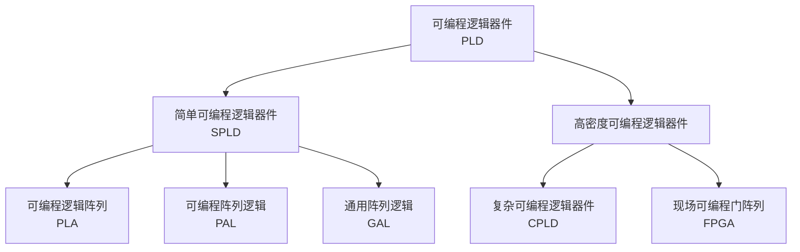
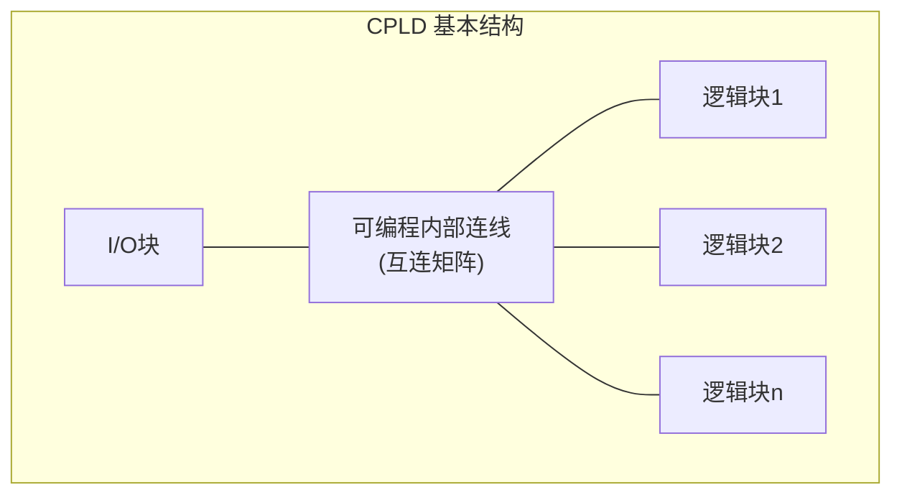
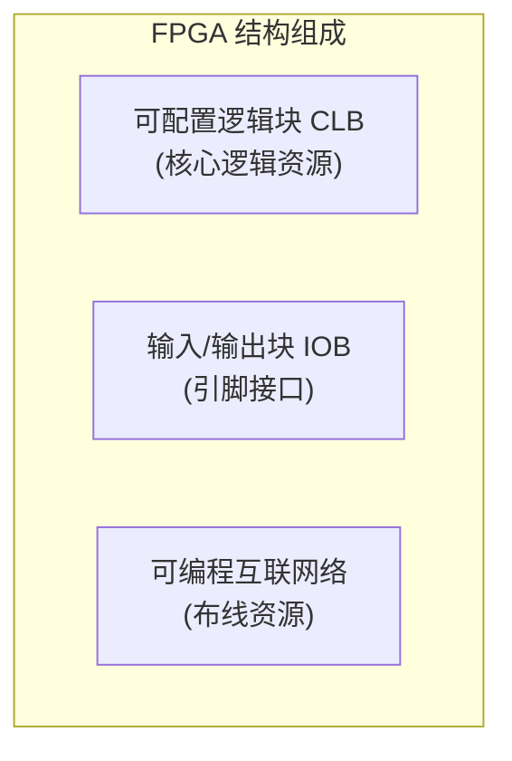

# 7.2 可编程逻辑器件（PLD、CPLD、FPGA）

## 一、可编程逻辑器件 PLD 简介

**可编程逻辑器件（Programmable Logic Device，PLD）**是用户可根据需要自行定义逻辑功能的器件。PLD 的核心优势：集成度高、电路尺寸小、功耗低、可靠性高，用户可在不改动 PCB 的情况下变更系统功能。

### 1. PLD 的分类

### 2. PLD 的基本结构

所有 PLD 均包含三个基本部分：

| 组成部分 | 功能 |
|---------|------|
| **输入缓冲电路** | 对输入信号进行预处理，提供互补信号（原变量 + 反变量） |
| **与或阵列** | PLD 的主体，实现"**积之和**"形式的逻辑函数 |
| **输出缓冲电路** | 对输出信号进行处理，可配置为组合/寄存器/三态等模式 |

### 3. PLD 电路中门电路的画法

PLD 使用简化的逻辑符号：

- **与门**：多输入单输出，可编程连接点用"x"表示，固定连接点用"·"表示
- **或门**：多输入单输出
- **互补输出缓冲器**：同时提供原变量和反变量
- **三态输出反相器**：带使能控制

---

## 二、低密度可编程逻辑器件（SPLD）

### 1. PLA（可编程逻辑阵列）

PLA 的**与阵列**和**或阵列**均可编程，灵活性最强。

**特点：**
- 与阵列和或阵列都可编程，灵活性高
- 缺点：速度慢、结构复杂成本高、布线困难利用率低、编程工具复杂

### 2. PAL（可编程阵列逻辑）

PAL 的与阵列可编程，**或阵列固定**。

**特点：**
- 与阵列可编程，或阵列固定，成本较 PLA 低
- 缺点：输出结构固定，灵活性差；编程后无法擦除；型号繁多，通用性差

### 3. GAL（通用阵列逻辑）

GAL 的与阵列可编程，或阵列固定，但输出端引入**OLMC（输出逻辑宏单元）**，可配置输出模式。

**特点：**
- 可反复编程，多次擦写
- 输出灵活：OLMC 可配置为组合/寄存器等多种模式
- 速度快、功耗低

---

## 三、复杂可编程逻辑器件 CPLD

**CPLD（Complex Programmable Logic Device）**是介于 PAL/GAL 与 FPGA 之间的中等规模可编程逻辑器件，本质是把多片 PAL/GAL 用**可编程互联矩阵**集成在同一芯片上。

**编程技术**：基于 EEPROM 或 Flash，配置信息**掉电不丢失**，无需外接存储芯片。

### 1. CPLD 基本结构

### 2. 逻辑块（Logic Block）

逻辑块是 CPLD 内部能够独立完成**组合与时序逻辑**功能的基本单元。各厂商命名不同：

| 厂商 | 名称 | 缩写 |
|------|------|------|
| Altera | 逻辑阵列块 | LAB |
| Xilinx | 功能块 | FB |
| Lattice | 通用逻辑块 | GLB |

**逻辑块内部包含：**
- **可编程乘积项阵列**：决定每个逻辑块乘积项的总数（如 XC9500：90 个 36 变量乘积项；MAX7000S：80 个 36 变量乘积项）
- **乘积项分配模块**：可将乘积项灵活分配给宏单元，支持多宏单元共享
- **宏单元**：包含或门、触发器、数据选择器和控制门，支持组合逻辑输出、寄存器输出、清零/置位

### 3. I/O 块

位于芯片周边，连接内部逻辑与外部引脚，可配置为输入、输出、双向、三态模式，同时完成**电平匹配**和**时序控制**。区分 VCCINT（内核电压）和 VCCIO（I/O 电压）。

### 4. 可编程内部连线

通过编程灵活接通信号通路，连接各个逻辑块和 I/O 块。各厂商实现方式不同：
- Altera：可编程连线
- Xilinx：开关矩阵
- Lattice：全局布线区

### 5. 典型 CPLD 产品参数

| 厂商 | 系列 | 代表型号 | 宏单元总数 | 工作电压 | 最高频率 |
|------|------|---------|:---:|:---:|:---:|
| Altera | MAX 7000S | EPM7032S | 64 | 5V | 175.4MHz |
| Altera | MAX II | EPM2210G | 1700 | 1.8V | 304MHz |
| Xilinx | XC9500XL | XC95144XL | 144 | 3.3V | 200MHz |
| Lattice | ispMACH4000V | 4128V | 128 | 3.3V | 333MHz |

---

## 四、现场可编程门阵列 FPGA

**FPGA（Field Programmable Gate Array）**是一种具备现场可编程特性的**半定制集成电路**，可通过配置文件重构内部逻辑与布线资源。FPGA 之父为 Xilinx 联合创始人罗斯-弗里曼。

### 1. 查找表（LUT）逻辑结构

**查找表（Look-Up Table）**是 FPGA 实现组合逻辑的核心。基本原理：将所有输入组合对应的输出结果预先存入存储器，用"查表"代替"逻辑运算"。

- 输入 = 地址
- 输出 = 该地址存的数据
- 本质是用 **SRAM** 实现任意逻辑函数

**示例：2 输入异或门用 LUT 实现**

| A B（地址） | 存储内容（F） |
|:---:|:---:|
| 0 0 | 0 |
| 0 1 | 1 |
| 1 0 | 1 |
| 1 1 | 0 |

一个 \( n \) 输入 LUT 需要 \( 2^n \) 位的 SRAM。常见有 4 输入 LUT 和 6 输入 LUT（通过 4 个 4 输入 LUT + 多路选择器级联实现）。

!!! warning "易错点"
    FPGA 基于 **SRAM 工艺**，配置信息存在片内 SRAM 中，**掉电即丢失**。因此 FPGA 通常需要**外接配置芯片**（如 Flash），上电后自动加载配置（这个过程称为"配置/加载"）。这与 CPLD 的 EEPROM/Flash 固化配置完全不同的。

### 2. FPGA 基本结构

| 组成部分 | 功能 |
|---------|------|
| **可配置逻辑块（CLB）** | 核心逻辑资源，由多个 SLICE 组成，每个 SLICE 含 LUT、触发器和进位链 |
| **I/O 块（IOB）** | 芯片外部引脚与内部电路的数据交换接口 |
| **可编程互联网络** | 逻辑块之间及逻辑块与 I/O 块之间的可编程连线和开关矩阵 |

高端 FPGA（如 Artix-7/Kintex-7/Virtex-7）互联分四层：局部互联、区域互联、全局互联、时钟网络。

### 3. CPLD vs FPGA 对比

| 对比项 | CPLD | FPGA |
|--------|------|------|
| 基本逻辑单元 | 乘积项 + 宏单元 | 查找表（LUT）+ 触发器 |
| 编程技术 | EEPROM/Flash（非易失） | SRAM（易失，需外接配置芯片） |
| 掉电后配置 | **保留** | **丢失** |
| 逻辑资源密度 | 较低 | **高** |
| 时序可预测性 | 好（固定互连延迟） | 较差（取决于布局布线） |
| 适合应用 | 控制逻辑、接口、组合逻辑密集 | 复杂时序、DSP、大规模数字系统 |

### 4. 摩尔定律与"时间缩微"

- **摩尔定律**（戈登-摩尔，英特尔）：集成电路上晶体管数目约每 18-24 个月翻一倍
- **"时间缩微"**（何庭波，华为）：用时间换空间，通过时分复用等架构创新，实现芯片性能与密度的持续提升
