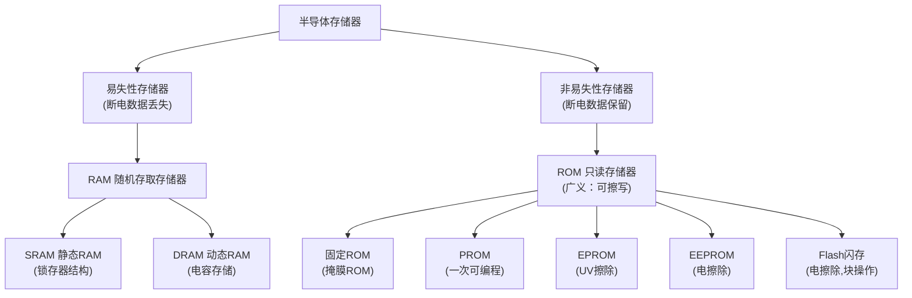

# 存储器及可编程逻辑器件

## 章节概述

本章介绍数字系统中的两大核心组件：**半导体存储器**和**可编程逻辑器件（PLD）**。存储器是数字系统中存储数据和程序的硬件基础，而 PLD 则为用户提供了灵活定制硬件逻辑的能力。从 ROM/RAM 的分类与原理，到 CPLD/FPGA 的结构与设计方法，本章覆盖了从存储到可编程逻辑的完整知识链。

---

## 7.1 半导体存储器

### 1. 半导体存储器的分类

| 类型 | 易失性 | 读写特性 | 典型应用 |
|------|:---:|------|------|
| **SRAM** | 易失 | 可随机读写 | CPU 缓存、高速暂存 |
| **DRAM** | 易失 | 可随机读写，需刷新 | 计算机主存（内存条） |
| **MROM** | 非易失 | 出厂固化，只读 | 固定程序、函数表 |
| **PROM** | 非易失 | 用户一次性编程 | 小批量固化程序 |
| **EPROM** | 非易失 | UV 擦除后重写 | 开发调试阶段 |
| **EEPROM** | 非易失 | 电擦除/电编程 | 配置存储、参数保存 |
| **Flash** | 非易失 | 电擦除、块操作 | SSD、U 盘、手机存储 |

!!! warning "易错点"
    ROM 最初指"只读存储器"，但现代广义 ROM 包括 EPROM、EEPROM、Flash 等**可擦写**器件。区分 ROM 和 RAM 的关键不是"能否写入"，而是**断电后数据是否保留**（易失性 vs 非易失性）。

### 2. ROM 的基本结构与工作原理

#### 2.1 基本结构

ROM 由四部分组成：

| 组成部分 | 功能 |
|---------|------|
| **地址译码器** | 将 n 位地址码译成 \( 2^n \) 条字线，每次仅选中一条 |
| **存储矩阵** | 核心部分，由 \( N \times M \) 个存储单元组成 |
| **输出缓冲器** | 提高带负载能力，实现三态控制以连接系统总线 |

**存储容量** = 字线数 N x 位线数 M

!!! warning "易错点"
    若 ROM 有 12 位地址线、8 位数据输出，则存储容量 = \( 2^{12} \times 8 = 4096 \times 8 = 32768 \) 位 = 32K 位（32Kb），而非 32KB。注意区分位（bit）和字节（Byte）。

#### 2.2 工作原理

ROM 内部可视为**与阵列** + **或阵列**的两级结构：

- **与阵列（地址译码器）**：产生所有最小项（字线），每个地址对应唯一字线被选中
- **或阵列（存储矩阵）**：字线和位线的交叉点是否连接，决定了该地址存储的数据。有二极管/晶体管连接处存"1"，无连接处存"0"

#### 2.3 ROM 的分类与特点

| 类型 | 编程方式 | 擦除方式 | 特点 |
|------|---------|---------|------|
| **固定 ROM（掩膜 ROM）** | 厂家掩膜工艺固化 | 不可擦 | 批量成本低，可靠性高；开发周期长 |
| **PROM** | 用户一次性编程（熔丝/反熔丝） | 不可擦 | 熔丝烧断为"0"，只能写一次 |
| **EPROM** | 电编程 | 紫外线擦除 | 整芯片擦除，擦除不便，效率低 |
| **EEPROM** | 电编程 | 电擦除 | 可按字节擦写，灵活方便 |
| **Flash Memory** | 电编程 | 电擦除（块操作） | 速度快，容量大，应用最广泛 |

**ROM 的主要特点：**
- 信息可随时读出，但不可随时写入（需特殊操作）
- **数据不易丢失，断电亦保存**
- 工作时**无需刷新**
- 电路结构简单，集成度高，宜批量生产

### 3. 随机存储器 RAM

#### 3.1 SRAM（静态随机存储器）

**基本存储单元**：6 管 CMOS 结构（两个交叉耦合反相器构成锁存器 + 两个门控管）

| 操作 | 说明 |
|------|------|
| **保持** | WL=0，门控管截止，锁存器自保持 |
| **读数据** | WL=1，BL和~BL预充至VDD/2，锁存器向位线放电，灵敏放大器检测 |
| **写数据** | 位线准备好数据，WL=1，位线强制改写锁存器状态 |

特点：速度快，无需刷新，但集成度低，功耗较大。常用于 **CPU 高速缓存**。

#### 3.2 DRAM（动态随机存储器）

**基本存储单元**：1 个 MOS 管 + 1 个电容（1T1C 结构）

| 操作 | 说明 |
|------|------|
| **保持** | WL=0，门控管截止，电容自保持 |
| **读数据** | WL=1，电容向位线放电，检测位线电压变化 |
| **写数据** | 位线准备好数据，WL=1，位线向电容充电/放电 |

特点：结构简单、集成度高、成本低，但需**定期刷新**，且是**破坏性读出**（读后需自动回写）。

!!! warning "易错点"
    DRAM 的读出是**破坏性读出**：读操作会消耗电容电荷，读后必须自动回写/刷新。DRAM 需要周期性刷新（通常每 64ms 内完成全部行的刷新）。

#### 3.3 SRAM vs DRAM 对比

| 对比项 | SRAM | DRAM |
|--------|------|------|
| 基本单元 | 6 管锁存器 | 1 管 + 1 电容 |
| 速度 | 快 | 慢 |
| 集成度 | 低 | 高 |
| 功耗 | 较大 | 较小 |
| 是否需要刷新 | 否 | 是（必须） |
| 成本 | 高 | 低 |
| 典型应用 | 缓存（Cache） | 主存（内存条） |

### 4. 存储器容量的扩展

| 扩展方式 | 方法 | 适用场景 |
|---------|------|---------|
| **位扩展** | 多片并联，地址线和控制线共用，每片负责部分数据位 | 增加每个字的位数 |
| **字扩展** | 高位地址经译码器产生片选信号，选中不同芯片 | 增加存储字的数量 |
| **字位同时扩展** | 先位扩展再字扩展 | 同时增加字数和位数 |

### 5. ROM 实现组合逻辑电路

ROM 的核心应用之一是**实现任意组合逻辑函数**。原理：将输入变量作为地址，将函数真值表存入存储矩阵。

- 地址译码器产生所有最小项（**与阵列**）
- 存储矩阵实现最小项之和（**或阵列**）
- 逻辑函数最小项之和中出现的那些最小项对应的位置存"1"

对于 \( n \) 输入 \( m \) 输出的组合逻辑，只需一片 \( 2^n \times m \) 的 ROM 即可实现。
