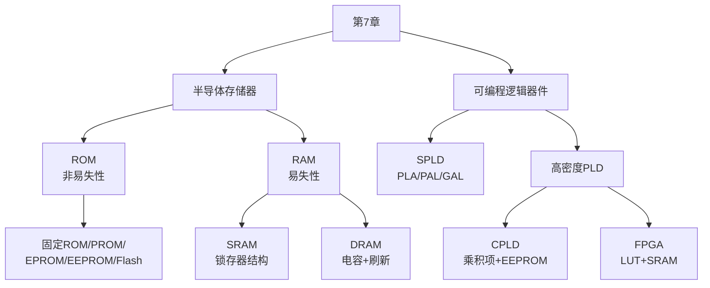

# 第7章 总结 — 存储器及可编程逻辑器件

## 一、知识体系总览

## 二、存储器核心要点

### 分类速查

| 类型 | 易失性 | 关键结构 | 刷新 | 典型用途 |
|------|:---:|------|:---:|------|
| SRAM | 易失 | 6管锁存器 | 否 | CPU缓存 |
| DRAM | 易失 | 1T1C | 是 | 内存条 |
| MROM | 非易失 | 掩膜固化 | 否 | 固定程序 |
| PROM | 非易失 | 熔丝/反熔丝 | 否 | 一次性编程 |
| EPROM | 非易失 | 浮栅MOS管 | 否 | UV擦除重写 |
| EEPROM | 非易失 | 薄氧化层浮栅 | 否 | 电擦除 |
| Flash | 非易失 | 浮栅/电荷俘获 | 否 | SSD/U盘 |

### ROM 核心原理
- ROM = **与阵列**（地址译码器，产生所有最小项）+ **或阵列**（存储矩阵，实现最小项之和）
- 存储容量 = 字线数 x 位线数 = \( 2^n \times m \)
- ROM 也可实现任意组合逻辑：输入变量 = 地址，函数真值表 = 存储内容

### SRAM vs DRAM
| | SRAM | DRAM |
|---|------|------|
| 单元 | 6管 | 1T1C |
| 速度 | 快 | 慢 |
| 密度 | 低 | 高 |
| 刷新 | 不需要 | 必须 |
| 读出 | 非破坏性 | **破坏性读出** |

!!! warning "易错点"
    DRAM 是"破坏性读出"——读操作消耗电容电荷，读后必须自动回写。不做回写，数据就会丢失。

### 存储器扩展
- **位扩展**：并联，增加数据宽度
- **字扩展**：片选+译码，增加地址空间
- **字位同时**：先位扩展、再字扩展

## 三、可编程逻辑器件核心要点

### SPLD 演进

| 器件 | 与阵列 | 或阵列 | 特点 |
|------|:---:|:---:|------|
| **PLA** | 可编程 | 可编程 | 灵活但复杂，已很少用 |
| **PAL** | 可编程 | **固定** | 简单但不能擦除 |
| **GAL** | 可编程 | 固定 | 输出有 OLMC，可反复擦写 |

### CPLD vs FPGA

| 对比项 | CPLD | FPGA |
|--------|------|------|
| 逻辑实现 | 乘积项（与或阵列） | 查找表 LUT（SRAM） |
| 存储工艺 | EEPROM/Flash | SRAM |
| 掉电保留 | **保留** | **丢失**（需外接配置芯片） |
| 资源密度 | 中低 | **高** |
| 时序可预测 | 好 | 取决于布局布线 |
| 适用场景 | 控制逻辑、胶合逻辑 | 复杂时序、DSP、大规模系统 |

### LUT 原理

- 把真值表直接存入 SRAM
- \( n \) 输入 LUT 需要 \( 2^n \) 位 SRAM
- 输入变量 = 地址，输出 = 该地址存储的内容
- **查表代替逻辑运算**，速度快

### FPGA 三大核心模块

| 模块 | 功能 |
|------|------|
| CLB（可配置逻辑块） | 由 SLICE 组成，含 LUT + 触发器 + 进位链，实现组合/时序逻辑 |
| IOB（I/O 块） | 引脚接口，支持多种电平标准，可配置输入/输出/双向 |
| 可编程互联 | 连线 + 开关矩阵，连接 CLB 与 IOB |

## 四、易错点汇总

| 易错点 | 正确理解 |
|--------|---------|
| ROM 和 RAM 区分标准 | 看**易失性**（断电后数据是否保留），不是看能否写入 |
| 存储容量单位 | 地址线 n 位 + 数据线 m 位 = \( 2^n \times m \)位，注意 bit vs Byte |
| DRAM 读出 | **破坏性读出**，读后必须回写 |
| SRAM 是否需要刷新 | **不需要**，锁存器自保持 |
| CPLD 掉电后配置 | **保留**（EEPROM/Flash 工艺） |
| FPGA 掉电后配置 | **丢失**（SRAM 工艺），需外接配置芯片 |
| FPGA 逻辑实现 | 基于 **LUT（查找表）**，而非乘积项 |
| CPLD 逻辑密度 | **低于** FPGA，而非高于 |
