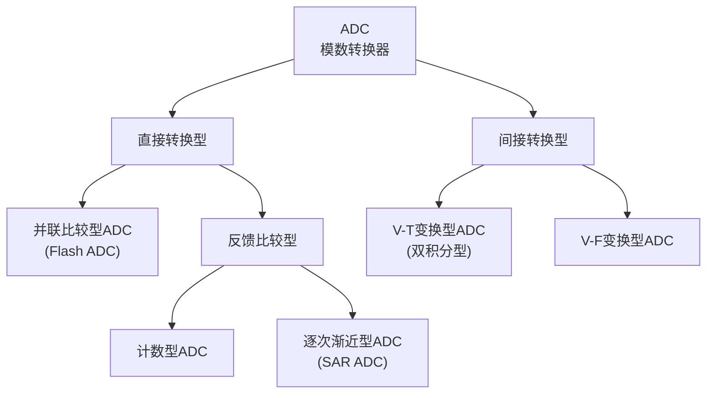

# 8.2 模/数转换器（ADC）原理与类型

## 一、A/D 转换的基本原理

**ADC（Analog to Digital Converter）**将时间上和幅度上均连续的模拟信号转换为离散的数字信号。转换过程分为四个步骤：

| 步骤 | 说明 | 执行电路 |
|------|------|---------|
| **采样** | 将时间上连续的模拟量变为时间上离散的模拟量 | 采样-保持电路 |
| **保持** | 采样期间的信号值保持不变，直到下次采样 | 采样-保持电路 |
| **量化** | 将采样值归一化到与之接近的离散数字电平 | ADC 内部 |
| **编码** | 将量化结果用二进制（或其他进制）代码表示 | ADC 内部 |

### 1. 奈奎斯特采样定理

\[
f_s \geq 2 f_{i(max)}
\]

通常取 \( f_s = (3 \sim 5) f_{i(max)} \)，以确保不失真地恢复原信号。

### 2. 量化与量化误差

**量化单位 \( \Delta \)**（即 1 LSB）：ADC 能分辨的最小电压变化量。

\[
\Delta = \frac{V_{REF}}{2^n}
\]

**量化误差**：模拟量和数字量之间不是一一对应关系，ADC 存在固有的转换误差。

- **只舍不入法**：量化误差 = \( 1 \) LSB
- **有舍有入法**（四舍五入）：量化误差 = \( \pm \frac{1}{2} \) LSB

!!! warning "易错点"
    ADC 位数 \( n \) 越大，量化单位 \( \Delta \) 越小，量化误差越小，分辨能力越强。

---

## 二、ADC 的分类

### 1. 并联比较型 ADC（Flash ADC）

**电路组成**：电阻分压网络 + 并行比较器阵列 + 寄存器 + 优先编码器。

**工作原理**：
- 电阻分压网络将 \( V_{REF} \) 分为 \( 2^n - 1 \) 个量化电平
- 所有比较器同时比较输入电压与各自参考电平
- 比较器输出经寄存器锁存，由优先编码器输出二进制码

**特点：**

| 优点 | 缺点 |
|------|------|
| **转换速度最快**（8 位输出 < 50ns） | 需要 \( 2^n - 1 \) 个比较器和触发器，**电路庞大** |
| 可**不附加**采样-保持电路 | 位数增加时硬件量指数增长 |

!!! warning "易错点"
    n 位并联比较型 ADC 需要 \( 2^n - 1 \) 个电压比较器和 \( 2^n - 1 \) 个触发器，而不是 \( 2^n \) 个。

### 2. 反馈比较型 ADC

**核心原理**：将 DAC 输出的模拟电压与 ADC 输入电压相比较，若不等则调整 DAC 输入数字量，直到相等为止。

#### 2.1 计数型 ADC

**工作过程**：计数器从 0 开始逐次加 1，DAC 输出阶梯电压，比较器检测何时 DAC 输出 >= 输入电压。

**特点：**

| 优点 | 缺点 |
|------|------|
| 电路**非常简单** | **转换时间长**，最长 \( (2^n - 1) \cdot T_{CP} \) |

#### 2.2 逐次渐近型 ADC（SAR ADC）

**核心思想**：**二分法试探**，类似天平称重——从最重砝码开始试放。

**工作过程**：
1. 逐次逼近寄存器（SAR）先置 MSB=1，其余为 0
2. DAC 输出对应模拟电压与输入电压比较
3. 若 DAC 输出 > 输入：该位清零；若 DAC 输出 < 输入：该位保留为 1
4. 重复以上步骤，从 MSB 到 LSB 依次确定每一位
5. n 次比较后完成转换

**特点：**

| 优点 | 缺点 |
|------|------|
| 转换比计数型**快得多**，固定 \( (n+2) \cdot T_{CP} \) 完成 | 需要 DAC + 比较器 + SAR |
| 电路规模比并联比较型**小得多** | 速度不及 Flash ADC |
| **目前应用最广泛**的 ADC 结构 | — |

!!! warning "易错点"
    逐次渐近型 ADC 完成一次转换需要 \( (n+2) \cdot T_{CP} \) 个时钟周期（n 为位数），而非 \( n \) 个周期。其内部**必不可少**的模块是 **DAC 电路**。

### 3. V-T 变换型 ADC（双积分型 ADC）

#### 3.1 工作原理

分两个阶段：

| 阶段 | 操作 | 说明 |
|------|------|------|
| **第一次积分（采样阶段）** | 对输入电压 \( U_I \) 定时积分 \( T_1 = 2^n \cdot T_{CP} \) | 定时采样 |
| **第二次积分（比较阶段）** | 对基准电压 \( -U_{REF} \) 反向积分，直到输出回零 | 定速比较 |

第二次积分时间 \( T_2 \) 与输入电压 \( U_I \) 成正比，计数值即 A/D 转换结果。

\[
T_2 = \frac{U_I}{U_{REF}} \cdot T_1
\]

#### 3.2 双积分型 ADC 特点

| 优点 | 缺点 |
|------|------|
| **转换结果与 R、C 参数无关** | **转换速度慢**，最长 \( (2^{n+1} - 1) \cdot T_{CP} \) |
| **转换结果与时钟周期无关** | 转换速度一般在每秒几十次以内 |
| **抗干扰能力强**（对平均值为零的噪声有强抑制） | — |
| 工作性能稳定，可用低精度元件制高精度 ADC | — |

#### 3.3 影响双积分型 ADC 精度的因素

- 计数器的位数
- 比较器的灵敏度
- 运放和比较器的零点漂移
- 积分电容的漏电
- 时钟频率的瞬时波动

---

## 三、ADC 的主要技术指标

### 1. 分辨率

用二进制位数 \( n \) 表征，或用最小可分辨电压 1 LSB 表示：

\[
1 \text{ LSB} = \frac{V_{REF}}{2^n}
\]

### 2. 转换精度

ADC 输出数字量与对应输入模拟电压理论数字量之间的最大偏差，包括量化误差、失调误差、增益误差、非线性误差。多以 LSB 的倍数或满量程的百分数表示。

### 3. 转换速度

- **转换时间**：完成一次完整模数转换所需的时间（μs、ms）
- **转换速率**：单位时间内能完成的转换次数（SPS、kSPS、MSPS）
- 转换速度主要取决于**转换电路的类型**

---

## 四、各型 ADC 性能对比

| 类型 | 最长转换时间 | 优点 | 缺点 |
|------|:---:|------|------|
| **并联比较型** | < 50ns | 速度最快，可不附加 S/H 电路 | 电路复杂庞大 |
| **计数反馈比较型** | \( (2^n - 1)T_{CP} \) | 电路原理简单 | 转换时间较长 |
| **逐次渐近型** | \( (n+2)T_{CP} \) | 速度较快，复杂度适中，**最常用** | 转换时间固定 |
| **V-T 型（双积分）** | \( (2^{n+1} - 1)T_{CP} \) | 抗干扰强，性能稳定 | 速度低，精度影响因素复杂 |
| **V-F 型** | — | 调频信号，抗干扰强 | 转换速度低 |

---

## 五、采样-保持电路

**功能**：在采样期间跟踪输入信号变化，在保持期间维持采样值不变。

- **采样阶段**：模拟开关闭合，输出跟随输入
- **保持阶段**：模拟开关断开，电容保持断开瞬间的电压值

集成采样保持电路如 **LF198**，广泛用于 ADC 前端。
