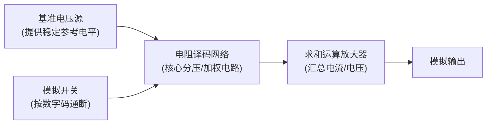

# 数模与模数转换电路

## 章节概述

自然界中的物理量（声音、温度、压力等）大多是**模拟量**，而数字系统只能处理**数字量**。**DAC（数模转换器）**和**ADC（模数转换器）**是连接模拟世界与数字世界的桥梁。本章从基本原理出发，系统介绍 DAC 和 ADC 的电路结构、工作原理、技术指标及典型应用。

---

## 8.1 数/模转换器（DAC）

### 1. D/A 转换的基本原理

**DAC（Digital to Analog Converter）**将输入的数字量 \( D_n \) 转换为与之成正比的模拟电压 \( V_O \)（或电流 \( I_O \)）。

\[
V_O = K \cdot D_n = K \cdot \sum_{i=0}^{n-1} X_i \cdot 2^i
\]

其中 \( K \) 为比例系数，\( X_i \in \{0, 1\} \) 为各位数字量，\( n \) 为位数。

### 2. DAC 的基本结构与分类

#### 2.1 基本结构

DAC 一般由四部分组成：

| 组成部分 | 功能 |
|---------|------|
| **基准电压源** | 提供稳定参考电平 \( V_{REF} \)，决定输出量程 |
| **模拟开关** | 按输入数字码通断，选通对应电阻支路 |
| **电阻译码网络** | 核心电路，按位权分压或加权，换算数值等级 |
| **求和运放** | 汇总各支路电流/电压，输出模拟电平 |

#### 2.2 DAC 分类

**按输入方式：**
- **并行输入 DAC**：所有数码位同时输入，转换速度快
- **串行输入 DAC**：数码逐位输入，速度慢但引脚少

**按译码网络类型：**

| 类型 | 原理 | 特点 |
|------|------|------|
| **权电阻网络 DAC** | 按二进制位权配比不同阻值电阻 | 结构简单，阻值跨度大 |
| **倒 T 型电阻网络 DAC** | R-2R 梯形网络，仅两种阻值 | **最常用**，易集成，精度高 |
| **权电流网络 DAC** | 恒流源替代电阻支路 | 精度最高，速度最快 |
| **权电容网络 DAC** | 按位权配比电容，电荷守恒分压 | CMOS 工艺友好 |
| **开关树型 DAC** | 等值电阻分压 + 树状开关抽头 | 最简单，单调性好 |

### 3. 权电阻网络 DAC

#### 3.1 电路原理

每位对应一个电阻，阻值与该位的权成反比。最低位（LSB）电阻最大（\( 2^{n-1}R \)），最高位（MSB）电阻最小（\( R \)）。

\[
I_i = \frac{V_{REF}}{2^{n-1-i} \cdot R} \cdot X_i
\]

\[
V_O = -R_f \sum_{i=0}^{n-1} I_i = -\frac{V_{REF} R_f}{2^{n-1} R} \sum_{i=0}^{n-1} X_i \cdot 2^i
\]

#### 3.2 电路特点

| 优点 | 缺点 |
|------|------|
| 结构简单，电阻元件数少 | 电阻阻值**跨度极大**（位数多时难以制造） |
| — | 电阻精度不一致，转换误差大 |
| — | 各支路电流差异大，易受噪声影响 |

**改进**：双级权电阻网络，将位数分为两组，通过分流电阻 \( R_s \) 连接，大幅减小电阻值跨度。

!!! warning "易错点"
    权电阻网络 DAC 中，阻值越大则**权值越小**，电流也越小。最高位（MSB）的电阻最小。所有权电阻的阻值**不相等**，而是按 2 的幂次配比。

### 4. 倒 T 型电阻网络 DAC

#### 4.1 电路原理

仅使用 R 和 2R 两种阻值，构成 R-2R 梯形网络。流入每个 2R 电阻的电流从高位到低位按**2 的整数倍递减**。

\[
I = \frac{V_{REF}}{R}，\quad I_3 = \frac{I}{2}，\quad I_2 = \frac{I}{4}，\quad I_1 = \frac{I}{8}，\quad I_0 = \frac{I}{16}
\]

\[
V_O = -R_f \cdot I_{\Sigma} = -\frac{V_{REF} R_f}{2^n R} \sum_{i=0}^{n-1} X_i \cdot 2^i
\]

#### 4.2 电路特点

| 优点 | 说明 |
|------|------|
| 仅用 R 和 2R 两种阻值 | 制造简单，精度高，**易于集成** |
| 各支路电流固定 | 无论开关位置如何，2R 两端电压恒为 \( V_{REF} \) |
| 转换速度较快 | 寄生电容影响小 |

!!! warning "易错点"
    相较于权电阻 DAC，倒 T 型电阻网络 DAC 的主要优点是**电阻网络只有两种阻值，易集成、精度高**。并非电路结构更简单或输出电压更大。

### 5. 权电流型 DAC

**背景**：模拟开关存在导通电阻和导通压降，且各开关不完全一致，影响转换精度。

**方案**：以**恒流源**替代权电阻支路，按位权配置不同大小的恒定电流，数字量控制通断。

| 特点 |
|------|
| 恒流源消除电阻压降误差 |
| 开关导通压降不影响输出 |
| 转换精度高、电流稳定、温漂影响小 |
| 可结合倒 T 型网络实现恒流源（利用运放虚短特性使各支路电压相同） |

### 6. 具有双极性输出的 DAC

前面 DAC 输出均为**单极性**（如 0 ~ -9.375V）。双极性 DAC 能将补码输入的正负数分别转换为正负极性的模拟电压。

**核心思路**：补码先转换为**偏移码**（符号位取反），再用单极性 DAC 转换，最后电平偏移。

**偏移码**：给所有数值加固定偏置 \( K = 2^{n-1} \)，将负数映射为非负数。偏移码 = 补码的符号位取反。

### 7. DAC 的主要技术指标

#### 7.1 分辨率

最小输出电压与最大输出电压的比值，**仅与位数有关**：

\[
\text{分辨率} = \frac{V_{LSB}}{V_{max}} = \frac{1}{2^n - 1}
\]

- \( V_{LSB} \)：输入数字量仅 LSB=1 时的输出电压
- \( V_{max} \)：输入全 1 时的满量程电压
- 厂商通常用**位数**表示分辨率，位数越多分辨率越高

!!! warning "易错点"
    分辨率只与**位数**有关，与基准电压 \( V_{REF} \) 无关。

#### 7.2 转换精度

实际输出与理想输出值的偏差程度，分三类误差：

| 误差类型 | 原因 | 表现 |
|---------|------|------|
| **比例系数误差** | \( V_{REF} \) 波动、运放增益偏离 | 斜率偏差 |
| **失调（零点）误差** | 运放零点漂移 | 输入全 0 时输出不为 0 |
| **非线性误差** | 开关导通电阻、电阻网络偏差 | 输入等量增加时输出不等量增加 |

总误差 = 三者绝对值之和。高精度 DAC 需配合**高稳定度 \( V_{REF} \)**和**低漂移运放**。

#### 7.3 转换速度

**建立时间 \( t_{set} \)**：从输入数字量突变开始，到输出电压进入稳态值 ±1/2LSB 范围内的时间。

### 8. 集成 DAC 芯片

| 芯片 | 位数 | 结构 | 说明 |
|------|:---:|------|------|
| **DAC0808** | 8 位 | 权电流型 | 双极型工艺，速度高 |
| **AD7533** | 10 位 | 倒 T 型 | 需外接运放，可用内部反馈电阻 |
| **CB7520** | 10 位 | 倒 T 型 | 配合 74LS161 可构成波形发生器 |
