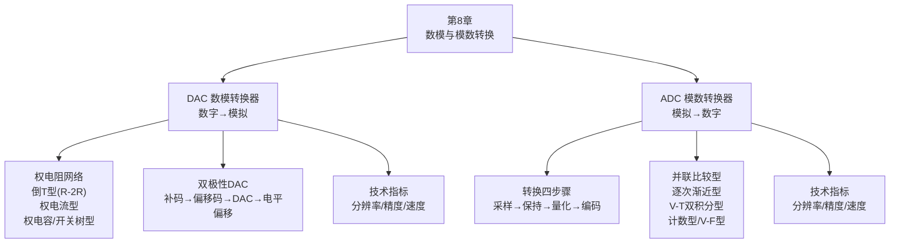

# 第8章 总结 — 数模与模数转换电路

## 一、知识体系总览

## 二、DAC 核心要点

### DAC 类型对比

| 类型 | 核心元件 | 核心特点 |
|------|---------|------|
| **权电阻网络** | 不同阻值电阻（按 2 的幂次配比） | 结构简单，阻值跨度大，难以集成 |
| **倒 T 型（R-2R）** | **仅 R 和 2R 两种阻值** | 易集成，精度高，**应用最广泛** |
| **权电流型** | 恒流源 | 精度最高，不受开关压降影响 |
| **权电容型** | 按位权配比电容 | CMOS 工艺友好 |
| **开关树型** | 等值电阻分压 + 树状开关 | 最简单，单调性好 |

### 重点公式

\[
\text{DAC 输出（权电阻）}：V_O = -\frac{V_{REF} R_f}{2^{n-1} R} \sum_{i=0}^{n-1} X_i \cdot 2^i
\]

\[
\text{DAC 输出（倒T型/R_f=R）}：V_O = -\frac{V_{REF}}{2^n} \sum_{i=0}^{n-1} X_i \cdot 2^i
\]

\[
\text{分辨率} = \frac{1}{2^n - 1}，\quad V_{LSB} = \frac{V_{max}}{2^n - 1}
\]

### DAC 技术指标

| 指标 | 定义 | 关键点 |
|------|------|------|
| **分辨率** | \( V_{LSB} / V_{max} \) | **仅与位数有关**，与 \( V_{REF} \) 无关 |
| **转换精度** | 比例系数误差 + 失调误差 + 非线性误差 | 需配合高稳定度 \( V_{REF} \) 和低漂移运放 |
| **转换速度** | 建立时间 \( t_{set} \) | 输出进入 ±1/2 LSB 范围内的时间 |

### 双极性 DAC

补码 →（符号位取反）→ 偏移码 → 单极性 DAC → 减去偏置电平 → 双极性输出

## 三、ADC 核心要点

### 转换四步骤

| 步骤 | 功能 | 电路 |
|------|------|------|
| 采样 | 时间连续 → 时间离散 | 采样-保持电路 |
| 保持 | 维持采样值不变 | 采样-保持电路 |
| 量化 | 归一化到离散电平 | ADC 内部 |
| 编码 | 量化结果 → 二进制代码 | ADC 内部 |

### 奈奎斯特采样定理

\[
f_s \geq 2 f_{i(max)}，\text{通常取 } f_s = (3 \sim 5) f_{i(max)}
\]

### 量化误差

| 量化方法 | 量化误差 |
|---------|:---:|
| 只舍不入 | \( 1 \) LSB |
| 有舍有入 | \( \pm \frac{1}{2} \) LSB |

### ADC 类型对比

| 类型 | 速度 | 硬件规模 | 抗干扰 | 核心应用 |
|------|:---:|:---:|:---:|------|
| 并联比较型 | **最快** (<50ns) | **最大** (\( 2^n-1 \)比较器) | 一般 | 高速采集 |
| 计数型 | 最慢 | 最小 | 一般 | 教学/低速 |
| 逐次渐近型 | **较快** (10~100μs) | 中等 | 一般 | **最广泛应用** |
| V-T 双积分型 | 慢 (ms级) | 中等 | **最强** | 精密测量/万用表 |

!!! warning "易错点"
    逐次渐近型 ADC 内部**必不可少**的模块是 **DAC 电路**。它通过 DAC 产生比较电压，用二分法逐次逼近输入电压。

### 双积分型 ADC 核心优势

1. 转换结果与 **R、C 参数无关**
2. 转换结果与**时钟周期无关**
3. 可用**低精度元件制成高精度 ADC**
4. 对**平均值为零的噪声**有极强抑制能力

## 四、易错点汇总

| 易错点 | 正确理解 |
|--------|---------|
| DAC 分辨率 | **仅与位数有关**，与 \( V_{REF} \) 无关 |
| 权电阻 DAC 阻值关系 | 阻值越大权值越小，MSB 电阻最小，各电阻**不相等** |
| 倒 T 型 DAC 优点 | 仅两种阻值，**易集成、精度高** |
| 权电流 DAC 原理 | 利用**不同大小的恒流源**实现不同位权 |
| ADC 转换步骤 | 采样、保持、量化、编码，共**四步** |
| Flash ADC 比较器数量 | \( 2^n - 1 \) 个比较器和触发器（不是 \( 2^n \)） |
| 逐次渐近 ADC 时间 | \( (n+2)T_{CP} \)（不是 \( n \cdot T_{CP} \)） |
| SAR ADC 必需模块 | **DAC 电路** |
| 双积分 ADC 精度 | 与 **R、C 参数无关**，与**时钟周期无关** |
| R-2R DAC + S/H | R-2R DAC 工作时**不需要**额外搭配采样保持电路 |
