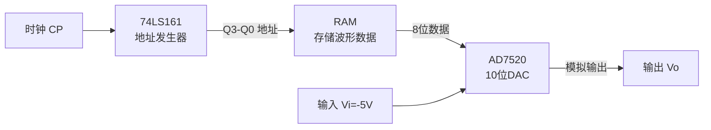

# DAC/ADC与波形发生器

D/A转换器和A/D转换器的计算题以及波形发生器综合题是每年期末考试的必考内容。核心知识点包括输出电压计算、分辨率、转换时间以及AD7520与ROM构成的波形发生器。

---

## 例题1：DAC输出电压计算（2020 A卷 填空6 / 2023 B卷 填空10）

**题目1**（2020 A）：已知8位D/A转换器的最大输出电压是9.945V，当输入代码为10111001时，输出的电压为____V。

**题目2**（2023 B）：对于10位输入的倒T形电阻网络DAC，若基准电压为V，输入数字量为D，在反馈电阻阻值为R的条件下，输出模拟电压 \(V_O\) 的计算公式为____。

**解答**：

**题目1解**：

8位DAC最大输出电压 \(V_{max} = 9.945V\) 对应输入 \(D = 11111111_2 = 255\)。

输入代码 \(10111001_2 = 185\)。

\[
V_O = V_{max} \times \frac{D}{2^n - 1} = 9.945 \times \frac{185}{255} \approx 7.215 \text{ V}
\]

**题目2解**：

10位倒T型电阻网络DAC的输出电压公式：

\[
V_O = -\frac{V_{REF}}{2^{10}} \times D = -\frac{V}{1024} \times D
\]

其中D为输入的10位数字量（\(0 \sim 1023\)），V为基准电压。输出电压与输入数字量成**正比**。

!!! note "知识点"
    - n位DAC的分辨率 = \(\frac{1}{2^n - 1}\)
    - 倒T型电阻网络只有R和2R两种电阻值
    - 权电阻DAC：第i位权电阻 \(R_i = R / 2^i\)，最高位电阻最小
    - 输出电压范围：\(0 \sim -V_{REF} \times \frac{2^n - 1}{2^n}\)

---

## 例题2：权电阻网络DAC电阻计算（2020 A卷 选择10 / 2021 B卷 选择3）

**题目**：一个8位权电阻网络DAC中最高数字位 \(d_7\) 对应的权电阻为R，则第5位数字位 \(d_5\) 对应的权电阻为( )。
- (A) 32R  (B) 16R  (C) 8R  (D) 4R

**解答**：

权电阻网络DAC中，第i位对应的权电阻为：

\[
R_i = R \times 2^{n-1-i}
\]

其中n为DAC位数，i为位号（从0开始），R为最高位（\(d_{n-1}\)）对应的权电阻。

对于8位DAC（\(n=8\)），最高位 \(d_7\) 对应 \(R_7 = R\)。

第5位 \(d_5\)：

\[
R_5 = R \times 2^{7-5} = R \times 2^2 = 4R
\]

**答案**：(D) 4R

!!! note "权电阻网络规律"
    - 最高位（\(d_{n-1}\)）：\(R_{n-1} = R\)
    - 次高位（\(d_{n-2}\)）：\(R_{n-2} = 2R\)
    - 第i位：\(R_i = R \times 2^{n-1-i}\)
    - 最低位（\(d_0\)）：\(R_0 = R \times 2^{n-1}\)（电阻最大）

---

## 例题3：ADC数字量输出计算（2022 A卷 填空5）

**题目**：已知某12位ADC的最小分辨电压为2mV，采用四舍五入的量化方法，若输入电压为5.338V，则输出数字量为( )。

**解答**：

**步骤一：计算数字量**

\[
D = \frac{V_{in}}{\Delta V} = \frac{5.338V}{0.002V} = 2669
\]

**步骤二：转换为二进制**

\[
2669 = 101001101101_2
\]

验证：\(2048 + 512 + 64 + 32 + 8 + 4 + 1 = 2669\)

**答案**：输出数字量为 \(101001101101_2\)

!!! tip "ADC计算要点"
    - 最小分辨电压 \(\Delta V = \frac{V_{max}}{2^n}\)，n为ADC位数
    - 四舍五入法：\(D = \text{round}(V_{in} / \Delta V)\)
    - 只舍不入法：\(D = \lfloor V_{in} / \Delta V \rfloor\)
    - n位ADC所需位数：\(n = \lceil \log_2 \frac{V_{max}}{\Delta V} \rceil\)

---

## 例题4：ADC类型比较与转换时间（2022 B卷 选择13-15 / 2023 B卷 选择13-15）

**题目1**：下列ADC中，( )不需要采样电路？
- (A) 双积分型  (B) 并联比较型  (C) 计数型  (D) 逐次渐近型

**题目2**：下列ADC中，( )对均值为0的噪声信号抗干扰性能最好？
- (A) 双积分型  (B) 计数型  (C) 逐次渐近型  (D) 并联比较型

**题目3**：某位长为7的逐次渐近型ADC，时钟频率 \(f_{cp} = 100\text{kHz}\)，完成一次转换的最长时间为？

**解答**：

**题目1答案**：(B) 并联比较型

并联比较型ADC直接将输入电压与各参考电压比较，不需要采样保持电路。

**题目2答案**：(A) 双积分型

双积分型ADC对周期性对称噪声（均值为0）具有极强的抑制能力，因为积分后噪声被平均抵消。

**题目3解答**：

逐次渐近型ADC转换时间：

\[
T = (n + 1) \times T_{cp} = (7 + 1) \times \frac{1}{100\text{kHz}} = 8 \times 10\mu s = 80\mu s
\]

**ADC类型对比表**：

| 类型 | 速度 | 精度 | 抗干扰 | 转换时间 | 特点 |
|:---:|:---:|:---:|:---:|:---|:---|
| 并联比较型 | 最快 | 较低 | 一般 | \(T_{cp}\) | 不需采样电路，电路复杂 |
| 逐次渐近型 | 较快 | 中等 | 一般 | \((n+1)T_{cp}\) | 性价比高，最常用 |
| 双积分型 | 最慢 | 最高 | 最好 | \(> 2^{n+1}T_{cp}\) | 抗干扰强，需采样电路 |
| 计数型 | 最慢 | 中等 | 一般 | \((2^n-1)T_{cp}\) | 结构简单 |

---

## 例题5：AD7520+RAM+74LS161波形发生器（2020 A卷 综合二）

**题目**：用数模转换器AD7520（10位倒T型DAC）、存储器RAM和十六进制计数器74LS161组成波形发生器电路。

(1) 定义 \(A_v = V_o / V_i\) 为增益，由输入数字量D（\(d_9 \sim d_0\)）决定，写出 \(A_v\) 的计算公式，并说明取值范围。

(2) 设 \(V_i = -5V\)，RAM内部数据见表，画出 \(V_o\) 波形图。

**解答**：

**(1) 增益公式**

AD7520是10位倒T型DAC，其输出电压：

\[
V_O = -\frac{V_{REF}}{2^{10}} \times D = -\frac{V_i}{1024} \times D
\]

增益：

\[
A_v = \frac{V_o}{V_i} = -\frac{D}{2^{10}} = -\frac{D}{1024}
\]

取值范围：当 D = 0 时 \(A_v = 0\)；当 D = 1023 时 \(A_v = -\frac{1023}{1024} \approx -0.999\)

\[
A_v \in \left[0, \, -\frac{1023}{1024}\right]
\]

**(2) 波形分析**

74LS161作为地址发生器循环计数（模16），其输出 \(Q_3 Q_2 Q_1 Q_0\) 作为RAM的地址输入。RAM输出8位数据作为AD7520的高8位数字输入（\(d_9 \sim d_2\)，低2位接地为0）。

当 \(V_i = -5V\) 时：

\[
V_O = -\frac{-5}{1024} \times D = \frac{5D}{1024}
\]

74LS161循环计数0~15，RAM按地址输出不同数据，AD7520将数据转换为电压，产生周期性阶梯波形。

**工作流程**：

!!! tip "波形发生器分析步骤"
    1. 确定计数器的计数循环（模数N）
    2. 将计数器输出作为ROM/RAM的地址
    3. 读取ROM/RAM中存储的数据
    4. 数据送入DAC转换为模拟电压
    5. 一个计数循环对应一个完整的波形周期

---

## 例题6：ROM波形发生器（2022 A卷 综合四）

**题目**：利用ROM构成的任意波形发生器电路。

(1) 写出输出 \(v_O\) 关于输入数字信号 \(D_3 D_2 D_1 D_0\) 的表达式

(2) 若 \(R_A = R\)，\(V_{REF} = 1V\)，当ROM内容如表所示时，计算 \(v_O\) 的数值，画出输出波形。

**解答**：

**(1) 输出表达式**

ROM的4位输出 \(D_3 D_2 D_1 D_0\) 作为权电阻DAC的输入。

权电阻DAC的输出电压：

\[
v_O = -V_{REF} \sum_{i=0}^{3} \frac{R}{R_i} D_i = -V_{REF} \sum_{i=0}^{3} \frac{R}{R/2^i} D_i = -V_{REF} \sum_{i=0}^{3} 2^i D_i
\]

展开：

\[
v_O = -V_{REF}(D_0 + 2D_1 + 4D_2 + 8D_3)
\]

当 \(V_{REF} = 1V\) 时：

\[
v_O = -(D_0 + 2D_1 + 4D_2 + 8D_3) = -D
\]

其中D为4位二进制数对应的十进制值。

**(2) 波形绘制**

根据ROM存储的数据，每个时钟周期输出一个电压值，形成阶梯波形。波形周期等于计数器的模数。

!!! note "ROM波形发生器"
    ROM波形发生器的核心原理：用计数器产生ROM地址序列，ROM中预先存储波形数据，DAC将数字数据转换为模拟电压。改变ROM内容即可改变输出波形形状，无需修改硬件电路。
