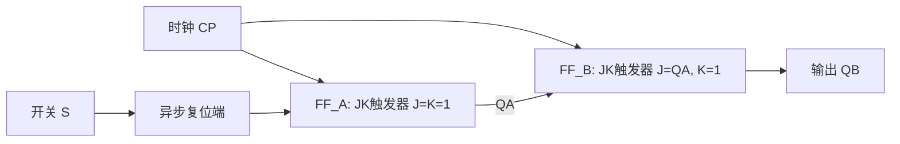

# 触发器波形分析

触发器波形分析是每年期末考试的必考题型，要求根据触发器的输入波形画出输出Q的波形。核心在于掌握触发器的特征方程和异步端优先级。

---

## 例题1：门控SR锁存器波形（2022 A卷 综合一）

**题目**：用与非门构成的门控SR锁存器如图所示，设锁存器初始状态为Q=1，输入E和S、R的逻辑电平波形如图所示，画出输出端Q对应的波形。

**解答**：

**步骤一：理解门控SR锁存器工作原理**

门控SR锁存器在使能信号 E=1 时根据 S、R 信号工作，E=0 时保持状态不变。

功能表：

| E | S | R | \(Q^{n+1}\) | 功能 |
|:---:|:---:|:---:|:---:|:---|
| 0 | × | × | \(Q^n\) | 保持 |
| 1 | 0 | 0 | \(Q^n\) | 保持 |
| 1 | 0 | 1 | 0 | 复位 |
| 1 | 1 | 0 | 1 | 置位 |
| 1 | 1 | 1 | 禁止 | 禁用 |

**步骤二：逐段分析波形**

设初始状态 Q=1，按时间分段分析：

1. **E=0 阶段**：Q保持为1
2. **E=1, S=0, R=0**：Q保持不变
3. **E=1, S=1, R=0**：Q置位为1
4. **E=1, S=0, R=1**：Q复位为0
5. **E=0 阶段**：Q保持当前值
6. **E=1, S=1, R=0**：Q置位为1

每个时间段的翻转根据功能表确定，E=0时所有变化都被锁存。

!!! warning "易错点"
    门控SR锁存器在E=1期间是透明传输的，S、R的变化会立即反映到Q端。只有E=0时才锁定。注意S=R=1是禁用状态。

---

## 例题2：JK触发器波形（含异步端）（2020 A卷 综合一）

**题目**：已知边沿JK触发器各输入端的电压波形如图所示，画出Q端对应的电压波形。触发器带异步置位端 \(\overline{S_D}\) 和异步复位端 \(\overline{R_D}\)，时钟CLK下降沿触发。初始状态 Q=0。

**解答**：

**步骤一：明确优先级**

异步端优先于时钟控制：

- \(\overline{S_D} = 0\)：立即置1，无论CLK和J、K如何
- \(\overline{R_D} = 0\)：立即置0
- \(\overline{S_D} = \overline{R_D} = 1\)：正常工作，按JK触发器特征方程

**步骤二：JK触发器特征方程**

\[
Q^{n+1} = J\overline{Q^n} + \overline{K}Q^n
\]

在CLK下降沿时刻，根据当前的J、K值计算次态。

**步骤三：逐个时钟周期分析**

1. **异步端有效期间**：Q立即跟随 \(\overline{S_D}\) 或 \(\overline{R_D}\) 变化
2. **异步端无效时**：在每个CLK下降沿，根据J、K值计算：
   - J=0, K=0 → 保持
   - J=0, K=1 → 复位（Q=0）
   - J=1, K=0 → 置位（Q=1）
   - J=1, K=1 → 翻转

!!! note "知识点"
    异步置位/复位端（直接置1/置0端）优先级最高，不受时钟控制。在分析波形时，首先检查异步端是否有效，然后再在时钟有效沿处按特征方程分析。

---

## 例题3：JK触发器单脉冲发生器（2023 B卷 综合二）

**题目**：已知下边沿JK-FF组成电路（含开关S），分析逻辑功能，将Q_A、Q_B的波形补充完整。

**电路结构**（文字描述）：

- FF_A：J_A接VCC（高电平），K_A接VCC，时钟CP
- FF_B：J_B接Q_A，K_B接VCC，时钟CP
- 开关S接在FF_A的异步复位端

**解答**：

**步骤一：写出驱动方程**

\[
J_A = K_A = 1 \quad \Rightarrow \quad \text{FF}_A \text{ 工作在T'模式（翻转）}
\]

\[
J_B = Q_A^n, \quad K_B = 1
\]

**步骤二：分析工作过程**

1. **初始状态**：开关S按下，\(\overline{R_{DA}} = 0\)，FF_A复位，\(Q_A = 0\)
2. **开关松开**：\(\overline{R_{DA}} = 1\)，FF_A开始正常工作
3. **第一个CP下降沿**：
   - FF_A：J=K=1 → 翻转 → \(Q_A\) 从0变1
   - FF_B：J=Q_A=0, K=1 → 复位 → \(Q_B = 0\)
4. **第二个CP下降沿**：
   - FF_A：翻转 → \(Q_A\) 从1变0
   - FF_B：J=Q_A=1（此时Q_A还是1，下降沿前的值）, K=1 → 翻转 → \(Q_B\) 从0变1
5. **第三个CP下降沿**：
   - FF_A：翻转 → \(Q_A\) 从0变1
   - FF_B：J=Q_A=0, K=1 → 复位 → \(Q_B\) 从1变0

**步骤三：逻辑功能**

该电路为 **单脉冲发生器**：每按动一次开关，在Q_B端只产生一个完整的时钟周期宽度的脉冲。脉冲宽度与按动开关的时间长短无关，每次脉冲宽度精确等于一个时钟周期。

!!! tip "解题技巧"
    分析触发器电路时，关键是确定各触发器的时钟是否相同。如果共用同一时钟（同步电路），则所有触发器同时更新；如果时钟不同（异步电路），需逐级判断时钟有效性。
