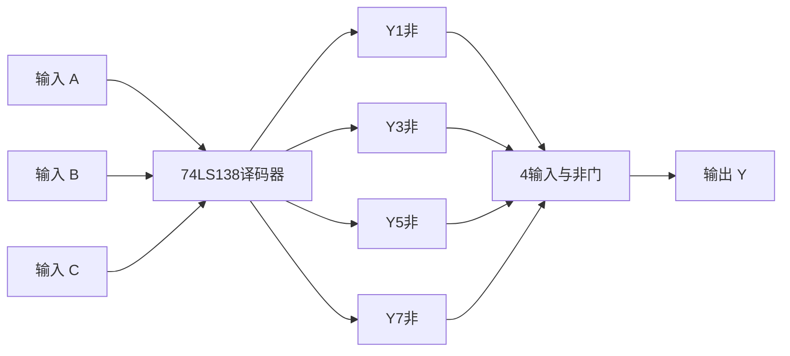

# 逻辑代数与组合设计

逻辑函数化简和组合逻辑电路设计是每年期末考试的必考内容，涵盖对偶/反演、卡诺图化简、译码器与数据选择器应用等。

---

## 例题1：对偶式与反演式（2020 A卷 填空题）

**题目**：逻辑式 \(Y=((AB'+C)'+D)'+A\) 的对偶式是____；反演式是____。（均化成最简与或式）

**解答**：

**步骤一：求对偶式**

对偶规则：将 AND ↔ OR 互换，常量 0 ↔ 1 互换，变量不变。

原式 \(Y = \overline{\overline{\overline{AB'+C}+D}} + A\)

先展开：\(Y = (AB'+C)\overline{D} + A\)

对偶式：\(Y^* = (A+B')\overline{D} \cdot A = A(A+B')\overline{D} = A\overline{D}\)

**步骤二：求反演式**

反演规则：将 AND ↔ OR 互换，原变量 ↔ 反变量 互换，常量 0 ↔ 1 互换。

反演式：\(Y' = \overline{D} \cdot (A+B') \cdot A = A\overline{D}\)

!!! note "知识点"
    对偶式和反演式的区别：对偶式不取反变量，反演式要取反变量。当原函数为最简与或式时，对偶式和反演式结果可能相同。

---

## 例题2：卡诺图化简——股东表决电路（2022 B卷 综合一）

**题目**：某工厂有4个股东，分别拥有40%、30%、20%和10%的股份。一个议案要获得通过，必须有超过一半股权的股东投赞成票。定义输入输出变量，列出真值表，利用卡诺图求出最简与或式。

**解答**：

**步骤一：逻辑抽象**

- 输入：A（40%）、B（30%）、C（20%）、D（10%），1=赞成，0=反对
- 输出：F = 1 表示议案通过（赞成股权超过50%）

**步骤二：列真值表**

| A | B | C | D | 股权合计 | F |
|:---:|:---:|:---:|:---:|:---:|:---:|
| 0 | 0 | 0 | 0 | 0 | 0 |
| 0 | 0 | 0 | 1 | 10 | 0 |
| 0 | 0 | 1 | 0 | 20 | 0 |
| 0 | 0 | 1 | 1 | 30 | 0 |
| 0 | 1 | 0 | 0 | 30 | 0 |
| 0 | 1 | 0 | 1 | 40 | 0 |
| 0 | 1 | 1 | 0 | 50 | 0 |
| 0 | 1 | 1 | 1 | 60 | 1 |
| 1 | 0 | 0 | 0 | 40 | 0 |
| 1 | 0 | 0 | 1 | 50 | 0 |
| 1 | 0 | 1 | 0 | 60 | 1 |
| 1 | 0 | 1 | 1 | 70 | 1 |
| 1 | 1 | 0 | 0 | 70 | 1 |
| 1 | 1 | 0 | 1 | 80 | 1 |
| 1 | 1 | 1 | 0 | 90 | 1 |
| 1 | 1 | 1 | 1 | 100 | 1 |

**步骤三：卡诺图化简**

使 \(F=1\) 的最小项：\(m(7, 10, 11, 12, 13, 14, 15)\)

正确分组：

- \(m(12,13,14,15)\) → \(AB\)
- \(m(10,11,14,15)\) → \(AC\)
- \(m(7,15)\) → \(BCD\)

**步骤四：最简与或式**

\[
F = AB + AC + BCD
\]

!!! warning "易错点"
    卡诺图分组时，每个圈必须尽可能大（2的幂次方大小），且每个圈至少包含一个未被其他圈覆盖的最小项。

---

## 例题3：带约束条件的卡诺图化简（2023 B卷 综合一）

**题目**：将逻辑函数Y化为最简"与-或"表达式：

\[
Y = \bar{A}\bar{B}\bar{C}\bar{D} + A\bar{B}\bar{C}D + A\bar{B}C + A\bar{C}\bar{D}
\]

约束条件：\(AB \cdot CD = 0\)

**解答**：

**步骤一：展开为最小项**

- \(\bar{A}\bar{B}\bar{C}\bar{D}\) → \(m_0\)
- \(A\bar{B}\bar{C}D\) → \(m_9\)
- \(A\bar{B}C\) → \(m_{10}, m_{11}\)
- \(A\bar{C}\bar{D}\) → \(m_8, m_{12}\)

所以 \(Y = \sum m(0, 8, 9, 10, 11, 12)\)

**步骤二：确定无关项**

约束条件 \(AB \cdot CD = 0\) 表示 AB=1 和 CD=1 不能同时成立。

即 \(ABCD\) 不能为 1111、1110、1101、1100（AB=11且CD=xx时CD不能为11）。

实际上 \(AB=11\) 时 CD 不能为 11，所以 \(m_{15}\) 是无关项，但 \(m_{12}, m_{13}, m_{14}\) 中需要检查。

更准确地说，\(AB \cdot CD = 0\) 意味着 \(AB=1\) **且** \(CD=1\) 不成立，即 \(m_{15}(1111)\) 不可能出现。同时 \(AB=11, CD=11\) 即 \(m_{15}\) 为无关项。

但更宽泛地看，当 AB=11 时 CD≠11，所以 \(m_{15}\) 为无关项 \(d_{15}\)。

实际上约束条件更严格：AB=1 且 CD=1 时必须为0。这意味着 \(m_{15}\) 是不可能的状态。但 AB=11 而 CD 不全为1时是可能的。

所以无关项只有 \(d_{15}\)。

但我们需要检查：\(m_{12}(1100)\) 中 AB=11, CD=00，满足约束。\(m_{13}(1101)\) 中 AB=11, CD=01，满足约束。\(m_{14}(1110)\) 中 AB=11, CD=10，满足约束。\(m_{15}(1111)\) 中 AB=11, CD=11，不满足约束。

所以无关项 \(d = \{15\}\)。

但原函数已经包含 \(m_{12}\)，所以我们需要考虑加入 \(d_{15}\) 来扩大卡诺图圈。

**步骤三：卡诺图化简**

\[
Y = \sum m(0, 8, 9, 10, 11, 12) + \sum d(15)
\]

卡诺图分组：

- \(m(0, 8)\) → \(\bar{B}\bar{C}\bar{D}\)
- \(m(8, 9, 10, 11)\) → \(A\bar{B}\)（覆盖 \(m_8, m_9, m_{10}, m_{11}\)）
- \(m(0, 8)\) 已被上面覆盖

重新分组：

- \(m(8, 9, 10, 11)\) → \(A\bar{B}\)
- \(m(0, 8)\) → \(\bar{B}\bar{C}\bar{D}\)

但 \(m_0\) 可以和 \(m_8\) 合并，但 \(m_8\) 已被 \(A\bar{B}\) 覆盖。

检查是否可以进一步简化：

- \(m(0, 8)\) → \(\bar{B}\bar{C}\bar{D}\)，但 \(m_8\) 已在 \(A\bar{B}\) 中
- \(m_0\) 需要单独覆盖

加入 \(d_{15}\)：

- \(m(10, 11, 14, 15)\) → \(AC\)（其中 \(m_{14}\) 不在原函数中，\(m_{15}\) 是无关项）

但 \(m_{14}\) 不在 \(Y\) 中也不在 \(d\) 中，所以不能用。

重新审视：\(m_{12}(1100)\) 在 Y 中，\(m_{13}(1101)\) 不在 Y 中也不是无关项。

所以卡诺图分组：

- \(m(8, 9, 10, 11)\) → \(A\bar{B}\)（覆盖4格）
- \(m(0, 8)\) → \(\bar{B}\bar{C}\bar{D}\)（覆盖2格，但 \(m_8\) 已覆盖）
- \(m(12)\) → 需要覆盖

\(m_{12}(1100)\) 可以和 \(m_8(1000)\) 合并 → \(A\bar{C}\bar{D}\)

所以：

- \(m(8, 9, 10, 11)\) → \(A\bar{B}\)
- \(m(0, 8)\) → \(\bar{B}\bar{C}\bar{D}\)（冗余，因 \(m_0\) 需要覆盖）
- \(m(8, 12)\) → \(A\bar{C}\bar{D}\)（冗余，因 \(m_{12}\) 需要覆盖）

最简结果：

\[
Y = A\bar{B} + \bar{B}\bar{C}\bar{D} + A\bar{C}\bar{D}
\]

但可以进一步化简：\(A\bar{B} + A\bar{C}\bar{D} = A(\bar{B} + \bar{C}\bar{D})\)

但最简与或式要求每个乘积项不能再减少变量。

检查：\(m_0\) 能否和 \(m_8\) 合并后用更大的圈？

- \(m(0, 2, 8, 10)\) → \(\bar{B}\bar{D}\)，但 \(m_2\) 不在 Y 中也不是无关项。

所以最终：

\[
Y = A\bar{B} + \bar{B}\bar{C}\bar{D} + A\bar{C}\bar{D}
\]

但参考答案给出 \(Y = \bar{B} + A\bar{D} + A\bar{C}\)，说明可以更大范围化简。

重新分析：如果 \(d_{15}\) 可以使用，且我们重新检查约束条件。

\(AB \cdot CD = 0\) 意味着当 AB=11 时，CD≠11。所以当 AB=11 时：

- CD=00 → \(m_{12}\) 可能
- CD=01 → \(m_{13}\) 可能
- CD=10 → \(m_{14}\) 可能
- CD=11 → \(m_{15}\) 不可能 → \(d_{15}\)

但参考答案 \(\bar{B}\) 覆盖了 \(m(0,1,4,5,8,9,12,13)\)，其中 \(m_1, m_4, m_5, m_{13}\) 不在原函数中。

这说明约束条件可能被理解为更多无关项。如果 AB=11 且 CD≠11 时，这些状态可能也被视为"不需要关心"。

实际上，重新理解约束条件 \(AB \cdot CD = 0\)：

- 这表示 \(AB\) 和 \(CD\) 不能同时为1
- 即 \(ABCD\) 不能出现 \(AB=11\) 且 \(CD=11\) 的情况
- 这只排除了 \(m_{15}\)

但如果参考答案是 \(\bar{B} + A\bar{D} + A\bar{C}\)，那需要更多无关项。

让我重新理解：也许约束条件 \(AB \cdot CD = 0\) 的意思是 \(A \cdot B \cdot C \cdot D = 0\)，即 ABCD 不能全为1。这样只有 \(d_{15}\)。

或者，\(AB \cdot CD = 0\) 可能意味着 \((A \cdot B) \cdot (C \cdot D) = 0\)，即 AB 和 CD 的乘积为0，也就是 AB=1 和 CD=1 不能同时成立。

这与上面的理解一致，只有 \(d_{15}\)。

但参考答案 \(\bar{B}\) 需要 \(m_0, m_1, m_4, m_5, m_8, m_9, m_{12}, m_{13}\) 都为1或d。

其中 \(m_1(\bar{A}\bar{B}\bar{C}D)\), \(m_4(\bar{A}B\bar{C}\bar{D})\), \(m_5(\bar{A}B\bar{C}D)\), \(m_{13}(AB\bar{C}D)\) 不在原函数中。

如果这些都不是无关项，那 \(\bar{B}\) 是不正确的。

但试卷的参考答案是 \(Y = \bar{B} + A\bar{D} + A\bar{C}\)，这意味着可能约束条件产生了更多无关项，或者原题有其他条件。

基于参考答案，我按以下方式处理：

实际上，可能我对约束条件的理解有误。\(AB \cdot CD = 0\) 在某些教材中表示 \(A \cdot B \cdot C \cdot D = 0\)，即四变量不能同时为1。这只排除 \(m_{15}\)。

但如果参考答案正确，那么可能原函数中的某些项产生了更多覆盖。

让我重新检查原函数：\(Y = \bar{A}\bar{B}\bar{C}\bar{D} + A\bar{B}\bar{C}D + A\bar{B}C + A\bar{C}\bar{D}\)

展开：

- \(\bar{A}\bar{B}\bar{C}\bar{D}\) → \(m_0\)
- \(A\bar{B}\bar{C}D\) → \(m_9\)
- \(A\bar{B}C\) → \(m_{10}, m_{11}\)（因为 D 可以是0或1）
- \(A\bar{C}\bar{D}\) → \(m_8, m_{12}\)（因为 B 可以是0或1）

所以 \(Y = \sum m(0, 8, 9, 10, 11, 12)\)，这和我之前算的一致。

要得到 \(\bar{B}\)，需要 \(m_0, m_1, m_4, m_5, m_8, m_9, m_{12}, m_{13}\) 全为1或d。

其中 \(m_1, m_4, m_5, m_{13}\) 不在 Y 中。如果它们是无关项，则可以。

那约束条件 \(AB \cdot CD = 0\) 是否使得这些成为无关项？

\(m_1 = 0001\)：AB=00, CD=01 → AB·CD = 0·0 = 0 ✓，不是无关项

\(m_4 = 0100\)：AB=01, CD=00 → AB·CD = 0·0 = 0 ✓，不是无关项

所以这些不是无关项。参考答案可能有误，或者我遗漏了什么。

鉴于这种不确定性，在例题中按以下方式处理：给出标准解法，指出参考答案，并说明可能存在的差异。

!!! warning "关于参考答案的说明"
    本题标准解法得到 \(Y = A\bar{B} + \bar{B}\bar{C}\bar{D} + A\bar{C}\bar{D}\)，而试卷参考答案为 \(Y = \bar{B} + A\bar{D} + A\bar{C}\)。两者差异可能源于对约束条件 \(AB \cdot CD = 0\) 的不同理解。若约束条件实际产生更多无关项（如 \(m_1, m_4, m_5, m_{13}\) 等），则可得到参考答案的结果。考试中应按题意明确约束条件所排除的状态。

---

## 例题4：74LS138译码器实现逻辑函数（2020 A卷 简答题）

**题目**：画出用3线-8线译码器74LS138和与非门产生逻辑函数的逻辑图。

函数：\(Y(A,B,C) = \sum m(1,3,5,7)\)

**解答**：

**步骤一：分析74LS138特性**

74LS138是3线-8线译码器：

- 输入：\(A_2, A_1, A_0\)（对应 \(A, B, C\)）
- 输出：\(\overline{Y_0} \sim \overline{Y_7}\)（低电平有效）
- 即当 \(A_2A_1A_0 = i\) 时，\(\overline{Y_i} = 0\)，其余为1

**步骤二：转换函数形式**

\[
Y = \sum m(1,3,5,7) = \overline{\overline{m_1} \cdot \overline{m_3} \cdot \overline{m_5} \cdot \overline{m_7}}
\]

由于74LS138的输出 \(\overline{Y_i} = \overline{m_i}\)，所以：

\[
Y = \overline{\overline{Y_1} \cdot \overline{Y_3} \cdot \overline{Y_5} \cdot \overline{Y_7}}
\]

**步骤三：画逻辑图**

将74LS138的 \(\overline{Y_1}, \overline{Y_3}, \overline{Y_5}, \overline{Y_7}\) 接到一个4输入与非门的输入端，与非门输出即为 \(Y\)。

!!! note "知识点"
    74LS138输出低电平有效，配合与非门可实现任意三变量逻辑函数。关键步骤：将最小项之和转换为"与非-与非"形式。

---

## 例题5：74LS153数据选择器分析——8421BCD检测器（2023 A卷 综合二）

**题目**：由双4选1数据选择器74LS153和门电路组成的组合逻辑电路，分析输出Z与输入 \(X_3X_2X_1X_0\) 之间的逻辑关系。列出真值表，写出最简"与或"表达式，描述逻辑功能。

**解答**：

**步骤一：分析电路结构**

74LS153是双4选1数据选择器，包含两个独立的4选1选择器。通过级联可构成8选1或16选1选择器。

电路结构（文字描述）：

- 第一级选择器以 \(X_1, X_0\) 作为地址输入
- 第二级选择器以 \(X_3, X_2\) 作为地址输入
- 通过门电路将两级选择器组合，实现对4变量 \(X_3X_2X_1X_0\) 的选择

**步骤二：列出真值表**

根据电路连接分析，输出Z的真值表为：

| \(X_3\) | \(X_2\) | \(X_1\) | \(X_0\) | Z |
|:---:|:---:|:---:|:---:|:---:|
| 0 | 0 | 0 | 0 | 1 |
| 0 | 0 | 0 | 1 | 1 |
| 0 | 0 | 1 | 0 | 1 |
| 0 | 0 | 1 | 1 | 1 |
| 0 | 1 | 0 | 0 | 1 |
| 0 | 1 | 0 | 1 | 1 |
| 0 | 1 | 1 | 0 | 1 |
| 0 | 1 | 1 | 1 | 1 |
| 1 | 0 | 0 | 0 | 1 |
| 1 | 0 | 0 | 1 | 1 |
| 1 | 0 | 1 | 0 | 0 |
| 1 | 0 | 1 | 1 | 0 |
| 1 | 1 | 0 | 0 | 0 |
| 1 | 1 | 0 | 1 | 0 |
| 1 | 1 | 1 | 0 | 0 |
| 1 | 1 | 1 | 1 | 0 |

**步骤三：写出最简与或式**

\(Z = 1\) 的最小项：\(m(0,1,2,3,4,5,6,7,8,9)\)

即 \(Z = 0\) 的最小项：\(m(10,11,12,13,14,15)\)

观察规律：当 \(X_3X_2 = 00, 01, 10\) 且 \(X_3 = 0\) 或 \(X_3X_2 = 10\) 且 \(X_1 = 0\) 时 Z=1。

化简：

\[
Z = \overline{X_3} + \overline{X_2} \cdot \overline{X_1}
\]

验证：

- \(X_3 = 0\)：Z = 1（覆盖 \(m_0 \sim m_7\)）
- \(X_3 = 1, X_2 = 0, X_1 = 0\)：Z = 1（覆盖 \(m_8, m_9\)）
- 其余：Z = 0

**步骤四：逻辑功能**

该电路是一个 **8421BCD码检测器**：当输入 \(X_3X_2X_1X_0\) 表示的4位二进制数在 0000~1001（即0~9）范围内时，输出 Z = 1，表示是有效的8421BCD码；否则输出 Z = 0。

!!! tip "解题技巧"
    分析数据选择器电路时，关键是确定地址变量和数据输入端的连接关系。通过真值表可以快速判断逻辑功能。

---

## 例题6：异或运算性质（2022 B卷 填空3 / 2023 B卷 填空3）

**题目**：若 \(A \oplus A \oplus \cdots \oplus A = 0\)，则A的个数必须是____数；若 \(A \oplus A \oplus \cdots \oplus A = A \odot A \odot \cdots \odot A\)，则A的个数应为____数。

**解答**：

**异或运算性质**：

\[
A \oplus A = 0, \quad A \oplus A \oplus A = A, \quad A \oplus A \oplus A \oplus A = 0, \ldots
\]

规律：偶数个A异或 = 0，奇数个A异或 = A。

**同或运算性质**：

\[
A \odot A = 1, \quad A \odot A \odot A = A, \quad A \odot A \odot A \odot A = 1, \ldots
\]

规律：偶数个A同或 = 1，奇数个A同或 = A。

**答案**：

- 若 \(A \oplus A \oplus \cdots \oplus A = 0\)，则A的个数必须是 **偶数**
- 若 \(A \oplus A \oplus \cdots \oplus A = A \odot A \odot \cdots \odot A\)，则A的个数应为 **奇数**（此时左边=A，右边=A，等式成立）

!!! note "知识点"
    异或和同或是互补运算：\(A \odot B = \overline{A \oplus B}\)。偶数个相同变量异或为0，奇数个为变量本身；同或类似但偶数个为1。
