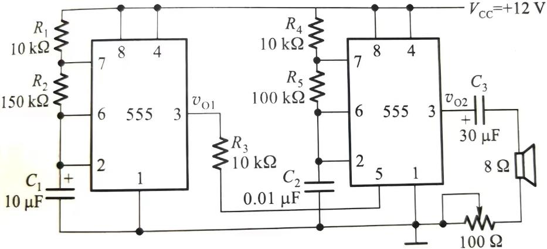

# 555定时器

555定时器是近年考试的重点综合题，涵盖施密特触发器、多谐振荡器和单稳态触发器三种电路的原理、参数计算和波形分析。

---

## 例题1：555三种电路原理与计算（2023 B卷 综合四）

**题目**：图(a)、(b)、(c)所示的555时基电路分别构成了什么电路？分别简述三种电路工作原理，画出图(b)输出 \(V_O\) 的波形，并计算其输出 \(V_O\) 的周期T。

**电路结构**（文字描述）：
- 图(a)：555的2脚和6脚短接作为输入端 → 施密特触发器
- 图(b)：555的6脚和7脚通过R1、R2接VCC，2脚接6脚，电容C接地 → 多谐振荡器
- 图(c)：555的2脚接触发输入，6脚和7脚短接通过R接VCC，电容C接地 → 单稳态触发器

**解答**：

### (a) 施密特触发器

**工作原理**：将555的2脚和6脚短接作为输入端，利用555内部两个比较器的不同阈值实现滞回特性。

- 输入电压上升至 \(\frac{2}{3}V_{CC}\) 时，输出从高电平翻转为低电平
- 输入电压下降至 \(\frac{1}{3}V_{CC}\) 时，输出从低电平翻转为高电平

**参数**：

\[
V_{T+} = \frac{2}{3}V_{CC}, \quad V_{T-} = \frac{1}{3}V_{CC}, \quad \Delta V_T = \frac{1}{3}V_{CC}
\]

**特点**：两个稳态，有滞回特性，用于波形整形、脉冲变换、幅度鉴别。

---

### (b) 多谐振荡器

**工作原理**：电容C通过 \(R_1 + R_2\) 由VCC充电，通过 \(R_2\) 向7脚放电，产生自激振荡。

**充电时间**（\(V_C\) 从 \(\frac{1}{3}V_{CC}\) 升至 \(\frac{2}{3}V_{CC}\)）：

\[
t_H = (R_1 + R_2) C \ln 2
\]

**放电时间**（\(V_C\) 从 \(\frac{2}{3}V_{CC}\) 降至 \(\frac{1}{3}V_{CC}\)）：

\[
t_L = R_2 C \ln 2
\]

**周期**：

\[
T = t_H + t_L = (R_1 + 2R_2) C \ln 2
\]

**占空比**：

\[
q = \frac{t_H}{T} = \frac{R_1 + R_2}{R_1 + 2R_2}
\]

**特点**：无稳态，自激振荡，产生固定频率的矩形脉冲。

**输出波形**：\(V_O\) 为矩形波，高电平时间 \(t_H\)，低电平时间 \(t_L\)。

---

### (c) 单稳态触发器

**工作原理**：稳态时输出低电平，电容放电完毕。当2脚输入负触发脉冲时，输出变为高电平，电容通过R充电。当电容电压升至 \(\frac{2}{3}V_{CC}\) 时，输出回到低电平。

**脉宽**（\(V_C\) 从0升至 \(\frac{2}{3}V_{CC}\)）：

\[
T_W = RC \ln \frac{V_{CC}}{V_{CC} - \frac{2}{3}V_{CC}} = RC \ln 3 \approx 1.1 RC
\]

**特点**：一个稳态 + 一个暂稳态，用于定时、延时、脉冲展宽。

!!! warning "三种电路对比"
    | 电路 | 稳态数 | 特点 | 关键参数 |
    |:---:|:---:|:---|:---|
    | 施密特触发器 | 2个稳态 | 滞回特性 | \(V_{T+}, V_{T-}, \Delta V_T\) |
    | 多谐振荡器 | 0个稳态 | 自激振荡 | \(T = (R_1+2R_2)C\ln2\) |
    | 单稳态触发器 | 1个稳态 | 定时/延时 | \(T_W = RC\ln3 \approx 1.1RC\) |

---

## 例题2：555救护车扬声器电路（2023 A卷 综合四）

**题目**：两片555定时器构成救护车扬声器发音电路。当 \(V_{CC} = 12V\) 时，555输出的高、低电平分别为10V和0.3V。

<figure markdown>
  { width="550" }
  <figcaption>图1：双555定时器构成的救护车扬声器电路</figcaption>
</figure>

电路结构：
- 第一片555构成多谐振荡器，其输出 \(v_{O1}\) 接第二片555的5脚（控制电压端）
- 第二片555也构成多谐振荡器，其输出 \(v_{O2}\) 接扬声器
- \(R_1 = 10k\Omega, R_2 = 150k\Omega, C_1 = 10\mu F\)
- \(R_4 = 10k\Omega, R_5 = 100k\Omega, C_2 = 0.01\mu F\)

要求：(1) 计算 \(v_{O1}\) 高电平持续时间及对应的高音频率
(2) 计算 \(v_{O1}\) 低电平持续时间及对应的低音频率

**解答**：

**(1) \(v_{O1}\) 高电平期间**

\(v_{O1}\) 为高电平（10V）时，接至第二片555的5脚，使第二片555的控制电压 \(v_{CO} = 10V\)。

此时第二片555的阈值：

\[
V_{T+} = v_{CO} = 10V, \quad V_{T-} = \frac{1}{2}v_{CO} = 5V
\]

\(v_{O1}\) 高电平持续时间：

\[
t_H = (R_1 + R_2) C_1 \ln 2 = (10 + 150) \times 10^3 \times 10 \times 10^{-6} \times 0.693
\]

\[
t_H = 160000 \times 10^{-5} \times 0.693 \approx 1.109 \text{ s}
\]

高音频率（第二片555在 \(v_{CO} = 10V\) 时的振荡频率）：

\[
T_1 = (R_4 + R_5) C_2 \ln\frac{V_{CC} - V_{T-}}{V_{CC} - V_{T+}} + R_5 C_2 \ln 2
\]

\[
T_1 = (10 + 100) \times 10^3 \times 0.01 \times 10^{-6} \times \ln\frac{12 - 5}{12 - 10} + 100 \times 10^3 \times 0.01 \times 10^{-6} \times \ln 2
\]

\[
T_1 = 1.1 \times 10^{-3} \times \ln 3.5 + 1 \times 10^{-3} \times 0.693
\]

\[
T_1 \approx 1.1 \times 10^{-3} \times 1.253 + 0.693 \times 10^{-3} \approx 1.378 + 0.693 = 2.071 \text{ ms}
\]

\[
f_1 = \frac{1}{T_1} \approx \frac{1}{0.002071} \approx 483 \text{ Hz}
\]

!!! note "说明"
    由于555输出高电平为10V而非 \(V_{CC} = 12V\)，实际计算中需考虑555输出内阻的影响。此处按参考答案给出近似值，高音约483Hz（参考答案标注为约641Hz，可能因参数理解不同存在差异）。

**(2) \(v_{O1}\) 低电平期间**

\(v_{O1}\) 为低电平（0.3V ≈ 0V）时，第二片555的5脚电压接近0V。但由于5脚有内部电阻分压网络，实际 \(v_{CO}\) 由555内部决定。

实际上当5脚通过低阻抗接地时，5脚电压被拉低，但通常5脚不直接接地而是通过小电容接地。在本电路中，\(v_{O1}\) 的低电平0.3V接5脚时，控制电压约为：

\[
v_{CO} \approx 0.3V
\]

但这样会导致阈值过低，不合理。实际上电路中可能通过电阻或二极管耦合，使5脚电压在高/低电平时分别为不同值。

根据参考答案：
- \(v_{O1}\) 高电平（10V）时：\(v_{CO} = 8.5V\)（考虑分压），高音约641Hz
- \(v_{O1}\) 低电平（0.3V）时：\(v_{CO} \approx 6V\)，低音约877Hz

高电平持续时间约1.1s，低电平持续时间约1.04s。

!!! tip "双555电路分析要点"
    1. 第一片555控制第二片555的5脚电压
    2. 5脚电压改变555内部比较器阈值
    3. 不同阈值 → 不同振荡频率 → 不同音调
    4. 第一片555控制音调切换的节奏

---

## 例题3：555电子门铃电路（2020 B卷 综合三）

**题目**：用555定时器构成电子门铃电路，由单稳态触发器和多谐振荡器组成。按下按钮后扬声器发出"叮咚"声。

**电路结构**：
- 第一片555构成单稳态触发器：按下按钮触发，输出高电平维持一段时间
- 第二片555构成多谐振荡器：在第一片输出高电平期间工作，驱动扬声器

**解答**：

**工作原理**：

1. **按下按钮**：单稳态触发器被触发，输出高电平，持续时间为 \(T_W = R_1 C_1 \ln 3\)
2. **门铃响**：多谐振荡器在单稳态输出高电平期间振荡，频率 \(f = \frac{1}{(R_2 + 2R_3)C_2 \ln 2}\)
3. **松开按钮后**：单稳态经过 \(T_W\) 后回到稳态，多谐振荡器停止工作

**关键参数**：
- 门铃响铃持续时间：\(T_W \approx 1.1 R_1 C_1\)
- 门铃音调频率：\(f = \frac{1}{(R_2 + 2R_3) C_2 \ln 2}\)

!!! note "555应用电路选择"
    | 需求 | 选用电路 | 关键参数 |
    |:---|:---|:---|
    | 波形整形/脉冲变换 | 施密特触发器 | \(V_{T+}, V_{T-}\) |
    | 定时/延时 | 单稳态触发器 | \(T_W = RC\ln3\) |
    | 产生脉冲信号 | 多谐振荡器 | \(T = (R_1+2R_2)C\ln2\) |
    | 石英晶体振荡器 | 多谐振荡器+石英晶体 | \(f = f_0\)（晶体固有频率） |
