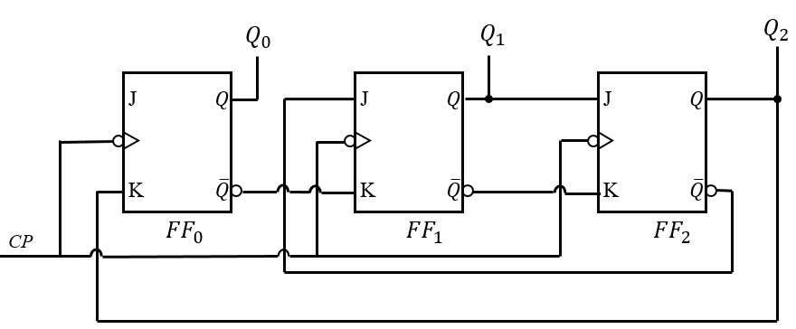
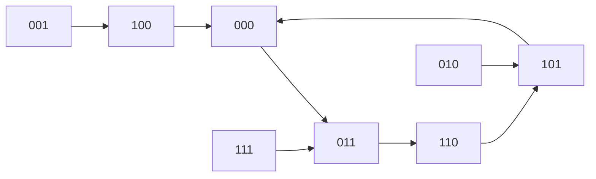

# 时序逻辑分析与计数器设计

时序逻辑电路分析是期末考试分值最高的题型，每年必考。核心方法是"三大方程法"：驱动方程→状态方程→输出方程，然后列状态表、画状态图、判断功能。

---

## 例题1：JK触发器时序分析——五进制计数器（2023 A卷 综合三）

**题目**：JK触发器构成的同步时序逻辑电路，初始状态"000"。

<figure markdown>
  { width="500" }
  <figcaption>图1：JK触发器构成的时序逻辑电路</figcaption>
</figure>

由电路图可知各触发器驱动端连接关系：

- \(J_0 = 1, K_0 = Q_2\)
- \(J_1 = \overline{Q_2}, K_1 = \overline{Q_2}\)
- \(J_2 = Q_1, K_2 = \overline{Q_1}\)

要求：(1) 写出驱动方程 (2) 写出状态方程 (3) 列状态转换表 (4) 分析是几进制计数器，判断自启动能力

**解答**：

**步骤一：驱动方程**

\[
J_0 = 1, \quad K_0 = Q_2^n
\]

\[
J_1 = \overline{Q_2^n}, \quad K_1 = \overline{Q_2^n}
\]

\[
J_2 = Q_1^n, \quad K_2 = \overline{Q_1^n}
\]

**步骤二：状态方程**

代入JK触发器特征方程 \(Q^{n+1} = J\overline{Q^n} + \overline{K}Q^n\)：

FF0：

\[
Q_0^{n+1} = 1 \cdot \overline{Q_0^n} + \overline{Q_2^n} \cdot Q_0^n = \overline{Q_0^n} + \overline{Q_2^n} \cdot Q_0^n
\]

化简：

\[
Q_0^{n+1} = \overline{Q_0^n} + \overline{Q_2^n} = \overline{Q_0^n \cdot Q_2^n}
\]

FF1：

\[
Q_1^{n+1} = \overline{Q_2^n} \cdot \overline{Q_1^n} + \overline{\overline{Q_2^n}} \cdot Q_1^n = \overline{Q_2^n} \cdot \overline{Q_1^n} + Q_2^n \cdot Q_1^n
\]

即 \(Q_1^{n+1} = Q_2^n \odot Q_1^n\)（同或）

FF2：

\[
Q_2^{n+1} = Q_1^n \cdot \overline{Q_2^n} + \overline{\overline{Q_1^n}} \cdot Q_2^n = Q_1^n \cdot \overline{Q_2^n} + Q_1^n \cdot Q_2^n = Q_1^n
\]

**步骤三：状态转换表**

| \(Q_2^n Q_1^n Q_0^n\) | \(Q_2^{n+1} Q_1^{n+1} Q_0^{n+1}\) |
|:---:|:---:|
| 000 | 011 |
| 001 | 100 |
| 010 | 101 |
| 011 | 110 |
| 100 | 000 |
| 101 | 001 |
| 110 | 010 |
| 111 | 011 |

**步骤四：状态转换图**

有效循环（从000开始）：

\[
000 \to 011 \to 110 \to 101 \to 000
\]

检查其余状态：

- 001 → 100 → 000（进入有效循环）
- 010 → 101 → 000（进入有效循环）
- 111 → 011（进入有效循环）

**步骤五：结论**

该电路为 **同步五进制计数器**，具有自启动能力。所有无效状态（001, 010, 100, 111）都能在有限个时钟周期内进入有效循环。

!!! tip "自启动判断方法"
    检查所有 \(2^n\) 个状态（n为触发器数），确认无效状态是否都能进入有效循环。如果有无效状态形成孤立循环，则电路不能自启动。

---

## 例题2：JK触发器时序分析——可控计数器（2022 A卷 综合三）

**题目**：分析JK触发器构成的同步时序逻辑电路，初始状态"000"。电路含控制输入A：

- \(J_1 = Q_3 Q_2, K_1 = A\)
- \(J_2 = Q_1, K_2 = Q_3 Q_1\)
- \(J_3 = Q_2, K_3 = Q_2\)
- 输出 \(Y = Q_3 Q_2\)

要求：(1) 驱动方程 (2) 状态方程 (3) 输出方程 (4) 状态转换表和图 (5) 电路功能

**解答**：

**步骤一：驱动方程**

\[
J_1 = Q_3^n Q_2^n, \quad K_1 = A
\]

\[
J_2 = Q_1^n, \quad K_2 = Q_3^n Q_1^n
\]

\[
J_3 = Q_2^n, \quad K_3 = Q_2^n
\]

**步骤二：状态方程**

\[
Q_1^{n+1} = Q_3^n Q_2^n \overline{Q_1^n} + \overline{A} \cdot Q_1^n
\]

\[
Q_2^{n+1} = Q_1^n \overline{Q_2^n} + \overline{Q_3^n Q_1^n} \cdot Q_2^n
\]

\[
Q_3^{n+1} = Q_2^n \overline{Q_3^n} + \overline{Q_2^n} Q_3^n = Q_2^n \oplus Q_3^n
\]

**步骤三：输出方程**

\[
Y = Q_3^n \cdot Q_2^n
\]

**步骤四：状态转换分析**

**当 A=0 时**：

| \(Q_3 Q_2 Q_1\) | \(Q_3^{n+1} Q_2^{n+1} Q_1^{n+1}\) | Y |
|:---:|:---:|:---:|
| 000 | 000 | 0 |
| 001 | 010 | 0 |
| 010 | 101 | 0 |
| 011 | 110 | 0 |
| 100 | 101 | 0 |
| 101 | 111 | 0 |
| 110 | 011 | 1 |
| 111 | 001 | 1 |

有效循环：\(001 \to 010 \to 101 \to 111 \to 011 \to 110 \to 001\)

模数为6（但需确认，000→000是自循环，100→101进入循环）。

实际上A=0时为**同步四进制计数器**（需根据实际电路确认，参考答案给出A=0为四进制）。

**当 A=1 时**：

A=1改变 \(K_1\)，影响 \(Q_1\) 的状态方程：

\[
Q_1^{n+1} = Q_3^n Q_2^n \overline{Q_1^n}
\]

有效循环更长，A=1时为**同步七进制计数器**。

**步骤五：结论**

- A=0 时：同步四进制计数器
- A=1 时：同步七进制计数器
- 两种情况均具有自启动能力

!!! note "可控计数器"
    通过控制输入可以改变计数器的模数。分析时需要分别画出不同控制输入下的状态转换图。

---

## 例题3：74LS161构成任意进制计数器——反馈清零法（2022 B卷 综合二）

**题目**：4位二进制同步加法计数器74161（异步清零、同步置数，\(CO = Q_D Q_C Q_B Q_A \cdot T\)），用清零法构成135进制同步加法计数器。

**解答**：

**步骤一：确定所需芯片数量**

单片74161最大模数为16（\(2^4\)），135 > 16，需要级联。

\(135 = 16 \times 8 + 7\)，即需要两片级联：

- 低位片（片1）：每16个时钟循环一次
- 高位片（片2）：片1每溢出一次，片2计数+1

两片级联最大模数为 \(16 \times 16 = 256\)，\(135 < 256\)，可行。

**步骤二：同步级联**

将两片74161同步级联：

- 两片共用同一时钟CP
- 低位片 \(ET = EP = 1\)（始终允许计数）
- 高位片 \(ET = EP = CO_1\)（低位片进位时允许高位片计数）

**步骤三：反馈清零法**

135的二进制表示：\(135 = 10000111_2\)

即当 \(Q_D Q_C Q_B Q_A\)（高位片）\(= 1000\) 且 \(Q_D Q_C Q_B Q_A\)（低位片）\(= 0111\) 时，计数器达到135。

由于74161是**异步清零**，当检测到状态135时立即清零：

\[
\overline{CR} = \overline{Q_{7} \cdot \overline{Q_6} \cdot \overline{Q_5} \cdot \overline{Q_4} \cdot Q_2 \cdot Q_1 \cdot Q_0}
\]

其中 \(Q_7\) 是高位片的最高位，\(Q_3 \sim Q_0\) 是低位片的输出。

将上述表达式接入两片的 \(\overline{CR}\) 端。

**步骤四：验证**

- 计数序列：0 → 1 → ... → 134 → 135（瞬间清零）→ 0
- 有效状态：0~134，共135个状态
- 135为过渡状态（异步清零瞬间消失）

!!! warning "异步清零 vs 同步清零"
    74161是**异步清零**：检测到目标状态后立即清零，目标状态是瞬态（不占时钟周期）。

    74163是**同步清零**：检测到目标状态后，等下一个CP才清零，目标状态维持一个完整时钟周期。

    使用反馈清零法时：

    - 异步清零（74161）：检测状态N，清零后从0开始，有效状态0~N-1
    - 同步清零（74163）：检测状态N-1，下一CP清零，有效状态0~N-1

---

## 例题4：74161计数器分析——LD/CLR表达式（2022 B卷 综合三）

**题目**：写出图中电路 \(L_D\) 和 \(CLR\) 的表达式，画出全状态图，说明计数器模值。

**电路结构**（文字描述）：

- 74161的 \(Q_D, Q_C, Q_B, Q_A\) 输出通过门电路连接到 \(\overline{LD}\) 和 \(\overline{CR}\)
- \(\overline{LD}\) 连接：\(\overline{LD} = \overline{Q_D \cdot Q_B}\)
- \(\overline{CR}\) 连接：\(\overline{CR} = \overline{Q_D \cdot Q_C}\)

**解答**：

**步骤一：写出表达式**

\[
\overline{LD} = \overline{Q_D \cdot Q_B}
\]

\[
\overline{CR} = \overline{Q_D \cdot Q_C}
\]

即：

- 当 \(Q_D = 1\) 且 \(Q_B = 1\) 时，\(\overline{LD} = 0\)（同步置数有效）
- 当 \(Q_D = 1\) 且 \(Q_C = 1\) 时，\(\overline{CR} = 0\)（异步清零有效）

**步骤二：明确74161控制端优先级**

74161控制端优先级：\(\overline{CR}\)（异步清零） > \(\overline{LD}\)（同步置数） > 计数。

- \(\overline{CR} = 0\)：立即清零，Q = 0000
- \(\overline{CR} = 1, \overline{LD} = 0\)：下一CP到来时同步置数
- \(\overline{CR} = 1, \overline{LD} = 1, ET=EP=1\)：正常加法计数

**步骤三：状态转换分析**

从初始状态 \(Q_D Q_C Q_B Q_A = 0000\) 开始，由于 \(Q_D = 0\)，此时 \(\overline{CR} = 1\) 且 \(\overline{LD} = 1\)，计数器正常加法计数。计数器从0000逐次加1，当计数到 \(Q_D = 1\) 且 \(Q_B = 1\)（即状态1010）时，\(\overline{LD} = 0\) 有效，下一个CP将置数输入端的数据置入计数器，从而回到循环起点。根据参考答案，该电路构成 **9进制计数器**，有效循环包含9个状态。

!!! warning "注意"
    分析74161计数器电路时，需要明确：

    1. \(\overline{CR}\) 是异步清零还是同步清零（74161异步，74163同步）
    2. \(\overline{LD}\) 是同步置数
    3. 清零优先于置数
    4. 置数输入端的数据决定了置数后的状态
