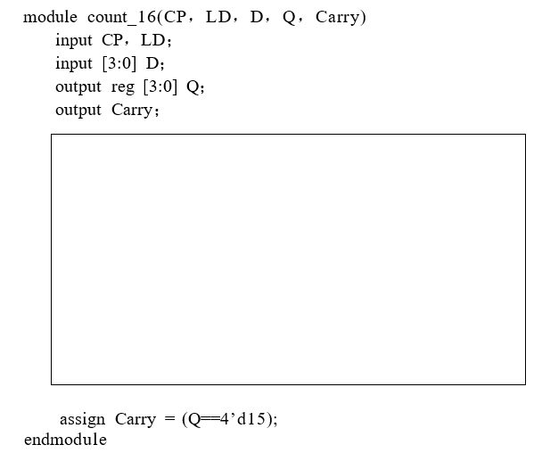
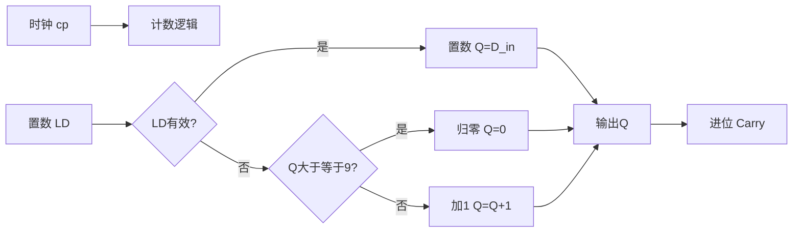
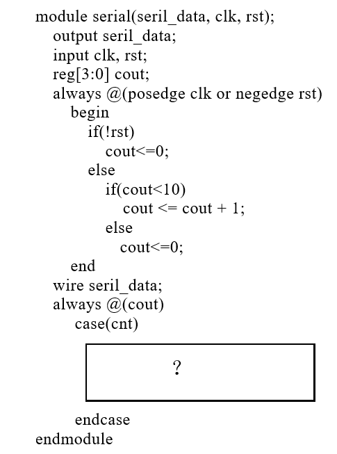
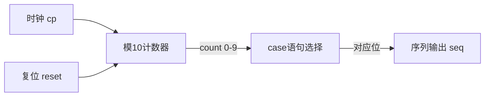

# Verilog HDL

Verilog HDL相关题目从2020年开始出现，主要考查数据类型、标识符规则、代码功能识别和模块设计。

---

## 例题1：Verilog基础语法（2022 A卷 填空8 / 选择6 / 选择12）

**题目1**（填空）：在Verilog HDL程序中，如果输入、输出变量的数据类型缺省，则默认为____型。

**题目2**（选择）：在Verilog HDL中，已知 \(a = 3'b100\)，\(b = 5'b11010\)，那么 \(\{a, b\} = \)( )。
- (1) 5'b10011  (2) 5'b11010  (3) 8'b10011010  (4) 8'b01100101

**题目3**（选择）：下列Verilog HDL标识不合法的是( )。
- (1) 16#OFA#  (2) CLR_RESET  (3) _01stu  (4) _$write

**解答**：

**题目1答案**：默认为 **wire** 型。

Verilog中wire型用于组合逻辑的连续赋值，reg型用于时序逻辑的always块内赋值。端口声明缺省时默认为wire型。

**题目2答案**：(3) 8'b10011010

拼接运算符 `{a, b}` 将a和b按从左到右顺序拼接：

\[
\{a, b\} = \{3'b100, 5'b11010\} = 8'b10011010
\]

总位数为 \(3 + 5 = 8\) 位。

**题目3答案**：(1) 16#OFA# 

标识符以数字开头，不合法。Verilog标识符规则：
- 以字母或下划线开头
- 只能包含字母、数字、下划线和 $
- 不能以数字开头

!!! note "Verilog标识符规则"
    | 规则 | 说明 |
    |:---|:---|
    | 首字符 | 字母或下划线 |
    | 允许字符 | 字母、数字、下划线、$ |
    | 禁止 | 以数字开头 |
    | 区分大小写 | Verilog大小写敏感 |
    
    数据类型：
    - **wire**：线网型，默认类型，用于连续赋值
    - **reg**：寄存器型，用于always块内赋值

---

## 例题2：Verilog设计10进制加法计数器（2022 A卷 综合二）

**题目**：使用Verilog语言设计10进制加法计数器，LD端口为低电平有效的异步置数控制端，Carry为进位输出端口，cp为时钟脉冲。补充代码。

<figure markdown>
  { width="400" }
  <figcaption>图1：原题给出的Verilog代码框架（需补全）</figcaption>
</figure>

**解答**：

```verilog
module counter10(
    input cp,          // 时钟
    input LD,          // 异步置数控制（低电平有效）
    input [3:0] D_in,  // 并行数据输入
    output reg [3:0] Q, // 计数输出
    output Carry        // 进位输出
);

    // 进位输出：计数值为9时产生进位
    assign Carry = (Q == 4'd9);

    always @(posedge cp or negedge LD) begin
        if (!LD)
            Q <= D_in;        // 异步置数：LD低电平立即置数
        else if (Q >= 4'd9)
            Q <= 4'd0;         // 计到9后归零
        else
            Q <= Q + 1;        // 正常计数
    end

endmodule
```

**代码分析**：

1. **异步置数**：`negedge LD` 在敏感列表中，LD下降沿立即触发置数
2. **同步计数**：在时钟上升沿检查计数值，到达9后归零
3. **进位输出**：使用 `assign` 语句，当 Q=9 时 Carry=1



!!! warning "异步置数 vs 同步置数"
    - **异步置数**：LD信号在敏感列表中（`posedge cp or negedge LD`），LD有效时立即置数，不等时钟
    - **同步置数**：LD信号在always块内判断（`posedge cp`），LD有效时需等下一个时钟上升沿才置数
    
    本题明确要求"异步置数"，因此LD必须在敏感列表中。

---

## 例题3：Verilog代码功能识别（2023 A卷 选择15 / 综合一）

**题目1**（选择）：下列代码描述的电路逻辑功能是( )。
- (A) 二进制半加器  (B) 二进制半减器  (C) 二进制全加器  (D) 二进制全减器

代码：
```verilog
module circuit(A, B, D, Bo);
    input A, B;
    output D, Bo;
    assign D = A ^ B;
    assign Bo = ~A & B;
endmodule
```

**题目2**（综合）：判断Verilog代码描述的电路结构是否正确，若正确，画出对应的逻辑电路图。

**解答**：

**题目1分析**：

分析输出表达式：
- \(D = A \oplus B\)：差值输出
- \(Bo = \overline{A} \cdot B\)：借位输出

列出真值表：

| A | B | D | Bo |
|:---:|:---:|:---:|:---:|
| 0 | 0 | 0 | 0 |
| 0 | 1 | 1 | 1 |
| 1 | 0 | 1 | 0 |
| 1 | 1 | 0 | 0 |

分析功能：
- A=0, B=0：0-0=0，无借位 → D=0, Bo=0 ✓
- A=0, B=1：0-1=1，有借位 → D=1, Bo=1 ✓
- A=1, B=0：1-0=1，无借位 → D=1, Bo=0 ✓
- A=1, B=1：1-1=0，无借位 → D=0, Bo=0 ✓

这是减法运算 A-B，且**没有考虑低位来的借位**。

**答案**：(B) 二进制半减器

!!! tip "半加器与半减器对比"
    | 电路 | 和/差 | 进位/借位 | 表达式 |
    |:---:|:---:|:---:|:---|
    | 半加器 | S | Co | \(S = A \oplus B\), \(Co = A \cdot B\) |
    | 半减器 | D | Bo | \(D = A \oplus B\), \(Bo = \overline{A} \cdot B\) |
    | 全加器 | S | Co | \(S = A \oplus B \oplus C_{in}\), \(Co = AB + C_{in}(A \oplus B)\) |
    | 全减器 | D | Bo | \(D = A \oplus B \oplus B_{in}\), \(Bo = \overline{A}B + B_{in}(\overline{A \oplus B})\) |
    
    注意：半加器和半减器的和/差表达式相同（异或），区别在进位/借位表达式。

---

## 例题4：Verilog设计序列信号发生器（2020 A卷 综合三）

**题目**：设计一个序列信号发生器电路，使之在一系列时钟信号作用下能周期性输出"0101110110"。用Verilog语言设计实现该序列信号发生器。

<figure markdown>
  { width="400" }
  <figcaption>图1：原题给出的Verilog代码框架（需补全）</figcaption>
</figure>

**解答**：

**方法：用计数器+case语句实现**

序列"0101110110"长度为10，使用模10计数器，在每个状态下输出序列的对应位。

```verilog
module seq_gen(
    input cp,          // 时钟
    input reset,       // 同步复位
    output reg seq     // 序列输出
);

    reg [3:0] count;    // 计数器（0~9）

    always @(posedge cp) begin
        if (reset)
            count <= 4'd0;
        else if (count >= 4'd9)
            count <= 4'd0;
        else
            count <= count + 1;
    end

    always @(posedge cp) begin
        if (reset)
            seq <= 1'b0;
        else
            case (count)
                4'd0: seq <= 1'b0;
                4'd1: seq <= 1'b1;
                4'd2: seq <= 1'b0;
                4'd3: seq <= 1'b1;
                4'd4: seq <= 1'b1;
                4'd5: seq <= 1'b1;
                4'd6: seq <= 1'b0;
                4'd7: seq <= 1'b1;
                4'd8: seq <= 1'b1;
                4'd9: seq <= 1'b0;
                default: seq <= 1'b0;
            endcase
    end

endmodule
```

**设计思路**：

1. **计数器模块**：0~9循环计数，模10
2. **输出模块**：根据当前计数值，用case语句选择输出序列的第count位

序列与状态对应关系：

| count | 0 | 1 | 2 | 3 | 4 | 5 | 6 | 7 | 8 | 9 |
|:---:|:---:|:---:|:---:|:---:|:---:|:---:|:---:|:---:|:---:|:---:|
| seq | 0 | 1 | 0 | 1 | 1 | 1 | 0 | 1 | 1 | 0 |



!!! tip "序列信号发生器设计方法"
    序列信号发生器有两种设计方法：
    
    1. **计数器+数据选择器**（硬件实现）：用计数器产生地址，用MUX/ROM选择输出
    2. **移位寄存器+反馈逻辑**：用移位寄存器存储序列，通过反馈网络产生下一状态
    
    序列长度为M时：
    - 计数器法：模M计数器 + M选1数据选择器
    - 移位寄存器法：需要 \(\lceil \log_2 M \rceil\) 级触发器

---

## 常见Verilog考点总结

| 考点 | 核心内容 | 出题频率 |
|:---|:---|:---:|
| 数据类型 | wire（默认）、reg | 常考 |
| 标识符规则 | 不能以数字开头 | 常考 |
| 拼接运算符 | {a, b} 按序拼接 | 常考 |
| case语句 | 多分支选择 | 综合 |
| always块 | 时序逻辑描述 | 综合 |
| 模块框架 | module...endmodule | 综合 |
| 计数器设计 | always+计数逻辑 | 综合 |
| 代码功能识别 | 分析表达式判断功能 | 综合 |
