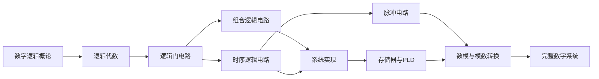

# 数字电子技术 Wiki

**数字电子技术**（Digital Electronics）是电子信息类专业的核心基础课程，研究数字信号的表示、处理与实现方法。本 Wiki 基于课程课件系统整理，涵盖从逻辑代数到模数转换的完整知识体系。

> 共 **40** 个页面 | **1129** 个公式 | **56** 个代码块

## 概念词云

触发器
组合逻辑
卡诺图
时序逻辑
门电路
计数器
TTL
布尔代数
编码器
寄存器
译码器
CMOS
Verilog
555
DAC/ADC
FPGA
竞争冒险
ROM/RAM
施密特
加法器
MUX

## 知识脉络

## 快速导航

| 主题 | 章节 | 核心内容 |
|------|------|----------|
| 基础概念 | [第1章 数字逻辑概论](ch01/index.md) | 模拟/数字信号、EDA 技术、FPGA 开发 |
| 数学工具 | [第2章 逻辑代数](ch02/index.md) | 数制转换、布尔代数、卡诺图化简、Verilog |
| 电路实现 | [第3章 逻辑门电路](ch03/index.md) | TTL、CMOS 门电路、接口电路 |
| 组合逻辑 | [第4章 组合逻辑电路](ch04/index.md) | 编码/译码器、数据选择器、加法器、竞争冒险 |
| 时序逻辑 | [第5章 时序逻辑电路](ch05/index.md) | 触发器、寄存器、计数器、分析与设计方法 |
| 脉冲电路 | [第6章 脉冲电路](ch06/index.md) | 555 定时器、施密特触发器、多谐振荡器 |
| 存储与可编程 | [第7章 存储器与PLD](ch07/index.md) | ROM/RAM、CPLD、FPGA |
| 模拟接口 | [第8章 数模与模数转换](ch08/index.md) | DAC、ADC 原理与类型 |

## 参考教材

- 康华光.《电子技术基础（数字部分）》（第六版）. 高等教育出版社
- 阎石.《数字电子技术基础》（第六版）. 高等教育出版社
- 课程课件及讲义
